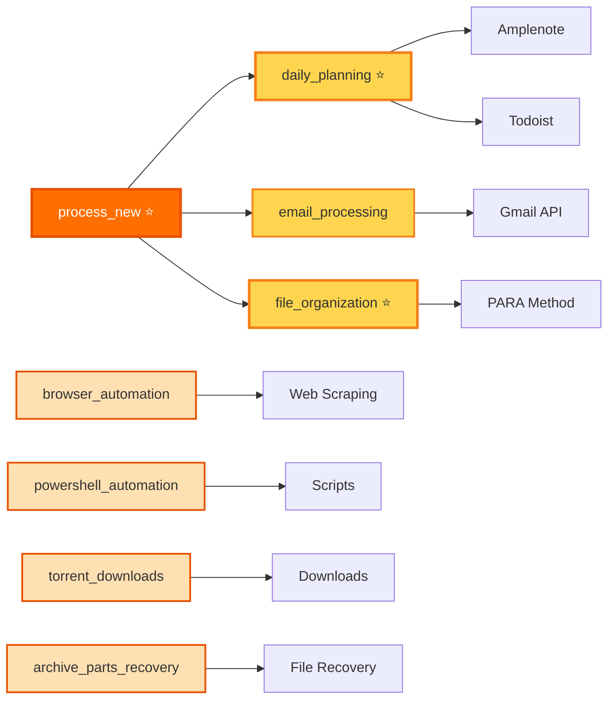
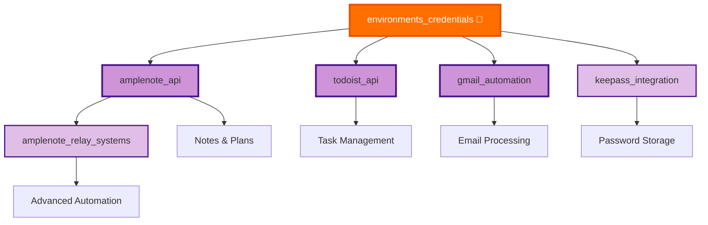
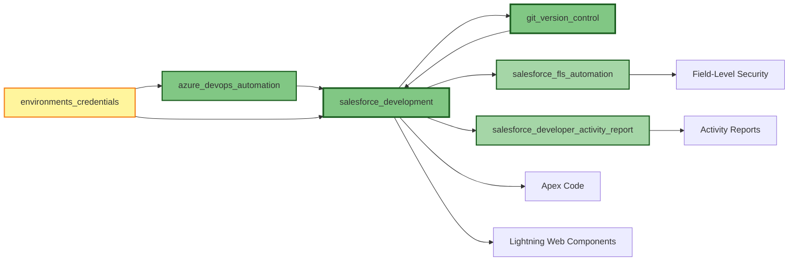
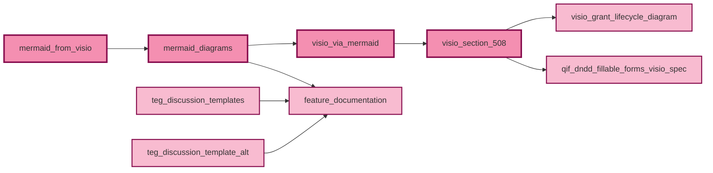
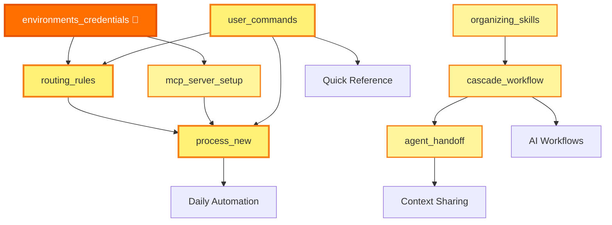

# Skills

AI agent skills organized by category. Each skill provides detailed instructions for specific workflows and integrations.

## Skills Organization Diagram

```mermaid
graph TB
    Root["📁 06_Skills<br/>36 AI Skills<br/>5 Categories"]
    
    Root --> Automation["🤖 AUTOMATION<br/>7 Skills<br/>Daily Workflows"]
    Root --> Integrations["🔌 INTEGRATIONS<br/>5 Skills<br/>API & Services"]
    Root --> Development["💻 DEVELOPMENT<br/>5 Skills<br/>Dev Tools"]
    Root --> Documentation["📝 DOCUMENTATION<br/>10 Skills<br/>Templates & Diagrams"]
    Root --> System["⚙️ SYSTEM<br/>9 Skills<br/>Core Configuration"]
    
    %% Automation Skills
    Automation --> A1["daily_planning ⭐<br/>Kanban board generation"]
    Automation --> A2["email_processing<br/>Automated email handling"]
    Automation --> A3["file_organization<br/>PARA method filing"]
    Automation --> A4["browser_automation<br/>Playwright web automation"]
    Automation --> A5["powershell_automation<br/>PowerShell scripting"]
    Automation --> A6["torrent_downloads<br/>Torrent management"]
    Automation --> A7["archive_parts_recovery<br/>Archive recovery"]
    
    %% Integration Skills
    Integrations --> I1["amplenote_api<br/>Amplenote integration"]
    Integrations --> I2["amplenote_relay_systems<br/>Advanced relay configs"]
    Integrations --> I3["gmail_automation<br/>Gmail API setup"]
    Integrations --> I4["todoist_api<br/>Task management API"]
    Integrations --> I5["keepass_integration<br/>Password manager"]
    
    %% Development Skills
    Development --> D1["salesforce_development<br/>Apex & LWC"]
    Development --> D2["salesforce_fls_automation<br/>Field-level security"]
    Development --> D3["salesforce_developer_activity_report<br/>Activity tracking"]
    Development --> D4["git_version_control<br/>Git workflows"]
    Development --> D5["azure_devops_automation<br/>ADO work items"]
    
    %% Documentation Skills
    Documentation --> Doc1["mermaid_diagrams<br/>Diagram syntax"]
    Documentation --> Doc2["visio_via_mermaid<br/>Mermaid to Visio"]
    Documentation --> Doc3["mermaid_from_visio<br/>Visio to Mermaid"]
    Documentation --> Doc4["mermaid_section_508<br/>Accessible Mermaid"]
    Documentation --> Doc5["visio_section_508<br/>Accessible Visio"]
    Documentation --> Doc6["visio_grant_lifecycle_diagram<br/>Grant diagrams"]
    Documentation --> Doc7["teg_discussion_templates<br/>TEG templates"]
    Documentation --> Doc8["feature_documentation<br/>Doc standards"]
    Documentation --> Doc9["qif_dndd_fillable_forms_visio_spec<br/>QIF forms"]
    Documentation --> Doc10["teg_discussion_template_alt<br/>Alt TEG template"]
    
    %% System Skills
    System --> S1["user_commands ⭐<br/>Quick command reference"]
    System --> S2["section_508_compliance<br/>Accessibility guidelines"]
    System --> S3["routing_rules<br/>System routing"]
    System --> S4["environments_credentials<br/>Credential management"]
    System --> S5["cascade_workflow<br/>AI workflow patterns"]
    System --> S6["process_new<br/>Process new items"]
    System --> S7["agent_handoff<br/>Agent protocols"]
    System --> S8["mcp_server_setup<br/>MCP configuration"]
    System --> S9["organizing_skills<br/>Skill organization"]
    
    %% Styling
    style Root fill:#e1f5fe,stroke:#01579b,stroke-width:3px
    style Automation fill:#fff3e0,stroke:#e65100,stroke-width:2px
    style Integrations fill:#f3e5f5,stroke:#4a148c,stroke-width:2px
    style Development fill:#e8f5e9,stroke:#1b5e20,stroke-width:2px
    style Documentation fill:#fce4ec,stroke:#880e4f,stroke-width:2px
    style System fill:#fff9c4,stroke:#f57f17,stroke-width:2px
    
    style A1 fill:#ffe0b2,stroke:#e65100
    style A2 fill:#ffe0b2,stroke:#e65100
    style A3 fill:#ffe0b2,stroke:#e65100
    style A4 fill:#ffe0b2,stroke:#e65100
    style A5 fill:#ffe0b2,stroke:#e65100
    style A6 fill:#ffe0b2,stroke:#e65100
    style A7 fill:#ffe0b2,stroke:#e65100
    
    style I1 fill:#e1bee7,stroke:#4a148c
    style I2 fill:#e1bee7,stroke:#4a148c
    style I3 fill:#e1bee7,stroke:#4a148c
    style I4 fill:#e1bee7,stroke:#4a148c
    style I5 fill:#e1bee7,stroke:#4a148c
    
    style D1 fill:#c8e6c9,stroke:#1b5e20
    style D2 fill:#c8e6c9,stroke:#1b5e20
    style D3 fill:#c8e6c9,stroke:#1b5e20
    style D4 fill:#c8e6c9,stroke:#1b5e20
    style D5 fill:#c8e6c9,stroke:#1b5e20
    
    style Doc1 fill:#f8bbd0,stroke:#880e4f
    style Doc2 fill:#f8bbd0,stroke:#880e4f
    style Doc3 fill:#f8bbd0,stroke:#880e4f
    style Doc4 fill:#f48fb1,stroke:#880e4f
    style Doc5 fill:#f48fb1,stroke:#880e4f
    style Doc6 fill:#f8bbd0,stroke:#880e4f
    style Doc7 fill:#f8bbd0,stroke:#880e4f
    style Doc8 fill:#f8bbd0,stroke:#880e4f
    style Doc9 fill:#f8bbd0,stroke:#880e4f
    style Doc10 fill:#f8bbd0,stroke:#880e4f
    
    style S1 fill:#fff176,stroke:#f57f17
    style S2 fill:#fff176,stroke:#f57f17
    style S3 fill:#fff59d,stroke:#f57f17
    style S4 fill:#fff59d,stroke:#f57f17
    style S5 fill:#fff59d,stroke:#f57f17
    style S6 fill:#fff59d,stroke:#f57f17
    style S7 fill:#fff59d,stroke:#f57f17
    style S8 fill:#fff59d,stroke:#f57f17
    style S9 fill:#fff59d,stroke:#f57f17
```

**📊 More Diagrams:** See [SKILLS_DIAGRAM.md](SKILLS_DIAGRAM.md) for additional views including skill relationships, workflows, and dependencies.

---

## Category Diagrams

### 🤖 Automation Skills Workflow

**Daily Use:** daily_planning, file_organization, process_new  
**Weekly Use:** email_processing  
**As-Needed:** browser_automation, powershell_automation, torrent_downloads, archive_parts_recovery

---

### 🔌 Integration Skills Network

**Setup Required:** environments_credentials (must configure first)  
**Core APIs:** amplenote_api, todoist_api, gmail_automation  
**Supporting:** keepass_integration, amplenote_relay_systems

---

### 💻 Development Skills Workflow

**Core:** salesforce_development, git_version_control  
**Automation:** salesforce_fls_automation, azure_devops_automation  
**Reporting:** salesforce_developer_activity_report

---

### 📝 Documentation Skills Pipeline

**Diagram Creation:** mermaid_from_visio → mermaid_diagrams → visio_via_mermaid → visio_section_508  
**Templates:** teg_discussion_templates, feature_documentation  
**Specialized:** visio_grant_lifecycle_diagram, qif_dndd_fillable_forms_visio_spec

---

### ⚙️ System Configuration Flow

**Quick Reference:** user_commands ⭐ (start here for common commands)  
**Critical Setup:** environments_credentials, routing_rules  
**Core Workflow:** process_new, mcp_server_setup  
**AI Management:** cascade_workflow, agent_handoff, organizing_skills

---

## Categories

### 🤖 Automation
Daily workflows and process automation skills.

- **[daily_planning](automation/skill_daily_planning.md)** - Smart Kanban board generation and task prioritization
- **[email_processing](automation/skill_email_processing.md)** - Automated email processing and task extraction
- **[file_organization](automation/skill_file_organization.md)** - PARA method file organization and download processing
- **[browser_automation](automation/skill_browser_automation.md)** - Web automation with Playwright and MCP
- **[powershell_automation](automation/skill_powershell_automation.md)** - PowerShell scripting and automation patterns
- **[torrent_downloads](automation/skill_torrent_downloads.md)** - Automated torrent download management
- **[archive_parts_recovery](automation/skill_archive_parts_recovery.md)** - Archive file recovery and extraction

### 🔌 Integrations
API and service integration skills.

- **[amplenote_api](integrations/skill_amplenote_api.md)** - Amplenote API integration and OAuth setup
- **[amplenote_relay_systems](integrations/skill_amplenote_relay_systems.md)** - Advanced Amplenote relay configurations
- **[gmail_automation](integrations/skill_gmail_automation.md)** - Gmail API setup and automation
- **[gmail_quick_start](integrations/gmail_quick_start.txt)** - Quick start guide for Gmail integration
- **[todoist_api](integrations/skill_todoist_api.md)** - Todoist API integration for task management
- **[keepass_integration](integrations/skill_keepass_integration.md)** - KeePass password manager integration

### 💻 Development
Development tools and workflow skills.

- **[salesforce_development](development/skill_salesforce_development.md)** - Salesforce Apex and LWC development workflows
- **[salesforce_fls_automation](development/skill_salesforce_fls_automation.md)** - Field-level security automation
- **[salesforce_developer_activity_report](development/skill_salesforce_developer_activity_report.md)** - Developer activity tracking and reporting
- **[git_version_control](development/skill_git_version_control.md)** - Git workflows and version control best practices
- **[azure_devops_automation](development/skill_azure_devops_automation.md)** - Azure DevOps work item automation

### 📝 Documentation
Documentation and template skills.

- **[mermaid_diagrams](documentation/skill_mermaid_diagrams.md)** - Mermaid diagram syntax and Visio conversion
- **[visio_via_mermaid](documentation/skill_visio_via_mermaid.md)** - Create Visio diagrams using Mermaid workflow
- **[mermaid_from_visio](documentation/skill_mermaid_from_visio.md)** - Convert Visio diagrams to Mermaid syntax
- **[mermaid_section_508](documentation/skill_mermaid_section_508.md)** - Section 508 compliant Mermaid diagrams
- **[visio_section_508](documentation/skill_visio_section_508.md)** - Section 508 compliant Visio diagrams
- **[teg_discussion_templates](documentation/skill_teg_discussion_templates.md)** - TEG discussion document templates
- **[feature_documentation](documentation/skill_feature_documentation.md)** - Feature documentation standards
- **[visio_grant_lifecycle_diagram](documentation/skill_visio_grant_lifecycle_diagram.md)** - Grant lifecycle diagram specifications
- **[qif_dndd_fillable_forms_visio_spec](documentation/skill_qif_dndd_fillable_forms_visio_spec.md)** - QIF DNDD fillable forms architecture

### ⚙️ System
Core system configuration and workflow skills.

- **[user_commands](system/skill_user_commands.md)** - Quick reference for common commands and workflows
- **[section_508_compliance](system/skill_section_508_compliance.md)** - Section 508 accessibility guidelines for all content
- **[routing_rules](system/skill_routing_rules.md)** - System-wide routing rules for tasks, notes, and files
- **[environments_credentials](system/skill_environments_credentials.md)** - Credential management and environment configuration
- **[cascade_workflow](system/skill_cascade_workflow.md)** - Cascade AI workflow patterns and best practices
- **[agent_handoff](system/skill_agent_handoff.md)** - Agent handoff protocols and context sharing
- **[mcp_server_setup](system/skill_mcp_server_setup.md)** - MCP server configuration and setup
- **[process_new](system/skill_process_new.md)** - Complete workflow for processing new items
- **[organizing_skills](system/skill_organizing_skills.md)** - Guidelines for organizing skills and creating tools

## Quick Start

### Most Used Skills
- [daily_planning](automation/skill_daily_planning.md) - Start here for daily workflow
- [email_processing](automation/skill_email_processing.md) - Weekly email management
- [file_organization](automation/skill_file_organization.md) - File management and PARA method
- [routing_rules](system/skill_routing_rules.md) - Understand where things go

### Setup Skills
- [environments_credentials](system/skill_environments_credentials.md) - Configure credentials first
- [gmail_automation](integrations/skill_gmail_automation.md) - Set up Gmail integration
- [amplenote_api](integrations/skill_amplenote_api.md) - Set up Amplenote integration

## Supporting Resources

- **_scripts/** - Automation scripts used by skills (see individual skill documentation for usage)
- **_tools/** - MCP server configurations and tools
- **SESSION_SUMMARY_20260222.md** - Recent session summary

**Note:** Directories prefixed with underscore (_) contain supporting resources rather than skills themselves.

---

**Last Updated:** March 1, 2026  
**Location:** `G:\My Drive\06_Skills\README.md`
