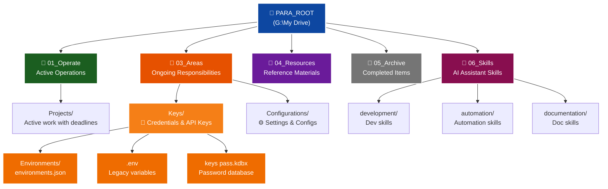
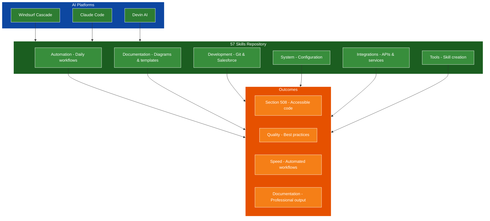
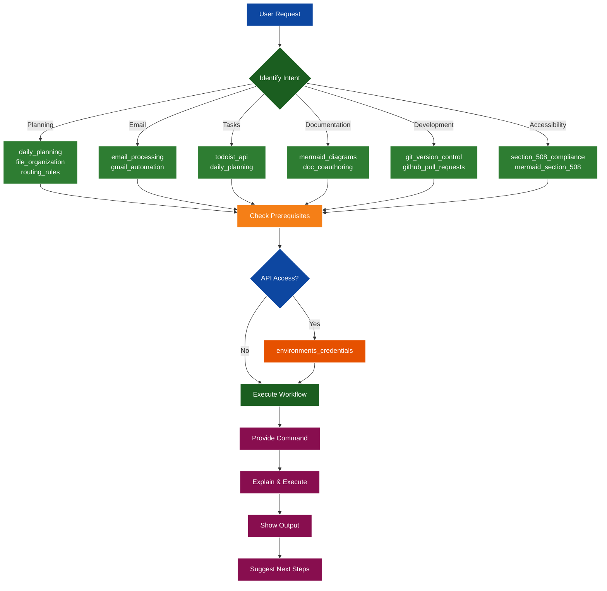
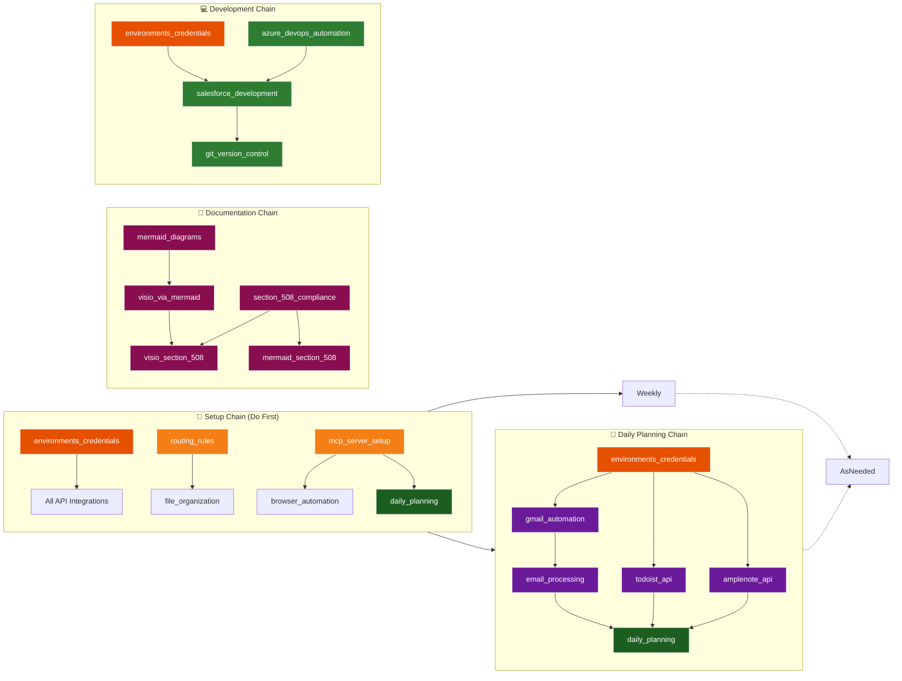
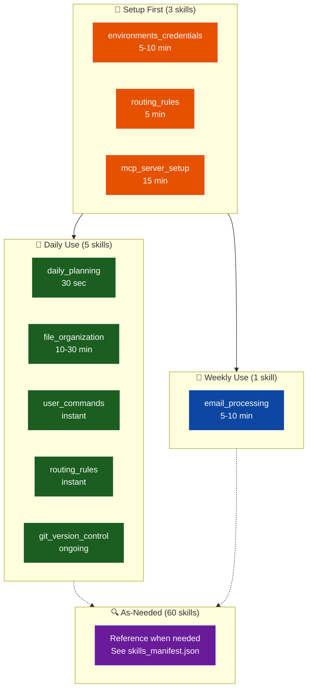
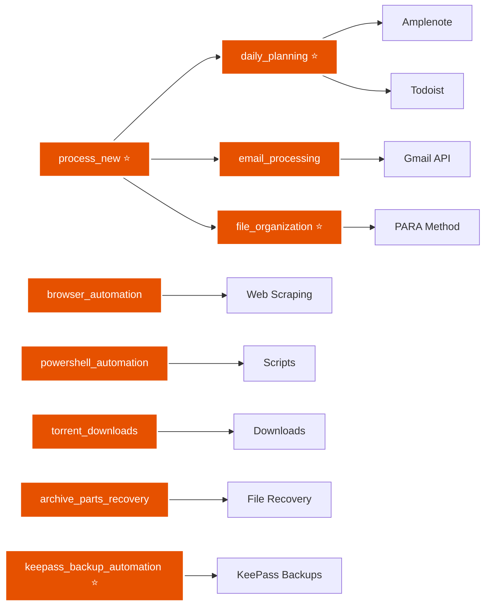
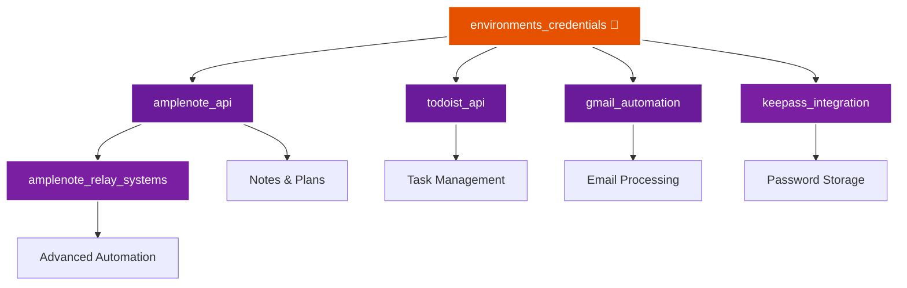
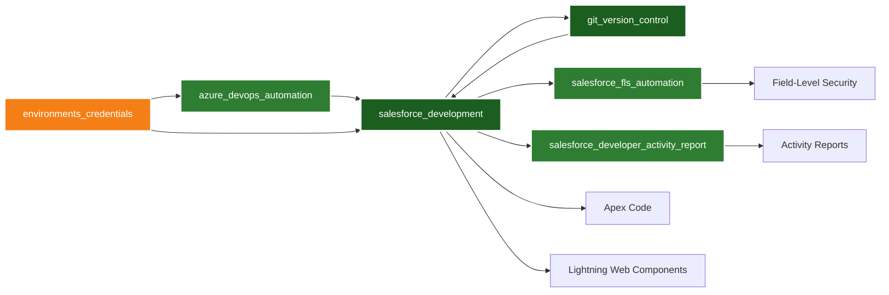
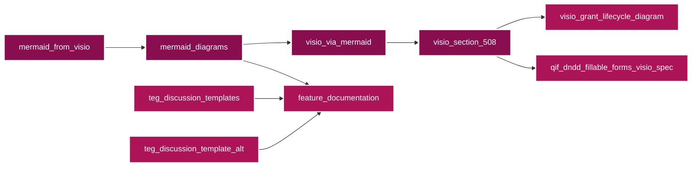
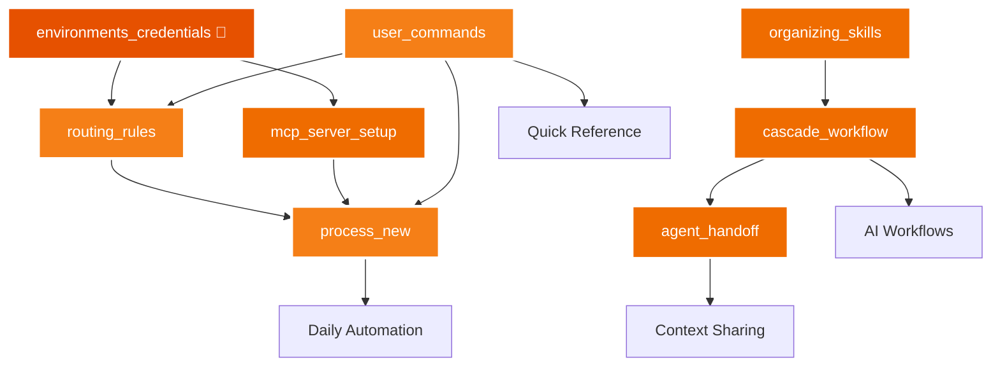

# Skills

**One repository to train your AI coding assistants in the ways of accessibility, automation, documentation, and enterprise development.**

Master Section 508 compliance, Salesforce workflows, Copado DevOps, professional diagramming, API integrations, GitFlow strategies, and comprehensive documentation. Whether you're using Windsurf Cascade, Devin AI, or Claude Code—teach your code-generating robot the right way to build.

**69 battle-tested skills. 6 categories. 3 AI platforms. Zero excuses for bad code.**

---

## Configuration

**📍 Repository Location:** This repository uses relative paths. Configure your local path in `skills_config.json`:

```json
{
  "SKILLS_ROOT": "G:\\My Drive\\06_Skills"
}
```

**Update for your environment:**
- **Windows:** `"C:\\Users\\YourName\\Documents\\06_Skills"`
- **Linux/Mac:** `"/home/username/06_Skills"` or `"/Users/username/Documents/06_Skills"`

**Using paths in documentation:**
- All paths are shown as: `${SKILLS_ROOT}/category/skill_name.md`
- Replace `${SKILLS_ROOT}` with your actual path from `skills_config.json`
- Example: `${SKILLS_ROOT}/automation/skill_daily_planning.md` → `C:\Skills\automation\skill_daily_planning.md`

**📂 PARA_ROOT Variable:**

Many skills reference `${PARA_ROOT}` for file organization and credentials. This points to your main PARA method organizational folder:

```json
{
  "PARA_ROOT": "G:\\My Drive"
}
```

**PARA Method Structure:**



**Key Folders:**
- `01_Operate/Projects/` - Active work with deadlines
- `03_Areas/` - Ongoing responsibilities (credentials, keys, configurations)
- `04_Resources/` - Reference materials
- `05_Archive/` - Completed items
- `06_Skills/` - AI assistant skills and workflows

**Example:** `${PARA_ROOT}/03_Areas/Keys/` resolves to `G:\My Drive\03_Areas\Keys\`

**Note:** Configure both `SKILLS_ROOT` and `PARA_ROOT` in `skills_config.json` for your environment.

---

AI agent skills organized by category. Each skill provides detailed instructions for specific workflows and integrations.

**🚀 New to this repository?** See [QUICKSTART.md](QUICKSTART.md) for a complete guide on using these skills in Windsurf Cascade, Claude Code, and Devin AI.

---

## Definitions

Understanding the terminology used in this repository:

### **Skill**
A reusable guide that teaches AI assistants how to perform specific tasks consistently and effectively. Skills are markdown documents (`.md` files) containing structured instructions, workflows, examples, and best practices.

**Characteristics:**
- Stored as markdown files in category folders (`automation/`, `documentation/`, etc.)
- Contains structured workflows and decision trees
- Includes examples, best practices, and quality checks
- Designed for repeated use across multiple sessions
- Can reference other skills, tools, and scripts

**Example:** `skill_daily_planning.md` teaches AI how to automate daily task planning by integrating Gmail, Calendar, and Todoist.

**Scope:** One skill = one clear purpose. If a skill does multiple unrelated things, it should be split into separate skills.

### **Tool**
An executable program (usually Python) that performs a specific automated function. Tools are the "doing" component that skills reference.

**Characteristics:**
- Stored in `_tools/` directory
- Executable files (`.py`, `.js`, `.bat`)
- Part of regular/daily workflows
- Integrates multiple services or APIs
- Produces actionable outputs

**Example:** `run_process_new.py` is a tool that scans Gmail, Calendar, and Todoist to generate daily plans.

**Relationship to Skills:** Skills provide the "how and when" instructions; tools provide the "what executes."

### **Script**
A one-off or occasional utility program for specific tasks. Unlike tools, scripts are not part of regular workflows.

**Characteristics:**
- Stored in `_scripts/` directory
- Run manually when needed
- Utility/helper functions
- Temporary or experimental code
- Not part of daily automation

**Example:** `migrate_old_notes.py` is a script for one-time data migration.

**Tool vs Script:** If you run it daily/weekly = tool. If you run it once or occasionally = script.

### **Workflow**
A multi-step process that orchestrates multiple tools and skills to accomplish a complex task.

**Characteristics:**
- Stored in `automation/` directory
- Combines multiple tools/skills
- Has defined stages or phases
- May include configuration files

**Example:** The daily planning workflow combines email analysis, calendar checking, and task creation.

### **Integration**
A reusable API client or service wrapper that other tools and skills can use.

**Characteristics:**
- Stored in `integrations/` directory
- Provides interface to external services
- Can be imported by multiple tools
- Well-defined, documented API

**Example:** `amplenote_api` provides methods for creating and updating Amplenote notes.

### **Resource**
Supporting files referenced by skills, including documentation, templates, configuration files, and reference materials.

**Types:**
- **References:** Documentation loaded into context as needed
- **Assets:** Files used in output (templates, icons, fonts)
- **Configuration:** Settings and credentials (`environments.json`, `config.yaml`)

**Example:** Section 508 color palettes, Visio icon libraries, diagram templates.

### **Skill Creator Definitions**
Special files that define how to generate or regenerate tools in `_tools/`:

**Storage Location:** `${SKILLS_ROOT}/_tools/skill-creator/`

**Purpose:** When a library updates or you need to regenerate a Python script, these definitions contain:
- The original prompt/instructions used to create the tool
- Configuration and requirements
- Expected behavior and outputs
- Integration points with other tools

**Files:**
- `README.md` - Overview and skill creation process
- `SKILL.md` - Complete skill creation workflow and templates

**Regeneration Use Case:** If `run_process_new.py` needs updates due to API changes, reference the skill creator definitions to regenerate with the same specifications but updated dependencies.

### **Category**
Organizational folders that group related skills by purpose:

- **🛠️ Tools** (`_tools/`) - Skill development and creation
- **🤖 Automation** (`automation/`) - Daily workflows and processes
- **🔌 Integrations** (`integrations/`) - API clients and service wrappers
- **💻 Development** (`development/`) - Dev tools and workflows
- **📝 Documentation** (`documentation/`) - Templates and diagram creation
- **⚙️ System** (`system/`) - Core configuration and setup

### **MCP (Model Context Protocol)**
A standard that connects AI systems with external tools and data sources, enabling AI assistants to access specialized functions and services.

**Example:** The daily planner MCP server provides tools for Gmail, Todoist, Calendar, and Amplenote operations.

### **PARA Method**
A file organization system used throughout this repository for managing all files, credentials, and resources.

**Four Core Folders:**
- **Projects** (`01_Operate/Projects/`) - Active work with deadlines and deliverables
- **Areas** (`03_Areas/`) - Ongoing responsibilities (credentials, keys, configurations)
- **Resources** (`04_Resources/`) - Reference materials and documentation
- **Archive** (`05_Archive/`) - Completed items and historical records

**Additional Folder:**
- **Skills** (`06_Skills/`) - AI assistant skills and workflows (this repository)

**Path Variable:** `${PARA_ROOT}` points to your PARA root folder (typically `G:\My Drive` on Windows)

**Key Usage:** Many skills reference `${PARA_ROOT}/03_Areas/Keys/` for credential storage and `${PARA_ROOT}/06_Skills/` for skill files.

**Example:** `${PARA_ROOT}/03_Areas/Keys/Environments/environments.json` contains API configurations for Salesforce, Azure DevOps, Gmail, Todoist, and other services.

---

## How It Works



**The Flow:** Your AI platform → Loads skills → Produces quality outcomes

---

## Skills Organization Diagram


**📊 More Diagrams:** See [SKILLS_DIAGRAM.md](SKILLS_DIAGRAM.md) for additional views including skill relationships, workflows, and dependencies.

**🤖 AI Integration:** See [SKILLS_CONTEXT.md](SKILLS_CONTEXT.md) for AI-optimized skill reference and [skills_manifest.json](skills_manifest.json) for machine-readable skill index.

**📖 Quick Start:** See [QUICKSTART.md](QUICKSTART.md) for complete guide on using skills in Windsurf and Claude Code.

---

## AI Integration for Windsurf, Claude Code & Devin

### Quick Start for AI Assistants

**Primary Resources:**
- **[SKILLS_CONTEXT.md](SKILLS_CONTEXT.md)** - Single source of truth for AI agents (comprehensive guide)
- **[skills_manifest.json](skills_manifest.json)** - Machine-readable skill index with complete metadata
- **[user_commands](system/skill_user_commands.md)** - Quick command reference with copy-paste examples

**How to Use:**
1. **First time?** Read SKILLS_CONTEXT.md for complete overview
2. **Need a command?** Check user_commands skill
3. **Programmatic access?** Parse skills_manifest.json
4. **Specific skill?** Reference individual skill markdown files

---

### For Windsurf Cascade

**Loading Skills in Windsurf:**

```markdown
# Method 1: Reference Specific Skill
"Check the daily_planning skill at ${SKILLS_ROOT}/automation/skill_daily_planning.md"

# Method 2: Load Multiple Skills
"Load the following skills:
- file_organization
- routing_rules
- skill_creator"

# Method 3: Load by Category
"Load all documentation skills from ${SKILLS_ROOT}/documentation/"

# Method 4: Use Skills Context
"Reference SKILLS_CONTEXT.md for complete skill overview"
```

**Windsurf Workflow Patterns:**

**Pattern 1: Task Execution**
```
User: "Plan my day"

Cascade Workflow:
1. Read: ${SKILLS_ROOT}/automation/skill_daily_planning.md
2. Check prerequisites: environments.json configured?
3. Navigate: cd "C:\Users\sol90\CascadeProjects\mcptools"
4. Execute: python run_process_new_v2.py
5. Monitor: Watch for completion (~30 seconds)
6. Verify: Check Todoist for new tasks
7. Report: "Created X tasks from Y emails and Z calendar events"
```

**Pattern 2: Skill Discovery**
```
User: "How do I organize my downloads?"

Cascade Workflow:
1. Search: skills_manifest.json for "file" or "organization"
2. Find: file_organization skill
3. Load: ${SKILLS_ROOT}/automation/skill_file_organization.md
4. Reference: routing_rules for PARA method
5. Guide: Walk user through filing process
6. Suggest: Related skills (media_filing_guide for media files)
```

**Pattern 3: Skill Creation**
```
User: "Create a new skill for X"

Cascade Workflow:
1. Load: ${SKILLS_ROOT}/_tools/skill-creator/README.md
2. Load: ${SKILLS_ROOT}/_tools/HOW_TO_FILE_TOOLS.md
3. Follow: Skill creation template
4. Determine: Correct folder based on purpose
5. Create: Skill markdown with proper structure
6. Update: Skills README if needed
```

**Pattern 4: Documentation Creation**
```
User: "Write a guide for Y"

Cascade Workflow:
1. Load: ${SKILLS_ROOT}/documentation/doc-coauthoring/README.md
2. Stage 1: Context Gathering (ask questions)
3. Stage 2: Refinement & Structure (draft content)
4. Stage 3: Reader Testing (validate clarity)
5. Reference: internal-comms for changelog format
6. Create: Comprehensive documentation
```

---

### For Claude Code

**Loading Skills in Claude:**

```markdown
# Method 1: Direct File Reference
@${SKILLS_ROOT}/automation/skill_daily_planning.md

# Method 2: Folder Reference
@${SKILLS_ROOT}/documentation/

# Method 3: Multiple Skills
@skill_file_organization.md
@skill_routing_rules.md
@HOW_TO_FILE_TOOLS.md

# Method 4: Context File
@SKILLS_CONTEXT.md for complete overview
```

**Claude Workflow Patterns:**

**Pattern 1: Quick Command Lookup**
```
User: "What's the command to plan my day?"

Claude Workflow:
1. Load: @user_commands
2. Find: daily_planning section
3. Provide: python run_process_new_v2.py
4. Explain: What it does
5. Show: Expected output
```

**Pattern 2: Skill-Based Development**
```
User: "Build an MCP server for X"

Claude Workflow:
1. Load: @mcp_builder/README.md
2. Load: @mcp_builder/SKILL.md
3. Follow: 4-phase development process
4. Phase 1: Research and planning
5. Phase 2: Implementation
6. Phase 3: Review and test
7. Phase 4: Create evaluations
```

**Pattern 3: Document Processing**
```
User: "Create a Word document with tables"

Claude Workflow:
1. Load: @document-processing/skill_docx.md
2. Check: Dependencies (docx-js, pandoc)
3. Provide: Code example using docx-js
4. Include: Table creation, styling, formatting
5. Reference: Best practices from skill
```

---

### For Devin AI

**Loading Skills in Devin:**

```bash
# Clone repository to workspace
git clone https://github.com/adourish/skills.git /workspace/skills

# Reference specific skill
cat /workspace/skills/automation/skill_daily_planning.md

# List skills by category
ls -la /workspace/skills/automation/

# Search for skills
find /workspace/skills -name "*mcp*"
```

**Devin Workflow Patterns:**

**Pattern 1: Autonomous Implementation**
```
User: "Implement daily planning automation following the skill"

Devin Workflow:
1. Review: /workspace/skills/automation/skill_daily_planning.md
2. Analyze: Dependencies (Todoist, Amplenote, Gmail APIs)
3. Plan: Implementation steps with milestones
4. Setup: Environment and credentials
5. Develop: Python automation script
6. Test: Validate with test data
7. Document: Usage instructions
8. Deploy: Provide deployment guide
```

**Pattern 2: Multi-Phase Projects**
```
User: "Build an MCP server for X, following the mcp_builder skill"

Devin Workflow:
1. Review: /workspace/skills/development/mcp-builder/README.md
2. Phase 1: Research API and plan architecture
3. Phase 2: Implement server with tools/resources
4. Phase 3: Add tests and error handling
5. Phase 4: Create evaluations and examples
6. Deliver: Complete working MCP server with docs
```

**Pattern 3: Skill-Based Development**
```
User: "Create new skill for API rate limiting"

Devin Workflow:
1. Review: /workspace/skills/_tools/skill-creator/README.md
2. Determine: Category (development) and structure
3. Create: Skill markdown with all sections
4. Add: Diagrams, examples, best practices
5. Update: README.md with new skill
6. Test: Validate all links and examples
7. Commit: Changes with proper message
```

**See [skill_devin_integration](system/skill_devin_integration.md) for complete guide.**

---

### AI-Optimized Features

**Structured Metadata:**
- 69 skills with tags, categories, and difficulty levels
- Dependencies mapped (e.g., daily_planning requires todoist_api, amplenote_api)
- Related skills linked (e.g., email_processing → gmail_automation)
- Frequency indicators (daily/weekly/as-needed)
- Time estimates for each skill

**Copy-Paste Commands:**
- Every skill includes ready-to-run commands
- Full paths specified (no ambiguity)
- Expected outputs documented
- Error handling guidance included

**User Intent Mapping:**
- Common requests mapped to skills
- Workflow patterns documented
- Use case categories defined
- Quick lookup by task type

### AI Workflow Examples

**Example 1: Daily Planning**
```
User: "Help me plan my day"

AI Workflow:
1. Check skills_manifest.json for "daily_planning"
2. Read: frequency=daily, difficulty=beginner
3. Command: cd "${SKILLS_ROOT}/_tools" && python run_process_new.py
4. Explain: Scans Gmail, Calendar, Todoist → Creates Kanban board
5. Output: Todoist tasks (5), Amplenote note, JSON file
6. Time: ~30 seconds
7. Related: Can also use email_processing, file_organization
```

**Example 2: File Organization**
```
User: "File my downloads"

AI Workflow:
1. Check skills_manifest.json for "file_organization"
2. Read: frequency=daily, uses PARA method
3. Check Downloads folder: Get-ChildItem "$env:USERPROFILE\Downloads"
4. Reference routing_rules skill for PARA locations
5. Suggest: Projects/Areas/Resources/Archive based on file type
6. Execute: Move-Item commands after user confirmation
7. Time: 10-30 minutes
```

**Example 3: Create Accessible Diagram**
```
User: "Create a flowchart that's Section 508 compliant"

AI Workflow:
1. Check skills_manifest.json for "mermaid_section_508"
2. Dependencies: mermaid_diagrams, section_508_compliance
3. Use approved color palette:
   - Light Blue (#e1f5fe) with black text
   - Forest Green (#1b5e20) with white text
4. Add icons + text labels (no color-only meaning)
5. Ensure 4.5:1 contrast minimum
6. Provide Mermaid syntax with styling
7. Related: Can convert to Visio with visio_via_mermaid
```

**Example 4: Salesforce Development**
```
User: "Open my Salesforce org"

AI Workflow:
1. Check skills_manifest.json for "salesforce_development"
2. Dependencies: environments_credentials, git_version_control
3. Command: sfdx force:org:open -u dmedev5
4. Related workflows:
   - Pull changes: sfdx force:source:pull
   - Push changes: sfdx force:source:push
   - Git commit: git add . && git commit -m "message"
5. Reference: salesforce_fls_automation for security
```

### Skill Discovery Strategy



**Step 1: Identify User Intent**
- Planning/Organization → daily_planning, file_organization, routing_rules
- Email Management → email_processing, gmail_automation
- Task Management → todoist_api, daily_planning
- Documentation → mermaid_diagrams, visio_via_mermaid, feature_documentation
- Development → salesforce_development, git_version_control
- Accessibility → section_508_compliance, mermaid_section_508

**Step 2: Check Prerequisites**
- API access needed? → Check environments_credentials
- First time setup? → Check routing_rules, mcp_server_setup
- Need commands? → Check user_commands

**Step 3: Execute Workflow**
- Provide copy-paste command
- Explain what it does
- Show expected output
- Mention related skills
- Offer next steps

### Common User Requests → Skills Mapping

| User Request | Primary Skill | Command | Related Skills |
|--------------|---------------|---------|----------------|
| "Plan my day" | daily_planning | `python run_process_new.py` | email_processing, todoist_api |
| "File downloads" | file_organization | Ask AI to help | routing_rules |
| "Process emails" | email_processing | `python email_processor.py` | gmail_automation, daily_planning |
| "Create diagram" | mermaid_diagrams | Create .mmd file | visio_via_mermaid, mermaid_section_508 |
| "Make it accessible" | section_508_compliance | Use approved colors | mermaid_section_508, visio_section_508 |
| "Show commands" | user_commands | Reference skill | All skills |
| "Where does this go?" | routing_rules | PARA method guide | file_organization |
| "Open Salesforce" | salesforce_development | `sfdx force:org:open` | git_version_control |
| "Commit code" | git_version_control | `git status` | salesforce_development |
| "Refresh token" | amplenote_api | `node refresh_amplenote_token.js` | daily_planning |

### Dependency Chains



**Setup Chain (Do First):**
```
environments_credentials → All API integrations
routing_rules → file_organization
mcp_server_setup → browser_automation, daily_planning
```

**Daily Planning Chain:**
```
environments_credentials → gmail_automation → email_processing → daily_planning
environments_credentials → todoist_api → daily_planning
environments_credentials → amplenote_api → daily_planning
```

**Documentation Chain:**
```
mermaid_diagrams → visio_via_mermaid → visio_section_508
section_508_compliance → mermaid_section_508 + visio_section_508
```

**Development Chain:**
```
environments_credentials → salesforce_development → git_version_control
azure_devops_automation → salesforce_development
```

### Skills by Frequency



**Daily Use (5 skills):**
- daily_planning - `python run_process_new.py` (30 sec)
- file_organization - Ask AI to help (10-30 min)
- user_commands - Quick reference (instant)
- routing_rules - Where things go (instant)
- git_version_control - Version control (ongoing)

**Weekly Use (1 skill):**
- email_processing - `python email_processor.py` (5-10 min)

**Setup First (3 skills):**
- environments_credentials - Configure APIs (5-10 min)
- routing_rules - Learn PARA method (5 min)
- mcp_server_setup - Windsurf integration (15 min)

**As-Needed (60 skills):**
- Reference when specific functionality needed
- See skills_manifest.json for complete list

### Best Practices for AI Agents

**DO:**
- ✓ Always provide full command paths
- ✓ Explain what command does before running
- ✓ Show expected outputs
- ✓ Reference related skills
- ✓ Check dependencies first
- ✓ Use Section 508 colors for diagrams
- ✓ Ask confirmation for destructive operations

**DON'T:**
- ✗ Assume user has API keys configured
- ✗ Run commands without explanation
- ✗ Use relative paths (always absolute)
- ✗ Create diagrams with color-only meaning
- ✗ Skip prerequisite skills
- ✗ Guess at commands (reference skills)

### Section 508 Compliance for AI

**When creating diagrams, always:**
1. Use approved color palette from mermaid_section_508
2. Include text labels + icons (no color-only meaning)
3. Ensure 4.5:1 contrast minimum
4. Provide alt text or description

**Approved Colors:**
- **Dark backgrounds:** Navy Blue (#0d47a1), Forest Green (#1b5e20), Burgundy (#880e4f) - white text
- **Light backgrounds:** Light Blue (#e1f5fe), Light Green (#e8f5e9), Light Pink (#fce4ec) - black text

### Quick Reference

**Most Important Skills:**
1. user_commands - All commands in one place
2. daily_planning - Daily workflow automation
3. routing_rules - Where everything goes
4. section_508_compliance - Accessibility standards

**File Locations:**
- Skills: `${SKILLS_ROOT}/`
- Tools: `${SKILLS_ROOT}/_tools/`
- Scripts: `${SKILLS_ROOT}/_scripts/`
- Credentials: `${PARA_ROOT}/03_Areas/Keys/Environments/environments.json`

**PARA Method:**
- Projects: `${PARA_ROOT}/01_Operate/Projects/` (active work)
- Areas: `${PARA_ROOT}/03_Areas/` (responsibilities)
- Resources: `${PARA_ROOT}/04_Resources/` (reference)
- Archive: `${PARA_ROOT}/05_Archive/` (completed)

**Note:** `${PARA_ROOT}` typically equals `G:\My Drive` on Windows or your Google Drive mount point. Configure in `skills_config.json`.

**Task/Note/Event Storage:**
- Tasks → Todoist (permanent)
- Notes → Amplenote (reference + daily view)
- Events → Google Calendar
- Files → PARA method

---

## Category Diagrams

### 🤖 Automation Skills Workflow



**Daily Use:** daily_planning, file_organization, process_new  
**Weekly Use:** email_processing  
**As-Needed:** browser_automation, powershell_automation, torrent_downloads, archive_parts_recovery, keepass_backup_automation

---

### 🔌 Integration Skills Network



**Setup Required:** environments_credentials (must configure first)  
**Core APIs:** amplenote_api, todoist_api, gmail_automation  
**Supporting:** keepass_integration, amplenote_relay_systems

---

### 💻 Development Skills Workflow



**Core:** salesforce_development, git_version_control  
**Automation:** salesforce_fls_automation, azure_devops_automation  
**Reporting:** salesforce_developer_activity_report

---

### 📝 Documentation Skills Pipeline



**Diagram Creation:** mermaid_from_visio → mermaid_diagrams → visio_via_mermaid → visio_section_508  
**Templates:** teg_discussion_templates, feature_documentation  
**Specialized:** visio_grant_lifecycle_diagram, qif_dndd_fillable_forms_visio_spec

---

### ⚙️ System Configuration Flow



**Quick Reference:** user_commands ⭐ (start here for common commands)  
**Critical Setup:** environments_credentials, routing_rules  
**Core Workflow:** process_new, mcp_server_setup  
**AI Management:** cascade_workflow, agent_handoff, organizing_skills

---

## Categories

### 🛠️ Tools
Skill development and organization tools.

- **[skill_creator](_tools/skill-creator/README.md)** - Meta-skill for creating new skills with structured approach
- **[HOW_TO_FILE_TOOLS](_tools/HOW_TO_FILE_TOOLS.md)** - Complete guide for organizing tools in Skills folder

### 🤖 Automation
Daily workflows and process automation skills.

- **[daily_planning](automation/skill_daily_planning.md)** - Smart Kanban board generation and task prioritization
- **[email_processing](automation/skill_email_processing.md)** - Automated email processing and task extraction
- **[file_organization](automation/skill_file_organization.md)** - PARA method file organization and download processing
- **[browser_automation](automation/skill_browser_automation.md)** - Web automation with Playwright and MCP
- **[powershell_automation](automation/skill_powershell_automation.md)** - PowerShell scripting and automation patterns
- **[torrent_downloads](automation/skill_torrent_downloads.md)** - Automated torrent download management
- **[archive_parts_recovery](automation/skill_archive_parts_recovery.md)** - Archive file recovery and extraction
- **[copado_cli_cicd_integration](automation/skill_copado_cli_cicd_integration.md)** - Copado CLI CI/CD pipeline integration (GitHub Actions, Azure DevOps, GitLab)
- **[copado_cli_automation_scripts](automation/skill_copado_cli_automation_scripts.md)** - Copado CLI automation scripts for deployments and backups

### 🔌 Integrations
API and service integration skills.

- **[amplenote_api](integrations/skill_amplenote_api.md)** - Amplenote API integration and OAuth setup
- **[amplenote_relay_systems](integrations/skill_amplenote_relay_systems.md)** - Advanced Amplenote relay configurations
- **[gmail_automation](integrations/skill_gmail_automation.md)** - Gmail API setup and automation
- **[gmail_quick_start](integrations/gmail_quick_start.txt)** - Quick start guide for Gmail integration
- **[todoist_api](integrations/skill_todoist_api.md)** - Todoist API integration for task management
- **[keepass_integration](integrations/skill_keepass_integration.md)** - KeePass password manager integration

### 💻 Development
Development tools and workflow skills.

- **[mcp_builder](development/mcp-builder/README.md)** - Build Model Context Protocol servers for LLM integrations
- **[github_pull_requests](development/skill_github_pull_requests.md)** - GitHub pull request workflow for skills updates
- **[gitflow_workflow](development/skill_gitflow_workflow.md)** - GitFlow branching strategy for releases
- **[git_version_control](development/skill_git_version_control.md)** - Git workflows and version control best practices
- **[salesforce_development](development/skill_salesforce_development.md)** - Salesforce Apex and LWC development workflows
- **[salesforce_fls_automation](development/skill_salesforce_fls_automation.md)** - Field-level security automation
- **[salesforce_developer_activity_report](development/skill_salesforce_developer_activity_report.md)** - Developer activity tracking and reporting
- **[azure_devops_automation](development/skill_azure_devops_automation.md)** - Azure DevOps work item automation
- **[soql_sosl](development/skill_soql_sosl.md)** - SOQL/SOSL query patterns and optimization
- **[apex_testing](development/skill_apex_testing.md)** - Test class patterns and code coverage strategies
- **[salesforce_deployment](development/skill_salesforce_deployment.md)** - Deployment patterns and cache invalidation
- **[lwc_development](development/skill_lwc_development.md)** - Lightning Web Component development patterns
- **[salesforce_rest_api](development/skill_salesforce_rest_api.md)** - OAuth authentication and REST API calls
- **[sfsync_script](_scripts/sfsync.ps1)** - Generic Salesforce metadata deployment script
- **[copado_user_stories](development/skill_copado_user_stories.md)** - Copado User Story creation and management
- **[copado_deployments](development/skill_copado_deployments.md)** - Copado deployment execution and monitoring
- **[copado_promotion_paths](development/skill_copado_promotion_paths.md)** - Copado pipeline configuration and quality gates
- **[copado_cli_metadata_operations](development/skill_copado_cli_metadata_operations.md)** - Copado CLI metadata retrieve, deploy, and compare
- **[azure_sql_queries](development/skill_azure_sql_queries.md)** - Azure SQL query patterns and optimization
- **[salesforce_cache_busting](development/skill_salesforce_cache_busting.md)** - Salesforce cache invalidation strategies
- **[sfsync_deployment](development/skill_sfsync_deployment.md)** - Generic sfsync deployment script usage

### 📝 Documentation
Documentation and template skills.

**Workflow & Collaboration:**
- **[doc_coauthoring](documentation/doc-coauthoring/README.md)** - Structured 3-stage collaborative document creation
- **[internal_comms](documentation/internal-comms/README.md)** - Professional announcements, updates, and changelogs

**Document Processing:**
- **[document_processing](documentation/document-processing/README.md)** - Complete guide for DOCX, PPTX, PDF, XLSX
- **[skill_docx](documentation/document-processing/skill_docx.md)** - Create and edit Word documents
- **[skill_pptx](documentation/document-processing/skill_pptx.md)** - Create and edit PowerPoint presentations
- **[skill_pdf](documentation/document-processing/skill_pdf.md)** - Process and manipulate PDF files
- **[skill_xlsx](documentation/document-processing/skill_xlsx.md)** - Create and edit Excel spreadsheets with formulas

**Diagram Tools:**
- **[diagram_tools](documentation/diagram-tools/)** - Mermaid to Visio conversion tool
- **[mermaid_diagrams](documentation/skill_mermaid_diagrams.md)** - Mermaid diagram syntax and Visio conversion
- **[visio_via_mermaid](documentation/skill_visio_via_mermaid.md)** - Create Visio diagrams using Mermaid workflow
- **[mermaid_from_visio](documentation/skill_mermaid_from_visio.md)** - Convert Visio diagrams to Mermaid syntax
- **[mermaid_section_508](documentation/skill_mermaid_section_508.md)** - Section 508 compliant Mermaid diagrams
- **[visio_section_508](documentation/skill_visio_section_508.md)** - Section 508 compliant Visio diagrams
- **[section_508_color_palette](documentation/skill_section_508_color_palette.md)** - Official Section 508 color palette for diagrams
- **[diagram_icons](documentation/skill_diagram_icons.md)** - Complete icon library for accessible diagrams
- **[visio_icons](documentation/skill_visio_icons.md)** - 100 Microsoft Visio Section 508 compliant icons
- **[diagram_tools](documentation/diagram-tools/README.md)** - Complete diagram creation toolkit

**Templates & Standards:**
- **[teg_discussion_templates](documentation/skill_teg_discussion_templates.md)** - TEG discussion document templates
- **[feature_documentation](documentation/skill_feature_documentation.md)** - Feature documentation standards
- **[visio_grant_lifecycle_diagram](documentation/skill_visio_grant_lifecycle_diagram.md)** - Grant lifecycle diagram specifications
- **[qif_dndd_fillable_forms_visio_spec](documentation/skill_qif_dndd_fillable_forms_visio_spec.md)** - QIF DNDD fillable forms architecture

### ⚙️ System
Core system configuration and workflow skills.

- **[user_commands](system/skill_user_commands.md)** - Quick reference for common commands and workflows
- **[devin_integration](system/skill_devin_integration.md)** - Using Skills repository with Devin AI
- **[section_508_compliance](system/skill_section_508_compliance.md)** - Section 508 accessibility guidelines for all content
- **[routing_rules](system/skill_routing_rules.md)** - PARA method routing and file organization rules
- **[environments_credentials](system/skill_environments_credentials.md)** - API credentials and environment configuration
- **[cascade_workflow](system/skill_cascade_workflow.md)** - Windsurf Cascade workflow patterns and best practices
- **[process_new](system/skill_process_new.md)** - Complete workflow for processing new items
- **[organizing_skills](system/skill_organizing_skills.md)** - Guidelines for organizing skills and creating tools
- **[copado_cli_installation](system/skill_copado_cli_installation.md)** - Copado CLI installation, authentication, and configuration
- **[readme_maintenance](system/skill_readme_maintenance.md)** - Maintaining README skills list and documentation

## Quick Start

### Most Used Skills
- [daily_planning](automation/skill_daily_planning.md) - Start here for daily workflow
- [email_processing](automation/skill_email_processing.md) - Weekly email management
- [file_organization](automation/skill_file_organization.md) - File management and PARA method
- [routing_rules](system/skill_routing_rules.md) - Understand where things go
- [skill_creator](_tools/skill-creator/README.md) - Create new skills

### Setup Skills
- [environments_credentials](system/skill_environments_credentials.md) - Configure credentials first
- [gmail_automation](integrations/skill_gmail_automation.md) - Set up Gmail integration
- [amplenote_api](integrations/skill_amplenote_api.md) - Set up Amplenote integration

### Documentation Skills
- [doc_coauthoring](documentation/doc-coauthoring/README.md) - Collaborative document creation
- [document_processing](documentation/document-processing/README.md) - Office document processing
- [internal_comms](documentation/internal-comms/README.md) - Announcements and updates

### Development Skills
- [mcp_builder](development/mcp-builder/README.md) - Build MCP servers

## Supporting Resources

- **_scripts/** - Automation scripts used by skills (see individual skill documentation for usage)
- **_tools/** - MCP server configurations and tools
- **SESSION_SUMMARY_20260222.md** - Recent session summary

**Note:** Directories prefixed with underscore (_) contain supporting resources rather than skills themselves.

---

## Changelog

### March 2, 2026
**Added 6 New Salesforce Development Skills:**
- **Development (6):** SOQL/SOSL Queries, Apex Testing, Salesforce Deployment, LWC Development, Salesforce REST API, sfsync Script
- **Focus:** Comprehensive Salesforce development patterns including query optimization, testing strategies, deployment best practices, component development, and API authentication

### March 1, 2026
**Added 18 New Skills:**
- **Tools Category (2):** Skill Creator, HOW_TO_FILE_TOOLS
- **Development (3):** MCP Builder, GitHub Pull Requests, GitFlow Workflow
- **Documentation (12):** Doc Co-Authoring, Internal Comms, Document Processing (DOCX, PPTX, PDF, XLSX), Diagram Tools, Media Filing Guide, Section 508 Color Palette, Diagram Icons, Visio Template Icons
- **System (1):** Devin Integration

**Updated:**
- Skills diagram with new Tools category
- Category counts: 54 total skills across 6 categories
- Documentation section reorganized into Workflow, Document Processing, Diagram Tools, and Templates
- Quick Start section with new skill references
- **All diagrams updated to Section 508 compliant colors** - Dark backgrounds with white text for 4.5:1 contrast ratio minimum
- **AI Integration section enhanced** - Added Windsurf Cascade, Claude Code, and Devin AI specific workflow patterns, loading methods, and practical examples

**Source:** Skills from [Anthropic Skills Repository](https://github.com/anthropics/skills)

---

**Last Updated:** March 2, 2026  
**Total Skills:** 63 across 6 categories  
**Location:** `${SKILLS_ROOT}/README.md`

