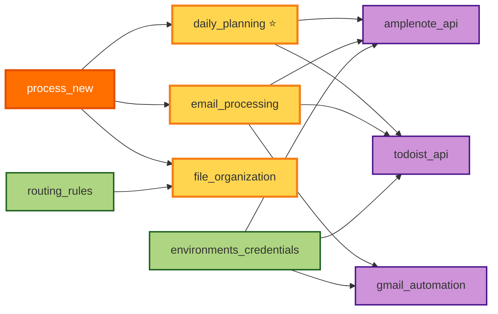
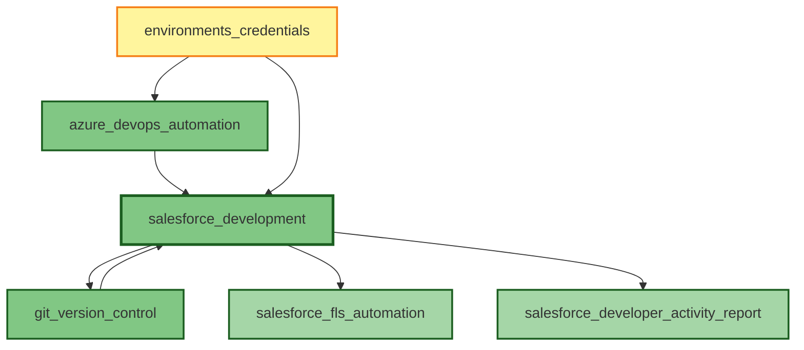
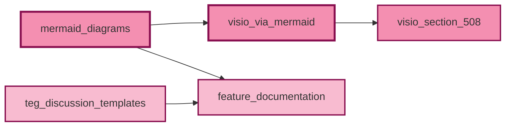
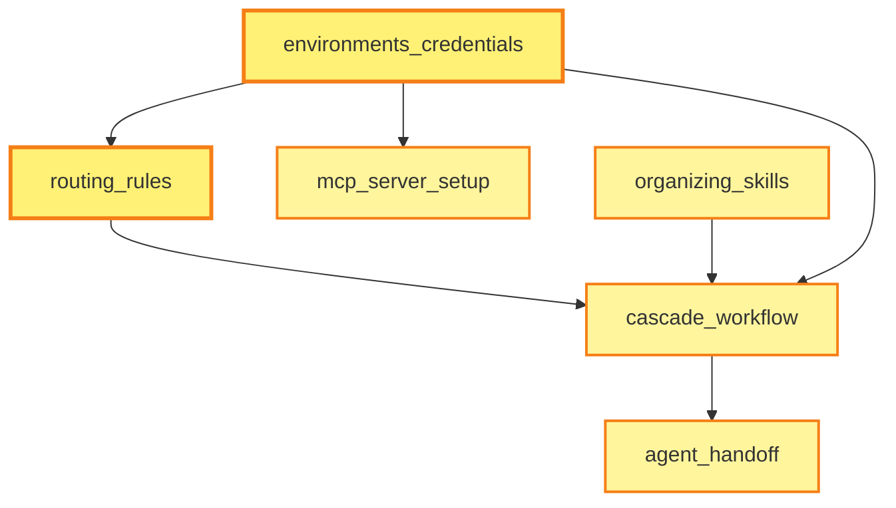
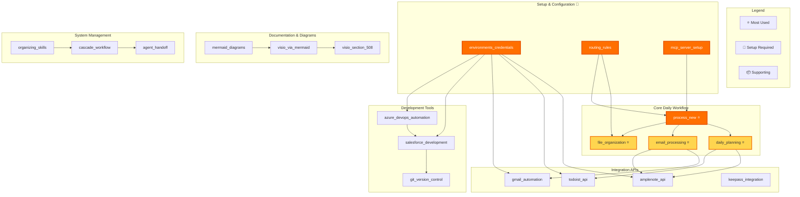
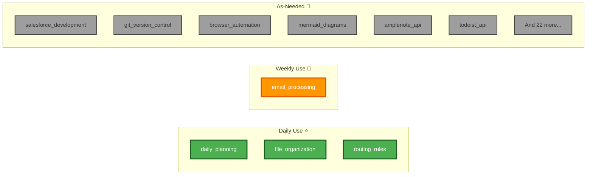

# Skills Organization Diagram

Complete visual map of all 32 AI skills organized by category.

---

## Skills Overview Diagram

```mermaid
graph TB
    Root["📁 06_Skills<br/>32 AI Skills<br/>5 Categories"]
    
    Root --> Automation["🤖 AUTOMATION<br/>7 Skills<br/>Daily Workflows"]
    Root --> Integrations["🔌 INTEGRATIONS<br/>5 Skills<br/>API & Services"]
    Root --> Development["💻 DEVELOPMENT<br/>5 Skills<br/>Dev Tools"]
    Root --> Documentation["📝 DOCUMENTATION<br/>8 Skills<br/>Templates & Diagrams"]
    Root --> System["⚙️ SYSTEM<br/>7 Skills<br/>Core Configuration"]
    
    %% Automation Skills
    Automation --> A1["daily_planning ⭐<br/>Kanban board generation"]
    Automation --> A2["email_processing<br/>Automated email handling"]
    Automation --> A3["file_organization<br/>PARA method filing"]
    Automation --> A4["browser_automation<br/>Playwright web automation"]
    Automation --> A5["powershell_automation<br/>PowerShell scripting"]
    Automation --> A6["torrent_downloads<br/>Torrent management"]
    Automation --> A7["archive_parts_recovery<br/>Archive recovery"]
    
    %% Integration Skills
    Integrations --> I1["amplenote_api<br/>Amplenote integration"]
    Integrations --> I2["amplenote_relay_systems<br/>Advanced relay configs"]
    Integrations --> I3["gmail_automation<br/>Gmail API setup"]
    Integrations --> I4["todoist_api<br/>Task management API"]
    Integrations --> I5["keepass_integration<br/>Password manager"]
    
    %% Development Skills
    Development --> D1["salesforce_development<br/>Apex & LWC"]
    Development --> D2["salesforce_fls_automation<br/>Field-level security"]
    Development --> D3["salesforce_developer_activity_report<br/>Activity tracking"]
    Development --> D4["git_version_control<br/>Git workflows"]
    Development --> D5["azure_devops_automation<br/>ADO work items"]
    
    %% Documentation Skills
    Documentation --> Doc1["mermaid_diagrams<br/>Diagram syntax"]
    Documentation --> Doc2["visio_via_mermaid<br/>Mermaid to Visio"]
    Documentation --> Doc3["visio_section_508<br/>Accessible diagrams"]
    Documentation --> Doc4["visio_grant_lifecycle_diagram<br/>Grant diagrams"]
    Documentation --> Doc5["teg_discussion_templates<br/>TEG templates"]
    Documentation --> Doc6["feature_documentation<br/>Doc standards"]
    Documentation --> Doc7["qif_dndd_fillable_forms_visio_spec<br/>QIF forms"]
    Documentation --> Doc8["teg_discussion_template_alt<br/>Alt TEG template"]
    
    %% System Skills
    System --> S1["routing_rules<br/>System routing"]
    System --> S2["environments_credentials<br/>Credential management"]
    System --> S3["cascade_workflow<br/>AI workflow patterns"]
    System --> S4["process_new<br/>Process new items"]
    System --> S5["agent_handoff<br/>Agent protocols"]
    System --> S6["mcp_server_setup<br/>MCP configuration"]
    System --> S7["organizing_skills<br/>Skill organization"]
    
    %% Styling
    style Root fill:#e1f5fe,stroke:#01579b,stroke-width:3px
    style Automation fill:#fff3e0,stroke:#e65100,stroke-width:2px
    style Integrations fill:#f3e5f5,stroke:#4a148c,stroke-width:2px
    style Development fill:#e8f5e9,stroke:#1b5e20,stroke-width:2px
    style Documentation fill:#fce4ec,stroke:#880e4f,stroke-width:2px
    style System fill:#fff9c4,stroke:#f57f17,stroke-width:2px
    
    style A1 fill:#ffe0b2,stroke:#e65100
    style A2 fill:#ffe0b2,stroke:#e65100
    style A3 fill:#ffe0b2,stroke:#e65100
    style A4 fill:#ffe0b2,stroke:#e65100
    style A5 fill:#ffe0b2,stroke:#e65100
    style A6 fill:#ffe0b2,stroke:#e65100
    style A7 fill:#ffe0b2,stroke:#e65100
    
    style I1 fill:#e1bee7,stroke:#4a148c
    style I2 fill:#e1bee7,stroke:#4a148c
    style I3 fill:#e1bee7,stroke:#4a148c
    style I4 fill:#e1bee7,stroke:#4a148c
    style I5 fill:#e1bee7,stroke:#4a148c
    
    style D1 fill:#c8e6c9,stroke:#1b5e20
    style D2 fill:#c8e6c9,stroke:#1b5e20
    style D3 fill:#c8e6c9,stroke:#1b5e20
    style D4 fill:#c8e6c9,stroke:#1b5e20
    style D5 fill:#c8e6c9,stroke:#1b5e20
    
    style Doc1 fill:#f8bbd0,stroke:#880e4f
    style Doc2 fill:#f8bbd0,stroke:#880e4f
    style Doc3 fill:#f8bbd0,stroke:#880e4f
    style Doc4 fill:#f8bbd0,stroke:#880e4f
    style Doc5 fill:#f8bbd0,stroke:#880e4f
    style Doc6 fill:#f8bbd0,stroke:#880e4f
    style Doc7 fill:#f8bbd0,stroke:#880e4f
    style Doc8 fill:#f8bbd0,stroke:#880e4f
    
    style S1 fill:#fff59d,stroke:#f57f17
    style S2 fill:#fff59d,stroke:#f57f17
    style S3 fill:#fff59d,stroke:#f57f17
    style S4 fill:#fff59d,stroke:#f57f17
    style S5 fill:#fff59d,stroke:#f57f17
    style S6 fill:#fff59d,stroke:#f57f17
    style S7 fill:#fff59d,stroke:#f57f17
```

---

## Skill Relationships Diagram

---

## Development Skills Workflow

---

## Documentation Skills Workflow

---

## System Configuration Flow

---

## Complete Skill Dependencies

---

## Skills by Frequency of Use

---

**Last Updated:** March 1, 2026  
**Total Skills:** 32  
**Location:** `G:\My Drive\06_Skills\SKILLS_DIAGRAM.md`
