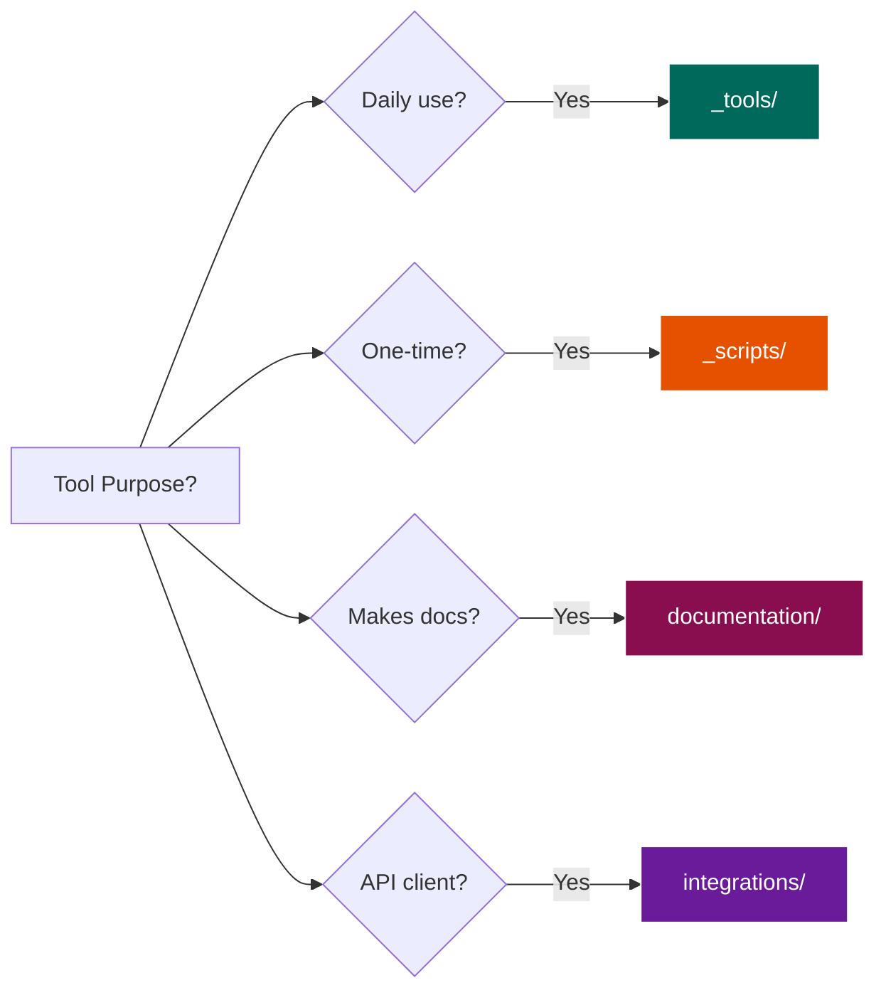

# SKILL: Quick Tool Filing

**Fast-track workflow for AI agents to file tools in under 30 seconds.**

**Last Updated:** March 1, 2026  
**Version:** 2.0.0  
**Category:** Tools  
**Complexity:** Simple

---

## What This Skill Does

Provides a rapid decision workflow to file new tools in the correct Skills repository location without extensive analysis.

## When to Use This Skill

- **User says:** "Quick file this"
- **User says:** "Where does this go?" (and you need a fast answer)
- **User uploads:** A single file that needs immediate filing
- **Trigger:** Simple, obvious filing decisions
- **Use instead of:** `skill_tool_filing.md` when speed is prioritized over detailed analysis

## What You'll Need

- Tool file or description
- One-sentence answer to: "What's the primary purpose?"

---

## Workflow: Quick File a Tool

### Step 1: Ask One Question

**Ask user:** "What's the primary purpose of this tool?"

### Step 2: Match to Pattern

**Decision Table:**

| If Purpose Is... | Then File In... | Example |
|------------------|-----------------|---------|
| Daily automation | `${SKILLS_ROOT}/_tools/` | Email → Tasks workflow |
| One-time utility | `${SKILLS_ROOT}/_scripts/` | Data cleanup |
| Documentation | `${SKILLS_ROOT}/documentation/` | Diagram converter |
| API wrapper | `${SKILLS_ROOT}/integrations/` | Notion client |
| Dev setup | `${SKILLS_ROOT}/development/` | Linter config |
| Workflow | `${SKILLS_ROOT}/automation/` | Multi-step process |
| System config | `${SKILLS_ROOT}/system/` | Environment setup |

### Step 3: Execute Filing

**Run the appropriate command:**

```bash
# Move file to determined location
mv {tool_file} {folder_from_table}
```

### Step 4: Confirm with User

**Output:**
```
✅ Filed: {tool_name}
📁 Location: {folder}
💡 Reason: {purpose}
```

---

## Quick Reference Patterns

**Visual Decision Guide:**



### Pattern Recognition

**Daily Planning Tools → `_tools/`**
- ✅ Runs regularly (scheduled)
- ✅ Part of daily workflow
- ✅ Integrates multiple services
- 📝 Examples: `run_process_new_v2.py`, `scheduler.py`

**Documentation Tools → `documentation/`**
- ✅ Creates/converts docs
- ✅ Generates diagrams
- ✅ Format conversion
- 📝 Examples: `mermaid_to_visio.py`

**Utility Scripts → `_scripts/`**
- ✅ Run manually when needed
- ✅ One-time or occasional use
- ✅ Testing/debugging helpers
- 📝 Examples: `cleanup_old_tasks.py`

**API Integrations → `integrations/`**
- ✅ Reusable API client
- ✅ Service wrapper
- ✅ Used by multiple tools
- 📝 Examples: `notion_client.py`

---

## AI Agent Instructions

**Quick filing workflow (30 seconds or less):**

1. **Ask:** "What's the primary purpose?"
2. **Match:** Use decision table to find folder
3. **Execute:** Move file with `mv` command
4. **Confirm:** Output location and reason

**When uncertain:**
- Default to `_scripts/` (can move later)
- Escalate to `skill_tool_filing.md` for complex cases

**Output format:**
```
✅ Filed: {filename}
📁 Location: ${SKILLS_ROOT}/{folder}/
💡 Reason: {one-line explanation}

📖 For detailed filing, use: skill_tool_filing.md
```

---

## Related Skills

- **skill_tool_filing.md** - Complete filing workflow with detailed analysis
- **skill_organizing_skills.md** - Overall repository organization

---

## Changelog

- **2026-03-01:** Converted to actionable AI agent skill
- **2026-03-01:** Added visual decision flowchart
- **2026-03-01:** Added step-by-step workflow with commands
- **2026-03-01:** Added AI agent instructions and output format
