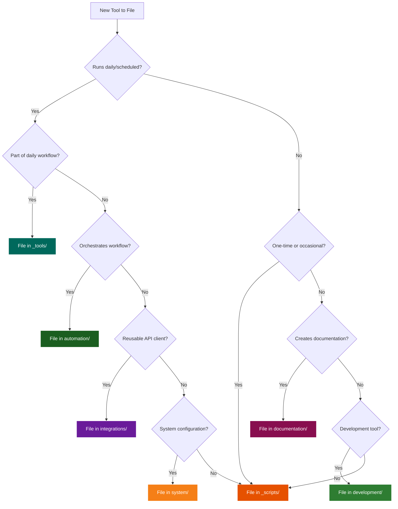

# SKILL: Tool Filing and Organization

**Actionable workflow for AI agents to correctly file new tools in the Skills repository.**

**Last Updated:** March 1, 2026  
**Version:** 2.0.0  
**Category:** Tools

---

## What This Skill Does

Automatically determines the correct location for new tools, scripts, and integrations in the Skills repository based on their purpose, usage pattern, and dependencies.

## When to Use This Skill

- **User says:** "Where should I put this new tool?"
- **User says:** "File this script for me"
- **User says:** "Organize this integration"
- **User creates:** A new Python script, Node.js tool, or automation
- **Trigger:** Any new file that needs to be added to the Skills repository

## What You'll Need

- Access to `${SKILLS_ROOT}/` directory
- Information about the tool's purpose and usage
- Understanding of the tool's dependencies and integrations

---

## Workflow: File a New Tool

### Step 1: Analyze the Tool

**Ask the user these questions:**

1. **What does this tool do?** (primary function)
2. **When will you use it?** (daily, weekly, as-needed, one-time)
3. **What does it integrate with?** (APIs, services, other tools)
4. **Who/what triggers it?** (user, schedule, automation)

### Step 2: Determine Folder Using Decision Tree

**Decision Logic:**



---

## Folder Structure

### **_tools/** - Daily Planning & Automation
**Purpose:** Tools that run regularly for daily operations

**Examples:**
- Email analysis and task generation
- Calendar integration
- Todoist automation
- Amplenote note creation
- Daily planning workflows

**When to use:**
- ✅ Runs on schedule (daily, hourly)
- ✅ Part of daily workflow
- ✅ Integrates multiple services
- ✅ Produces actionable outputs

**Current tools:**
- `run_process_new_v2.py` - Main daily planning workflow
- `scheduler.py` - Automated scheduling
- `auth_manager.py` - Credential management
- `gmail_tools.py`, `todoist_tools.py`, `calendar_tools.py` - API integrations

---

### **_scripts/** - Utility Scripts
**Purpose:** One-off or occasional utility scripts

**Examples:**
- Data cleanup scripts
- Migration tools
- Testing utilities
- Debugging helpers

**When to use:**
- ✅ Run manually when needed
- ✅ Not part of regular workflow
- ✅ Utility/helper function
- ✅ Temporary or experimental

**File naming:** `{action}_{target}.py`
- `cleanup_old_tasks.py`
- `migrate_notes.py`
- `test_api_connection.py`

---

### **automation/** - Workflow Automation
**Purpose:** Automated workflows and process orchestration

**Examples:**
- Multi-step workflows
- Process automation
- Batch operations
- Scheduled tasks

**When to use:**
- ✅ Orchestrates multiple tools
- ✅ Complex workflow with steps
- ✅ Scheduled automation
- ✅ Business process automation

**Structure:**
```
automation/
├── workflow_name/
│   ├── README.md
│   ├── workflow.py
│   └── config.yaml
```

---

### **integrations/** - API Integrations
**Purpose:** Standalone API integration libraries

**Examples:**
- API client libraries
- Service wrappers
- Integration modules
- Data connectors

**When to use:**
- ✅ Reusable API client
- ✅ Service integration
- ✅ Can be used by multiple tools
- ✅ Well-defined interface

**Structure:**
```
integrations/
├── service_name/
│   ├── README.md
│   ├── client.py
│   ├── models.py
│   └── tests/
```

---

### **development/** - Development Tools
**Purpose:** Development setup, configs, and tooling

**Examples:**
- IDE configurations
- Linters and formatters
- Build scripts
- Development utilities

**When to use:**
- ✅ Development environment setup
- ✅ Code quality tools
- ✅ Build/deploy scripts
- ✅ Developer utilities

**Examples:**
- `.vscode/` settings
- `pyproject.toml`
- `setup.py`
- `Makefile`

---

### **documentation/** - Documentation Tools
**Purpose:** Tools for creating and managing documentation

**Examples:**
- Diagram generators
- Documentation converters
- Template generators
- Report builders

**When to use:**
- ✅ Creates documentation
- ✅ Converts formats
- ✅ Generates diagrams
- ✅ Documentation workflow

**Current tools:**
- `diagram-tools/mermaid_to_visio.py` - Convert Mermaid to Visio
- `document-processing/` - DOCX, PPTX, PDF, XLSX creation and editing

**Structure:**
```
documentation/
├── diagram-tools/
├── document-processing/
├── report-generators/
└── template-tools/
```

---

### **system/** - System Configuration
**Purpose:** System setup, configuration, and maintenance

**Examples:**
- System setup scripts
- Configuration management
- Environment setup
- System utilities

**When to use:**
- ✅ System configuration
- ✅ Environment setup
- ✅ System maintenance
- ✅ Infrastructure setup

---

### Step 3: Execute Filing Action

**Based on decision tree result, execute the appropriate action:**

#### Action: File in `_tools/`
```bash
# Move/copy tool to _tools directory
mv {tool_file} ${SKILLS_ROOT}/_tools/
```
**Reason:** Daily automation, scheduled tasks, multi-service integration

#### Action: File in `_scripts/`
```bash
# Move/copy script to _scripts directory
mv {tool_file} ${SKILLS_ROOT}/_scripts/
```
**Reason:** One-time utility, occasional use, testing/debugging

#### Action: File in `automation/`
```bash
# Create workflow directory
mkdir -p ${SKILLS_ROOT}/automation/{workflow_name}
mv {tool_files} ${SKILLS_ROOT}/automation/{workflow_name}/
```
**Reason:** Multi-step workflow, process orchestration

#### Action: File in `integrations/`
```bash
# Create integration directory
mkdir -p ${SKILLS_ROOT}/integrations/{service_name}
mv {tool_files} ${SKILLS_ROOT}/integrations/{service_name}/
```
**Reason:** Reusable API client, service wrapper

#### Action: File in `documentation/`
```bash
# File in appropriate documentation subfolder
mv {tool_file} ${SKILLS_ROOT}/documentation/{subfolder}/
```
**Reason:** Creates/converts documentation, generates diagrams

#### Action: File in `development/`
```bash
# Move to development tools
mv {tool_file} ${SKILLS_ROOT}/development/
```
**Reason:** Development setup, linters, build scripts

#### Action: File in `system/`
```bash
# Move to system configuration
mv {tool_file} ${SKILLS_ROOT}/system/
```
**Reason:** System setup, configuration management

### Step 4: Organize File Structure

**Determine structure based on complexity:**

**Single file tool:**
```
folder/
└── tool_name.py
```

**Multi-file tool:**
```
folder/
└── tool_name/
    ├── README.md
    ├── main.py
    ├── config.yaml
    └── tests/
```

**Complex tool:**
```
folder/
└── tool_name/
    ├── README.md
    ├── src/
    │   ├── __init__.py
    │   ├── main.py
    │   └── utils.py
    ├── tests/
    ├── docs/
    └── config/
```

### Step 5: Create Documentation

**Execute: Create README.md**

```bash
# Navigate to tool directory
cd ${SKILLS_ROOT}/{folder}/{tool_name}/

# Create README.md
cat > README.md << 'EOF'
# {Tool Name}

{Brief description of what it does}

## Purpose

{Why this tool exists and what problem it solves}

## Usage

```bash
python tool_name.py [options]
```

## Prerequisites

- Python 3.8+
- Dependencies: `pip install -r requirements.txt`
- API Keys: {List required keys}

## Configuration

{Environment variables or config files needed}

## When to Use

- {Trigger condition 1}
- {Trigger condition 2}

EOF
```

### Step 6: Update Skills Index

**If this is a new skill (not just a tool), update the README.md:**

```bash
# Add to appropriate category in ${SKILLS_ROOT}/README.md
# Update skill count
# Add to Skills Organization Diagram if it's a ⭐ featured skill
```

---

## Examples

### Example 1: Email Analysis Tool

**Question:** Where does `analyze_emails.py` go?

**Analysis:**
- **Purpose:** Analyzes emails for daily planning
- **Frequency:** Daily, automated
- **Integration:** Gmail API, OpenRouter
- **Output:** Todoist tasks

**Answer:** `_tools/analyze_emails.py`
- Part of daily workflow
- Runs automatically
- Integrates multiple services

---

### Example 2: Document Processing Skills

**Question:** Where do DOCX/PPTX/PDF/XLSX skills go?

**Analysis:**
- **Purpose:** Create, edit, and analyze office documents
- **Frequency:** As needed for documentation
- **Integration:** Standalone libraries (python-docx, pypdf, openpyxl)
- **Output:** Documents, reports, presentations

**Answer:** `documentation/document-processing/`
- Creates documentation
- Converts formats
- Documentation workflow
- Not part of daily automation

---

### Example 3: Mermaid to Visio Converter

**Question:** Where does `mermaid_to_visio.py` go?

**Analysis:**
- **Purpose:** Converts diagram formats
- **Frequency:** As needed
- **Integration:** None (standalone)
- **Output:** Documentation files

**Answer:** `documentation/diagram-tools/mermaid_to_visio.py`
- Creates documentation
- Not part of daily workflow
- Documentation-focused

---

### Example 3: API Client Library

**Question:** Where does `notion_client.py` go?

**Analysis:**
- **Purpose:** Notion API wrapper
- **Frequency:** Used by other tools
- **Integration:** Notion API
- **Output:** Reusable library

**Answer:** `integrations/notion/client.py`
- Reusable API client
- Can be imported by multiple tools
- Well-defined interface

---

### Example 4: One-time Migration Script

**Question:** Where does `migrate_old_notes.py` go?

**Analysis:**
- **Purpose:** Migrate data once
- **Frequency:** One-time use
- **Integration:** Amplenote
- **Output:** Migrated data

**Answer:** `_scripts/migrate_old_notes.py`
- One-time utility
- Not part of regular workflow
- Temporary/maintenance script

---

## Best Practices

### 1. **One Tool, One Purpose**
Each tool should have a clear, single purpose. If a tool does multiple things, consider splitting it.

### 2. **Reusable Components**
If code is used by multiple tools, extract it to `integrations/` or create a shared library.

### 3. **Configuration Separate from Code**
Use config files (`config.yaml`, `.env`) instead of hardcoding values.

### 4. **Document Dependencies**
Always include `requirements.txt` or document dependencies in README.

### 5. **Version Control**
Keep development in Git repos (like CascadeProjects), copy stable versions to Skills folder.

### 6. **Naming Conventions**

**Files:**
- Use snake_case: `analyze_emails.py`
- Be descriptive: `convert_mermaid_to_visio.py` not `convert.py`
- Include action: `create_`, `update_`, `delete_`, `analyze_`

**Folders:**
- Use kebab-case: `diagram-tools/`
- Be specific: `email-analysis/` not `tools/`

### 7. **README Template**

```markdown
# Tool Name

One-line description.

## Purpose

Why this tool exists and what problem it solves.

## Usage

\`\`\`bash
python tool_name.py --option value
\`\`\`

## Prerequisites

- Python 3.8+
- Node.js (if needed)
- API keys: List what's needed

## Configuration

How to configure (environment variables, config files).

## Examples

Common use cases with examples.

## Troubleshooting

Common issues and solutions.
```

---

## Maintenance

### Moving Tools

If you realize a tool is in the wrong place:

1. **Create new location**
2. **Copy files** (don't move yet)
3. **Update references** in other tools
4. **Test** that everything works
5. **Delete old location**
6. **Update documentation**

### Deprecating Tools

When a tool is no longer needed:

1. **Move to** `05_Archive/tools/`
2. **Document why** it was deprecated
3. **Note replacement** if applicable
4. **Keep for reference** (don't delete immediately)

---

## Quick Reference

| Tool Type | Folder | Example |
|-----------|--------|---------|
| Daily automation | `_tools/` | Email analysis |
| Utility script | `_scripts/` | Data cleanup |
| Workflow | `automation/` | Multi-step process |
| API client | `integrations/` | Service wrapper |
| Dev tool | `development/` | Linter config |
| Doc tool | `documentation/` | Diagram converter |
| System setup | `system/` | Environment setup |

---

## Getting Help

**Still not sure where to file a tool?**

Ask these questions:
1. Is it part of my daily workflow? → `_tools/`
2. Is it a one-time utility? → `_scripts/`
3. Is it reusable by other tools? → `integrations/`
4. Does it create documentation? → `documentation/`
5. Is it for development? → `development/`

**When in doubt:** Start in `_scripts/`, move later if it becomes part of regular workflow.

---

---

## Private/Sensitive Content

Some content should not be documented in public-facing skills:

### Media Files
For organizing media (videos, pictures, audio, magazines), see:
**`G:\My Drive\04_Resources\Media\HOW_TO_FILE_MEDIA.md`**

This guide covers:
- Video organization (movies, TV shows, documentaries, tutorials)
- Picture management (photos, screenshots, wallpapers)
- Audio filing (music, podcasts, audiobooks)
- Magazine and document organization
- Privacy considerations for sensitive media

**Privacy Rule:** When creating skills or documentation that might be shared, reference the media filing guide generically without listing specific folder names.

---

---

## AI Agent Instructions

**When user requests filing a tool:**

1. **Gather information** - Ask the 4 key questions (Step 1)
2. **Apply decision tree** - Use the flowchart logic (Step 2)
3. **Execute filing** - Move files to correct location (Step 3)
4. **Organize structure** - Single file vs multi-file (Step 4)
5. **Create README** - Document the tool (Step 5)
6. **Update index** - Add to README if it's a skill (Step 6)

**Output to user:**
- Chosen location and reasoning
- File structure created
- README.md content
- Next steps (if any)

---

## Changelog

- **2026-03-01:** Converted to actionable AI agent skill
- **2026-03-01:** Added decision tree flowchart diagram
- **2026-03-01:** Added step-by-step workflow with commands
- **2026-03-01:** Added AI agent instructions section
