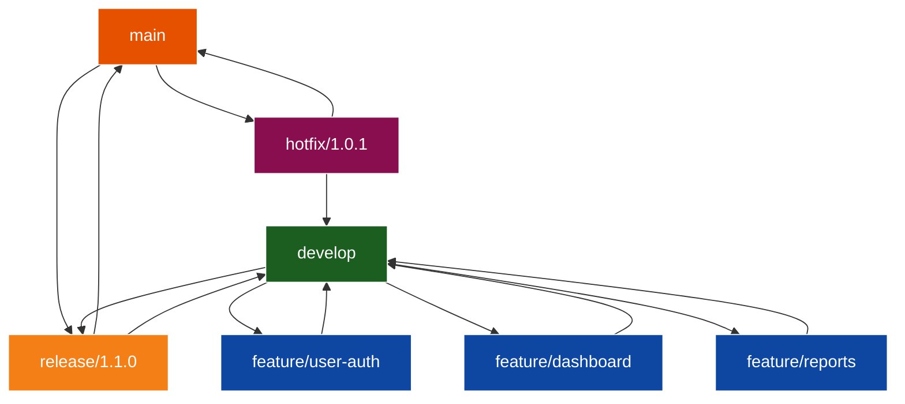
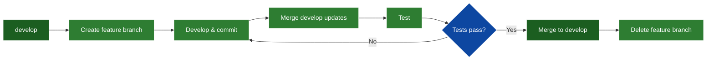

# GitFlow Workflow

Comprehensive guide for using the GitFlow branching strategy for development projects.

---

## Overview

GitFlow is a branching model for Git that defines a strict branching structure designed around project releases. It provides a robust framework for managing larger projects with scheduled releases.

---

## When to Use

### ✅ Use GitFlow When:
- Working on projects with scheduled releases
- Managing multiple versions in production
- Need clear separation between development and production
- Team collaboration with multiple developers
- Require hotfix capability for production issues

### ❌ Don't Use GitFlow When:
- Continuous deployment (use GitHub Flow instead)
- Small projects with single developer
- Rapid iteration without formal releases
- Simple feature-based development

---

## Branch Types

### Main Branches (Permanent)

**1. `main` (or `master`)**
- Production-ready code only
- Every commit is a release
- Tagged with version numbers
- Never commit directly to main

**2. `develop`**
- Integration branch for features
- Latest development changes
- Base for feature branches
- Reflects next release state

### Supporting Branches (Temporary)

**3. Feature Branches**
- Branch from: `develop`
- Merge back to: `develop`
- Naming: `feature/*` or `feature/TICKET-123-description`
- Purpose: New features and enhancements

**4. Release Branches**
- Branch from: `develop`
- Merge to: `main` AND `develop`
- Naming: `release/*` or `release/1.2.0`
- Purpose: Prepare for production release

**5. Hotfix Branches**
- Branch from: `main`
- Merge to: `main` AND `develop`
- Naming: `hotfix/*` or `hotfix/1.2.1`
- Purpose: Critical production fixes

---

## GitFlow Diagram



---

## Complete Workflow

### Initial Setup

```bash
# Clone repository
git clone https://github.com/username/project.git
cd project

# Create develop branch (if doesn't exist)
git checkout -b develop
git push -u origin develop

# Verify branches
git branch -a
```

---

### Feature Development Workflow

#### Step 1: Start New Feature

```bash
# Update develop branch
git checkout develop
git pull origin develop

# Create feature branch
git checkout -b feature/user-authentication

# Verify branch
git branch
```

#### Step 2: Develop Feature

```bash
# Make changes
vim src/auth.py

# Commit regularly
git add src/auth.py
git commit -m "Add user authentication module"

# Push to remote (for backup/collaboration)
git push -u origin feature/user-authentication
```

#### Step 3: Complete Feature

```bash
# Update with latest develop
git checkout develop
git pull origin develop
git checkout feature/user-authentication
git merge develop

# Resolve conflicts if any
# Test thoroughly

# Merge to develop
git checkout develop
git merge --no-ff feature/user-authentication

# Push develop
git push origin develop

# Delete feature branch
git branch -d feature/user-authentication
git push origin --delete feature/user-authentication
```

**Feature Branch Lifecycle:**


---

### Release Workflow

#### Step 1: Create Release Branch

```bash
# When develop is ready for release
git checkout develop
git pull origin develop

# Create release branch
git checkout -b release/1.2.0

# Update version numbers
vim package.json  # Update version to 1.2.0
vim CHANGELOG.md  # Add release notes

git add .
git commit -m "Bump version to 1.2.0"

# Push release branch
git push -u origin release/1.2.0
```

#### Step 2: Release Testing & Bug Fixes

```bash
# Fix bugs found during testing
vim src/bug-fix.py
git add src/bug-fix.py
git commit -m "Fix: Resolve login issue"

# Only bug fixes allowed, no new features!
```

#### Step 3: Finalize Release

```bash
# Merge to main
git checkout main
git pull origin main
git merge --no-ff release/1.2.0
git tag -a v1.2.0 -m "Release version 1.2.0"
git push origin main --tags

# Merge back to develop
git checkout develop
git pull origin develop
git merge --no-ff release/1.2.0
git push origin develop

# Delete release branch
git branch -d release/1.2.0
git push origin --delete release/1.2.0
```

**Release Branch Lifecycle:**


---

### Hotfix Workflow

#### Step 1: Create Hotfix Branch

```bash
# Critical bug in production!
git checkout main
git pull origin main

# Create hotfix branch
git checkout -b hotfix/1.2.1

# Update version
vim package.json  # Change to 1.2.1
git add package.json
git commit -m "Bump version to 1.2.1"
```

#### Step 2: Fix the Bug

```bash
# Fix critical issue
vim src/critical-bug.py
git add src/critical-bug.py
git commit -m "Hotfix: Resolve critical security vulnerability"

# Test thoroughly
npm test
```

#### Step 3: Deploy Hotfix

```bash
# Merge to main
git checkout main
git merge --no-ff hotfix/1.2.1
git tag -a v1.2.1 -m "Hotfix version 1.2.1"
git push origin main --tags

# Merge to develop (or current release branch if exists)
git checkout develop
git merge --no-ff hotfix/1.2.1
git push origin develop

# Delete hotfix branch
git branch -d hotfix/1.2.1
git push origin --delete hotfix/1.2.1
```

**Hotfix Branch Lifecycle:**


---

## Naming Conventions

### Branch Names

```bash
# Features
feature/user-authentication
feature/JIRA-123-add-dashboard
feature/payment-integration

# Releases
release/1.2.0
release/2.0.0-beta

# Hotfixes
hotfix/1.2.1
hotfix/security-patch
hotfix/URGENT-fix-login
```

### Commit Messages

```bash
# Feature commits
feat: Add user authentication module
feat(auth): Implement OAuth2 login

# Bug fixes
fix: Resolve null pointer in user service
fix(api): Handle timeout errors gracefully

# Hotfix commits
hotfix: Patch critical security vulnerability
hotfix(db): Fix data corruption issue
```

### Version Tags

```bash
# Semantic versioning: MAJOR.MINOR.PATCH
v1.0.0    # Initial release
v1.1.0    # New features
v1.1.1    # Bug fixes
v2.0.0    # Breaking changes
```

---

## Best Practices

### 1. Never Commit Directly to Main or Develop
```bash
# ❌ Wrong
git checkout main
git commit -m "Quick fix"

# ✅ Correct
git checkout -b hotfix/quick-fix
git commit -m "Fix issue"
# Then merge via PR
```

### 2. Always Use --no-ff for Merges
```bash
# Preserves branch history
git merge --no-ff feature/my-feature

# Shows clear merge commits in history
```

### 3. Tag Every Release
```bash
# Annotated tags with messages
git tag -a v1.2.0 -m "Release 1.2.0: New features"
git push origin --tags
```

### 4. Keep Feature Branches Short-Lived
- Merge to develop within 1-2 weeks
- Avoid long-running feature branches
- Rebase regularly with develop

### 5. Test Before Merging
```bash
# Run tests before merging
npm test
npm run lint
npm run build

# Only merge if all pass
```

---

## Common Scenarios

### Scenario 1: Multiple Features in Progress

```bash
# Developer A
git checkout -b feature/user-profile
# Work on user profile

# Developer B
git checkout develop
git checkout -b feature/notifications
# Work on notifications

# Both merge to develop when complete
# No conflicts if working on different areas
```

### Scenario 2: Emergency Hotfix During Release

```bash
# Release branch exists: release/2.0.0
# Critical bug found in production

# Create hotfix from main
git checkout main
git checkout -b hotfix/2.1.1

# Fix bug
git commit -m "Hotfix: Critical bug"

# Merge to main
git checkout main
git merge --no-ff hotfix/2.1.1

# Merge to develop AND release branch
git checkout develop
git merge --no-ff hotfix/2.1.1

git checkout release/2.0.0
git merge --no-ff hotfix/2.1.1
```

### Scenario 3: Abandoned Feature

```bash
# Feature no longer needed
git checkout develop

# Delete local branch
git branch -D feature/abandoned-feature

# Delete remote branch
git push origin --delete feature/abandoned-feature
```

---

## GitFlow with Pull Requests

### Feature PR Workflow

```bash
# Create feature branch
git checkout -b feature/new-feature

# Push to remote
git push -u origin feature/new-feature

# Create PR on GitHub: feature/new-feature → develop
# Get code review
# Merge via GitHub (squash or merge commit)

# Update local
git checkout develop
git pull origin develop
git branch -d feature/new-feature
```

### Release PR Workflow

```bash
# Create release branch
git checkout -b release/1.3.0
git push -u origin release/1.3.0

# Create PR: release/1.3.0 → main
# After approval, merge to main
# Tag the release

# Create PR: release/1.3.0 → develop
# Merge back to develop
```

---

## Tools & Automation

### Git Flow CLI Tool

```bash
# Install git-flow
# Windows: choco install gitflow-avh
# Mac: brew install git-flow-avh

# Initialize in repository
git flow init

# Use git-flow commands
git flow feature start user-auth
git flow feature finish user-auth

git flow release start 1.2.0
git flow release finish 1.2.0

git flow hotfix start 1.2.1
git flow hotfix finish 1.2.1
```

### Automation Scripts

**Auto-merge script:**
```bash
#!/bin/bash
# merge-feature.sh

FEATURE_BRANCH=$1

git checkout develop
git pull origin develop
git merge --no-ff $FEATURE_BRANCH
git push origin develop
git branch -d $FEATURE_BRANCH
git push origin --delete $FEATURE_BRANCH

echo "Feature $FEATURE_BRANCH merged and deleted"
```

---

## Troubleshooting

### Issue: Forgot to Branch from Develop

```bash
# Currently on main, should be on develop
git checkout develop
git checkout -b feature/my-feature
git cherry-pick <commit-hash>  # Pick commits from main
```

### Issue: Merge Conflicts

```bash
# During merge
git merge develop
# CONFLICT in file.py

# Resolve conflicts
vim file.py  # Fix conflicts
git add file.py
git commit -m "Resolve merge conflicts"
```

### Issue: Need to Update Feature with Develop Changes

```bash
# Option 1: Merge
git checkout feature/my-feature
git merge develop

# Option 2: Rebase (cleaner history)
git checkout feature/my-feature
git rebase develop
```

---

## Related Skills

- **[git_version_control](skill_git_version_control.md)** - Basic Git workflows
- **[skill_github_pull_requests](skill_github_pull_requests.md)** - GitHub PR workflow
- **[salesforce_development](skill_salesforce_development.md)** - Uses GitFlow
- **[azure_devops_automation](skill_azure_devops_automation.md)** - CI/CD integration

---

## Quick Reference

### Feature Flow
```bash
git checkout develop
git checkout -b feature/my-feature
# ... work ...
git checkout develop
git merge --no-ff feature/my-feature
git branch -d feature/my-feature
```

### Release Flow
```bash
git checkout -b release/1.2.0
# ... version bump & testing ...
git checkout main
git merge --no-ff release/1.2.0
git tag -a v1.2.0 -m "Release 1.2.0"
git checkout develop
git merge --no-ff release/1.2.0
git branch -d release/1.2.0
```

### Hotfix Flow
```bash
git checkout main
git checkout -b hotfix/1.2.1
# ... fix ...
git checkout main
git merge --no-ff hotfix/1.2.1
git tag -a v1.2.1 -m "Hotfix 1.2.1"
git checkout develop
git merge --no-ff hotfix/1.2.1
git branch -d hotfix/1.2.1
```

---

## Changelog

- **2026-03-01:** Created GitFlow workflow skill

---

**Location:** `G:\My Drive\06_Skills\development\skill_gitflow_workflow.md`  
**Category:** Development  
**Difficulty:** Intermediate  
**Time:** Ongoing workflow
