# GitHub Pull Requests for Skills Updates

Complete guide for updating skills using GitHub pull requests and collaboration workflows.

---

## Overview

This skill covers how to contribute to the Skills repository using GitHub pull requests, including forking, branching, committing, and submitting changes for review.

---

## When to Use

- Contributing new skills to the repository
- Updating existing skill documentation
- Fixing errors or improving clarity
- Adding examples or use cases
- Collaborating with team members on skills

---

## Prerequisites

- Git installed and configured
- GitHub account
- Access to the Skills repository
- Basic understanding of Git commands

---

## Workflow Overview

```mermaid
graph LR
    A[Fork Repository] --> B[Clone Fork]
    B --> C[Create Branch]
    C --> D[Make Changes]
    D --> E[Commit Changes]
    E --> F[Push to Fork]
    F --> G[Create Pull Request]
    G --> H[Code Review]
    H --> I{Approved?}
    I -->|Yes| J[Merge to Main]
    I -->|No| D
    
    style A fill:#1b5e20,stroke:#ffffff,color:#ffffff
    style B fill:#2e7d32,stroke:#ffffff,color:#ffffff
    style C fill:#2e7d32,stroke:#ffffff,color:#ffffff
    style D fill:#2e7d32,stroke:#ffffff,color:#ffffff
    style E fill:#2e7d32,stroke:#ffffff,color:#ffffff
    style F fill:#2e7d32,stroke:#ffffff,color:#ffffff
    style G fill:#e65100,stroke:#ffffff,color:#ffffff
    style H fill:#2e7d32,stroke:#ffffff,color:#ffffff
    style I fill:#0d47a1,stroke:#ffffff,color:#ffffff
    style J fill:#1b5e20,stroke:#ffffff,color:#ffffff
```



---

## Step-by-Step Guide

### Step 1: Fork the Repository

**If working with a remote repository:**

1. Navigate to the Skills repository on GitHub
2. Click "Fork" button in top-right corner
3. Select your account as the destination
4. Wait for fork to complete

**Command Line Alternative:**
```bash
# Clone the original repository
git clone https://github.com/adourish/skills.git
cd skills

# Add your fork as a remote
git remote add fork https://github.com/YOUR_USERNAME/skills.git
```

---

### Step 2: Clone Your Fork

```bash
# Clone your forked repository
git clone https://github.com/YOUR_USERNAME/skills.git
cd skills

# Add upstream remote (original repository)
git remote add upstream https://github.com/adourish/skills.git

# Verify remotes
git remote -v
```

**Expected Output:**
```
origin    https://github.com/YOUR_USERNAME/skills.git (fetch)
origin    https://github.com/YOUR_USERNAME/skills.git (push)
upstream  https://github.com/adourish/skills.git (fetch)
upstream  https://github.com/adourish/skills.git (push)
```

---

### Step 3: Create a Feature Branch

**Branch Naming Convention:**
- `feature/skill-name` - New skills
- `update/skill-name` - Updates to existing skills
- `fix/issue-description` - Bug fixes
- `docs/topic` - Documentation updates

```bash
# Update your main branch first
git checkout main
git pull upstream main

# Create and switch to new branch
git checkout -b feature/add-gitflow-skill

# Verify you're on the new branch
git branch
```

---

### Step 4: Make Your Changes

**For New Skills:**

1. Create skill file in appropriate folder:
   ```bash
   # Example: New development skill
   touch development/skill_gitflow_workflow.md
   ```

2. Follow skill template structure:
   ```markdown
   # Skill Name
   
   Brief description
   
   ## Overview
   ## When to Use
   ## Prerequisites
   ## Step-by-Step Guide
   ## Examples
   ## Best Practices
   ## Troubleshooting
   ## Related Skills
   ```

3. Add to appropriate category in README.md

**For Updating Skills:**

1. Open existing skill file
2. Make necessary changes
3. Update changelog section
4. Verify all links still work

---

### Step 5: Commit Your Changes

**Best Practices for Commits:**

- Write clear, descriptive commit messages
- Use present tense ("Add skill" not "Added skill")
- Reference issues if applicable
- Keep commits focused and atomic

```bash
# Check what files changed
git status

# Stage specific files
git add development/skill_gitflow_workflow.md
git add README.md

# Or stage all changes
git add .

# Commit with descriptive message
git commit -m "Add GitFlow workflow skill

- Created comprehensive guide for GitFlow branching strategy
- Included diagrams for feature, release, and hotfix flows
- Added examples for common scenarios
- Updated README with new skill reference"

# View commit history
git log --oneline -5
```

**Commit Message Format:**
```
<type>: <subject>

<body>

<footer>
```

**Types:**
- `feat:` New feature/skill
- `fix:` Bug fix
- `docs:` Documentation update
- `style:` Formatting changes
- `refactor:` Code restructuring
- `test:` Adding tests
- `chore:` Maintenance tasks

---

### Step 6: Push to Your Fork

```bash
# Push branch to your fork
git push origin feature/add-gitflow-skill

# If this is the first push, set upstream tracking
git push -u origin feature/add-gitflow-skill
```

**Expected Output:**
```
Enumerating objects: 5, done.
Counting objects: 100% (5/5), done.
Delta compression using up to 16 threads
Compressing objects: 100% (3/3), done.
Writing objects: 100% (3/3), 2.77 KiB | 1.38 MiB/s, done.
Total 3 (delta 2), reused 0 (delta 0)
To https://github.com/YOUR_USERNAME/skills.git
   3d7962c..0953c68  feature/add-gitflow-skill -> feature/add-gitflow-skill
```

---

### Step 7: Create Pull Request

**On GitHub:**

1. Navigate to your fork on GitHub
2. Click "Compare & pull request" button (appears after push)
3. Or: Go to "Pull requests" tab → "New pull request"

**Fill Out PR Template:**

```markdown
## Description
Brief description of changes

## Type of Change
- [ ] New skill
- [ ] Skill update
- [ ] Bug fix
- [ ] Documentation update

## Changes Made
- Added GitFlow workflow skill
- Updated README with new skill
- Added workflow diagrams

## Testing
- [ ] Verified all links work
- [ ] Checked markdown formatting
- [ ] Tested code examples (if applicable)
- [ ] Reviewed for typos/errors

## Related Issues
Closes #123 (if applicable)

## Screenshots
(If adding diagrams or visual changes)
```

**PR Title Format:**
```
[Category] Brief description

Examples:
[Development] Add GitFlow workflow skill
[Documentation] Update MCP Builder examples
[Fix] Correct broken links in file organization skill
```

---

### Step 8: Code Review Process

**What Reviewers Check:**

1. **Content Quality**
   - Clear and accurate information
   - Proper grammar and spelling
   - Consistent formatting
   - Complete examples

2. **Structure**
   - Follows skill template
   - Appropriate categorization
   - Proper file naming
   - Updated README

3. **Technical Accuracy**
   - Commands work as described
   - Code examples are correct
   - Links are valid
   - Dependencies noted

**Responding to Feedback:**

```bash
# Make requested changes
vim development/skill_gitflow_workflow.md

# Commit changes
git add .
git commit -m "Address review feedback

- Clarified hotfix branch process
- Added more examples
- Fixed typos"

# Push updates
git push origin feature/add-gitflow-skill
```

**PR automatically updates with new commits**

---

### Step 9: Merge and Cleanup

**After PR is Approved:**

1. Maintainer merges PR to main branch
2. Your changes are now in the main repository

**Clean Up Your Local Repository:**

```bash
# Switch back to main
git checkout main

# Update main from upstream
git pull upstream main

# Delete feature branch locally
git branch -d feature/add-gitflow-skill

# Delete feature branch on fork
git push origin --delete feature/add-gitflow-skill

# Prune remote branches
git remote prune origin
```

---

## Common Scenarios

### Scenario 1: Updating Your Branch with Latest Changes

```bash
# Fetch latest from upstream
git fetch upstream

# Merge upstream main into your branch
git checkout feature/add-gitflow-skill
git merge upstream/main

# Or rebase (cleaner history)
git rebase upstream/main

# Push updated branch
git push origin feature/add-gitflow-skill --force-with-lease
```

### Scenario 2: Fixing Conflicts

```bash
# After merge/rebase conflict
git status  # See conflicted files

# Edit files to resolve conflicts
# Look for <<<<<<< HEAD markers

# After resolving
git add <resolved-files>
git commit -m "Resolve merge conflicts"
git push origin feature/add-gitflow-skill
```

### Scenario 3: Amending Last Commit

```bash
# Make additional changes
vim skill_file.md

# Amend last commit
git add .
git commit --amend --no-edit

# Force push (only if not yet reviewed)
git push origin feature/add-gitflow-skill --force-with-lease
```

### Scenario 4: Multiple Commits to Clean Up

```bash
# Interactive rebase to squash commits
git rebase -i HEAD~3  # Last 3 commits

# In editor, change 'pick' to 'squash' for commits to combine
# Save and exit

# Force push cleaned history
git push origin feature/add-gitflow-skill --force-with-lease
```

---

## Best Practices

### 1. Keep Branches Focused
- One feature/fix per branch
- Don't mix unrelated changes
- Keep PRs small and reviewable

### 2. Write Clear Commit Messages
- First line: Brief summary (50 chars)
- Blank line
- Detailed explanation if needed
- Reference issues: "Fixes #123"

### 3. Update Regularly
- Sync with upstream frequently
- Rebase before creating PR
- Keep fork up to date

### 4. Test Before Submitting
- Verify all commands work
- Check all links
- Test code examples
- Review formatting

### 5. Respond to Reviews Promptly
- Address feedback quickly
- Ask questions if unclear
- Thank reviewers
- Update PR description if scope changes

---

## Troubleshooting

### Issue: "Your branch is behind 'upstream/main'"

```bash
git fetch upstream
git merge upstream/main
# Or: git rebase upstream/main
git push origin feature/branch-name
```

### Issue: "Permission denied (publickey)"

```bash
# Check SSH key
ssh -T git@github.com

# Or use HTTPS instead
git remote set-url origin https://github.com/YOUR_USERNAME/skills.git
```

### Issue: "Merge conflicts"

```bash
# See conflicted files
git status

# Edit files, resolve conflicts
# Remove <<<<<<< ======= >>>>>>> markers

# Mark as resolved
git add <file>
git commit
```

### Issue: "Accidentally committed to main"

```bash
# Create branch from current state
git branch feature/my-changes

# Reset main to upstream
git checkout main
git reset --hard upstream/main

# Switch to feature branch
git checkout feature/my-changes
```

---

## GitHub CLI Alternative

**Using `gh` CLI:**

```bash
# Install GitHub CLI
# Windows: winget install GitHub.cli
# Mac: brew install gh

# Authenticate
gh auth login

# Create PR from command line
gh pr create --title "Add GitFlow skill" --body "Comprehensive guide for GitFlow workflow"

# View PR status
gh pr status

# Checkout a PR locally
gh pr checkout 123

# Merge PR
gh pr merge 123 --squash
```

---

## Related Skills

- **[git_version_control](skill_git_version_control.md)** - Basic Git workflows
- **[skill_gitflow_workflow](skill_gitflow_workflow.md)** - GitFlow branching strategy
- **[skill_creator](_tools/skill-creator/README.md)** - Creating new skills
- **[HOW_TO_FILE_TOOLS](_tools/HOW_TO_FILE_TOOLS.md)** - Organizing skills

---

## Quick Reference

### Common Commands

```bash
# Setup
git clone https://github.com/YOUR_USERNAME/skills.git
git remote add upstream https://github.com/adourish/skills.git

# Create branch
git checkout -b feature/my-skill

# Commit changes
git add .
git commit -m "Add new skill"

# Push and create PR
git push origin feature/my-skill
gh pr create

# Update branch
git fetch upstream
git rebase upstream/main

# Cleanup
git checkout main
git branch -d feature/my-skill
```

---

## Changelog

- **2026-03-01:** Created GitHub pull requests skill

---

**Location:** `G:\My Drive\06_Skills\development\skill_github_pull_requests.md`  
**Category:** Development  
**Difficulty:** Intermediate  
**Time:** 15-30 minutes per PR
