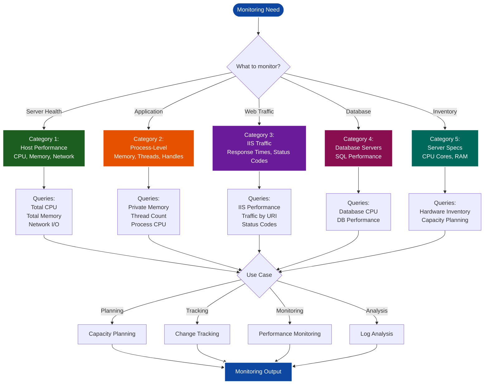
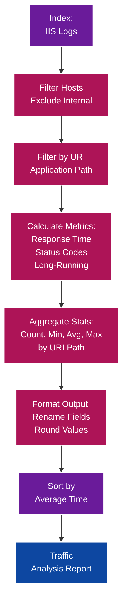
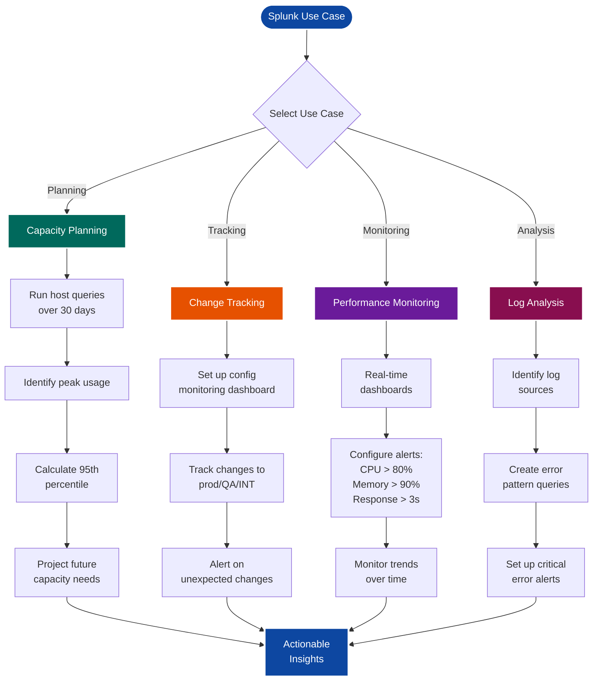

# SKILL: Splunk Monitoring

**Actionable workflow for monitoring server performance, application health, and troubleshooting issues using Splunk queries.**

**Last Updated:** March 1, 2026  
**Version:** 1.0.0  
**Category:** Development

---

## What This Skill Does

Provides comprehensive Splunk query patterns for monitoring and troubleshooting:
- Server performance monitoring (CPU, memory, network, disk)
- Process-level resource tracking
- IIS web traffic analysis
- Database server monitoring
- Application performance metrics
- Log analysis and alerting

**Use Cases:**
- Capacity planning for production/QA/UAT environments
- Performance troubleshooting and optimization
- Change tracking and configuration monitoring
- Real-time alerting for performance issues
- Historical trend analysis

## When to Use This Skill

- **User says:** "Monitor server performance with Splunk"
- **User says:** "Check CPU/memory usage in Splunk"
- **User says:** "Analyze IIS traffic patterns"
- **User says:** "Find slow-running processes"
- **Trigger:** Performance issues, capacity planning, or troubleshooting

## What You'll Need

- Splunk access with appropriate index permissions
- Knowledge of target environment (prod, QA, UAT)
- Application names and host identifiers
- Index names for metrics and logs

---

## Visual Overview: Splunk Monitoring Workflow

### Query Category Selection Guide



---

### Host Performance Monitoring Flow

```mermaid
graph LR
    Index[Index:<br/>windows_metrics] --> MStats[mstats command]
    MStats --> Metrics[Collect Metrics:<br/>CPU, Memory,<br/>Disk, Network]
    Metrics --> Group[Group by Host]
    Group --> Eval[Evaluate & Round]
    Eval --> Chart[Timechart<br/>5-min intervals]
    Chart --> Output[Performance<br/>Dashboard]
    
    style Index fill:#1b5e20,stroke:#ffffff,stroke-width:2px,color:#ffffff
    style MStats fill:#2e7d32,stroke:#ffffff,color:#ffffff
    style Metrics fill:#2e7d32,stroke:#ffffff,color:#ffffff
    style Group fill:#2e7d32,stroke:#ffffff,color:#ffffff
    style Eval fill:#2e7d32,stroke:#ffffff,color:#ffffff
    style Chart fill:#1b5e20,stroke:#ffffff,stroke-width:2px,color:#ffffff
    style Output fill:#0d47a1,stroke:#ffffff,stroke-width:3px,color:#ffffff
```



---

### IIS Traffic Analysis Flow



---

### Splunk Use Cases Workflow



---

### Query Optimization Strategy

```mermaid
graph LR
    Query[Splunk Query] --> Check1{Specific<br/>Time Range?}
    Check1 -->|No| Fix1[Add time range:<br/>earliest=-24h]
    Check1 -->|Yes| Check2{Filter<br/>Early?}
    
    Fix1 --> Check2
    Check2 -->|No| Fix2[Move filters<br/>before aggregation]
    Check2 -->|Yes| Check3{Use<br/>Indexed Fields?}
    
    Fix2 --> Check3
    Check3 -->|No| Fix3[Use indexed fields<br/>for better performance]
    Check3 -->|Yes| Check4{Limit<br/>Results?}
    
    Fix3 --> Check4
    Check4 -->|No| Fix4[Add head/tail<br/>to limit results]
    Check4 -->|Yes| Check5{Use<br/>mstats?}
    
    Fix4 --> Check5
    Check5 -->|No| Fix5[Use mstats<br/>for metrics data]
    Check5 -->|Yes| Optimized[Optimized<br/>Query]
    
    Fix5 --> Optimized
    
    style Query fill:#0d47a1,stroke:#ffffff,stroke-width:2px,color:#ffffff
    style Optimized fill:#1b5e20,stroke:#ffffff,stroke-width:3px,color:#ffffff
    style Fix1 fill:#e65100,stroke:#ffffff,color:#ffffff
    style Fix2 fill:#e65100,stroke:#ffffff,color:#ffffff
    style Fix3 fill:#e65100,stroke:#ffffff,color:#ffffff
    style Fix4 fill:#e65100,stroke:#ffffff,color:#ffffff
    style Fix5 fill:#e65100,stroke:#ffffff,color:#ffffff
```



---

## Query Category 1: Host Performance Monitoring

### Total Host CPU Usage

**Purpose:** Monitor overall CPU load across hosts

```splunk
| mstats max(LogicalDisk.Avg._Disk_sec/Write) as LogicalDisk_Avg_write 
  max(LogicalDisk.Avg._Disk_sec/Read) as LogicalDisk_Avg_Read 
  max(Processor.%_Processor_Time) AS cpu_load 
  max(Processor.%_User_Time) as user_load 
  max(Memory.%_Committed_Bytes_In_Use) AS memory_load 
  max(Network_Interface.Bytes_Sent/sec) as bytes_sent 
  max(Network_Interface.Bytes_Received/sec) as bytes_received
WHERE index=hrsa_desam_ehb_windows_metrics env=prod app=grants4 span=1m
GROUPBY host
| eval cpu_load=round(cpu_load,2), 
  memory_load=round(memory_load,2), 
  bytes_sent=round(bytes_sent,2), 
  bytes_received=round(bytes_received,2) 
| timechart cont=false span=5m 
  max(cpu_load) as "Max Load" 
  max(user_load) as "Max User" 
  by host
```

**Customization:**
- Change `index=` to your metrics index
- Adjust `env=` (prod, qa, uat)
- Modify `app=` to target application
- Change `span=` for different time intervals

---

### Total Host Memory Usage

**Purpose:** Track memory consumption across servers

```splunk
| mstats max(LogicalDisk.Avg._Disk_sec/Write) as LogicalDisk_Avg_write 
  max(LogicalDisk.Avg._Disk_sec/Read) as LogicalDisk_Avg_Read 
  max(Processor.%_Processor_Time) AS cpu_load 
  max(Processor.%_User_Time) as user_load 
  max(Memory.%_Committed_Bytes_In_Use) AS memory_load 
  max(Network_Interface.Bytes_Sent/sec) as bytes_sent 
  max(Network_Interface.Bytes_Received/sec) as bytes_received
WHERE index=hrsa_desam_ehb_windows_metrics env=prod app=grants4 span=1m
GROUPBY host
| eval cpu_load=round(cpu_load,2), 
  memory_load=round(memory_load,2), 
  bytes_sent=round(bytes_sent,2), 
  bytes_received=round(bytes_received,2) 
| timechart cont=false span=5m 
  max(memory_load) as memory_load 
  by host
```

**Use for:**
- Memory leak detection
- Capacity planning
- Performance baseline establishment

---

### Network I/O Monitoring

**Purpose:** Monitor network throughput

```splunk
| mstats max(Network_Interface.Bytes_Sent/sec) as bytes_sent 
  max(Network_Interface.Bytes_Received/sec) as bytes_received
WHERE index=hrsa_desam_ehb_windows_metrics env=prod app=grants4 span=1m
GROUPBY host
| eval bytes_sent=round(bytes_sent,2), 
  bytes_received=round(bytes_received,2)
| timechart cont=false span=5m 
  max(bytes_sent) as "Bytes Sent" 
  max(bytes_received) as "Bytes Received" 
  by host
```

---

## Query Category 2: Process-Level Monitoring

### Private Memory by Process

**Purpose:** Track memory usage per process and user

```splunk
| mstats max(Process.CPUUsage) AS cpu_usage 
  max(Process.WorkingSet) AS mem_working 
  max(Process.PrivateMemorySize) as mem_private 
  max(Process.VirtualMemorySize) as mem_virtual 
  max(Process.Handles) as handles 
  max(Process.Threads) as threads
WHERE index=hrsa_desam_ehb_windows_metrics env=prod app=grants4 span=5m
GROUPBY host process_name process_user
| rex field=process_user "\\\\(?<USER>.*)"
| eval cpu_usage=round(cpu_usage,2), 
  mem_working=round(mem_working,0), 
  mem_private=round(mem_private,0), 
  mem_virtual=round(mem_virtual,0), 
  handles=round(handles,0), 
  threads=round(threads,0), 
  service=case(
    process_name="w3wp.exe", host."*".USER, 
    process_name!="w3wp.exe", host."*".process_name, 
    1=1, "TRUE"
  )
| fields _time, host, process_user, process_name, USER, 
  cpu_usage, mem_working, mem_private, mem_virtual, 
  handles, threads, service 
| search (
    (process_name=w3wp.exe AND process_user=*BPMH*) OR 
    (process_name=dotnet* AND process_user=*BPMH*) OR 
    process_name=BPMH*
  )
| timechart cont=false span=5m limit=0 useother=f 
  max(mem_private) by service
```

**Key features:**
- Extracts user from domain\user format
- Filters by process name and user
- Groups IIS worker processes by app pool
- Tracks private memory over time

**Customize:**
- Replace `*BPMH*` with your application identifier
- Adjust process filters for your environment

---

### Host Thread Count

**Purpose:** Monitor thread usage per process

```splunk
| mstats max(Process.CPUUsage) AS cpu_usage 
  max(Process.WorkingSet) AS mem_working 
  max(Process.PrivateMemorySize) as mem_private 
  max(Process.VirtualMemorySize) as mem_virtual 
  max(Process.Handles) as handles 
  max(Process.Threads) as threads
WHERE index=hrsa_desam_ehb_windows_metrics env=prod app=grants4 span=5m
GROUPBY host process_name process_user
| rex field=process_user "\\\\(?<USER>.*)"
| eval cpu_usage=round(cpu_usage,2), 
  mem_working=round(mem_working,0), 
  mem_private=round(mem_private,0), 
  mem_virtual=round(mem_virtual,0), 
  handles=round(handles,0), 
  threads=round(threads,0), 
  service=case(
    process_name="w3wp.exe", host."*".USER, 
    process_name!="w3wp.exe", host."*".process_name, 
    1=1, "TRUE"
  )
| fields _time, host, process_user, process_name, USER, 
  cpu_usage, mem_working, mem_private, mem_virtual, 
  handles, threads, service 
| search (
    (process_name=w3wp.exe AND process_user=*BPMH*) OR 
    (process_name=dotnet* AND process_user=*BPMH*) OR 
    process_name=BPMH*
  )
| timechart cont=false span=5m limit=0 useother=f 
  max(threads) by service
```

**Use for:**
- Thread pool exhaustion detection
- Application health monitoring
- Performance troubleshooting

---

## Query Category 3: IIS Web Traffic Analysis

### IIS Traffic Performance

**Purpose:** Analyze web traffic patterns, response times, and HTTP status codes

```splunk
index=hrsa_desam_ehb_prod sourcetype=ms:iis:*
NOT (
  cs_host="oitnet" OR cs_host="127.0.0.1" OR 
  cs_host="162*" OR cs_host="165*" OR 
  cs_host="ehb*" OR cs_host="gems*" OR 
  cs_host="localhost*" OR cs_host="webmail*"
)
(uri_path=*uds*)
| eval PageTime=round(time_taken/1000,0)
| eval longrun=if(time_taken>3000,1,0)
| eval 1xxpages=if(sc_status>=100 and sc_status<=199,1,0)
| eval 2xxpages=if(sc_status>=200 and sc_status<=299,1,0)
| eval 3xxpages=if(sc_status>=300 and sc_status<=399,1,0)
| eval 4xxpages=if(sc_status>=400 and sc_status<=499,1,0)
| eval 5xxpages=if(sc_status>=500 and sc_status<=599,1,0)
| eval otherpages=if(sc_status<100 OR sc_status>599,1,0)
| stats 
  sum(1xxpages) as http1xx 
  sum(2xxpages) AS http2xx 
  sum(3xxpages) as http3xx 
  sum(4xxpages) as http4xx 
  sum(5xxpages) as http5xx 
  sum(otherpages) as httpother
  count as Total 
  sum(longrun) as Greaterthan3sec 
  min(PageTime) AS mintime 
  avg(PageTime) AS avgtime 
  max(PageTime) AS maxtime 
  avg(2xxpages) AS avg2xxpages 
  by uri_path
| eval Greaterthan3sec%=round((Greaterthan3sec/Total)*100,2)."%"
| fields uri_path, http1xx, http2xx, http3xx, http4xx, 
  http5xx, httpother, Total, Greaterthan3sec, 
  Greaterthan3sec%, mintime, avgtime, maxtime, avg2xxpages
| sort avgtime desc
| rename 
  Greaterthan3sec AS ">3sec" 
  Greaterthan3sec% AS ">3sec%"
  uri_path as URI 
  http1xx as 1xx 
  http2xx as 2xx 
  http3xx as 3xx 
  http4xx as 4xx 
  http5xx as 5xx 
  httpother as Other
  mintime as Minimum 
  avgtime as Average 
  maxtime as Maximum
| fieldformat Average=round(Average,2)
```

**Key metrics:**
- HTTP status code distribution (1xx-5xx)
- Response time statistics (min, avg, max)
- Percentage of slow requests (>3 seconds)
- Total request count per URI

**Customization:**
- Adjust `uri_path=*uds*` to filter by application
- Change `time_taken>3000` threshold (milliseconds)
- Modify exclusion filters in `NOT` clause
- Update `index=` and `sourcetype=` for your environment

---

### Traffic by Query String

**Purpose:** Analyze traffic patterns by URL parameters

```splunk
index=hrsa_desam_ehb_prod sourcetype=ms:iis:*
NOT (cs_host="oitnet" OR cs_host="127.0.0.1")
| stats count by cs_uri_query
| sort count desc
```

---

### Traffic by Referrer

**Purpose:** Track traffic sources

```splunk
index=hrsa_desam_ehb_prod sourcetype=ms:iis:*
NOT (cs_host="oitnet" OR cs_host="127.0.0.1")
| stats count by cs_Referer
| sort count desc
```

---

## Query Category 4: Database Server Monitoring

### Database CPU Usage

**Purpose:** Monitor SQL Server CPU consumption

```splunk
| mstats max(LogicalDisk.Avg._Disk_sec/Write) as LogicalDisk_Avg_write 
  max(LogicalDisk.Avg._Disk_sec/Read) as LogicalDisk_Avg_Read 
  max(Processor.%_Processor_Time) AS cpu_load 
  max(Processor.%_User_Time) as user_load 
  max(Memory.%_Committed_Bytes_In_Use) AS memory_load 
  max(Network_Interface.Bytes_Sent/sec) as bytes_sent 
  max(Network_Interface.Bytes_Received/sec) as bytes_received
WHERE index=hrsa_desam_ehb_windows_metrics env=prod (app=egis) span=1m
GROUPBY host
| eval cpu_load=round(cpu_load,2), 
  memory_load=round(memory_load,2), 
  bytes_sent=round(bytes_sent,2), 
  bytes_received=round(bytes_received,2) 
| timechart cont=false span=5m 
  max(cpu_load) as "Max Load" 
  max(user_load) as "Max User" 
  by host
```

**Use for:**
- Database server health monitoring
- Query performance impact analysis
- Capacity planning for database tier

---

## Query Category 5: Server Specifications

### Server CPU and Memory Specs

**Purpose:** Inventory server hardware specifications

```splunk
index=hrsa_desam_ehb_windows_metrics 
| stats 
  latest(host.cpu.cores) as cores 
  latest(host.mem.total) as ram_bytes 
  by host
| eval ram_gb=round(ram_bytes/1024/1024/1024,2)
| fields host, cores, ram_gb
| sort host
```

---

## Splunk Use Cases

### 1. Capacity Planning

**Objective:** Prepare for production/QA/UAT deployments

**Workflow:**
1. Run host performance queries over 30-day period
2. Identify peak usage times and patterns
3. Calculate 95th percentile resource usage
4. Project future capacity needs
5. Document baseline metrics

**Queries to use:**
- Total Host CPU Usage
- Total Host Memory Usage
- Network I/O Monitoring

---

### 2. Change Tracking

**Objective:** Monitor configuration changes to servers

**Workflow:**
1. Set up dashboard for configuration monitoring
2. Track changes to production/QA/INT servers
3. Alert on unexpected changes
4. Maintain change history

**Queries to use:**
- Server Specifications (baseline)
- Custom configuration change queries

---

### 3. Performance Monitoring

**Objective:** Monitor UAT environment performance

**Workflow:**
1. Set up real-time performance dashboards
2. Configure alerts for threshold violations
3. Monitor application-specific metrics
4. Track trends over time

**Alerts to configure:**
- CPU > 80% for 5 minutes
- Memory > 90% for 5 minutes
- Response time > 3 seconds for 10% of requests
- HTTP 5xx errors > 1% of total requests

---

### 4. Log Analysis

**Objective:** Monitor logs in UAT environments

**Workflow:**
1. Identify relevant log sources
2. Create queries for error patterns
3. Set up alerts for critical errors
4. Generate daily/weekly reports

---

## Common Query Patterns

### Time Range Selection

```splunk
earliest=-24h latest=now
earliest=-7d@d latest=@d
earliest=-30d@d latest=@d
```

### Filtering by Environment

```splunk
env=prod
env=qa
env=uat
env=int
```

### Grouping and Aggregation

```splunk
| stats count by field_name
| stats avg(metric) max(metric) min(metric) by host
| timechart span=5m avg(metric) by host
```

### Formatting Output

```splunk
| eval rounded_value=round(value,2)
| fieldformat value=round(value,2)
| rename old_name as "New Name"
| fields field1, field2, field3
| sort field desc
```

---

## Best Practices

### Query Optimization

1. **Use specific time ranges** - Avoid open-ended searches
2. **Filter early** - Apply filters before aggregations
3. **Use indexed fields** - Leverage indexed fields for better performance
4. **Limit results** - Use `head` or `tail` to limit result sets
5. **Use mstats for metrics** - More efficient than stats for metric data

### Dashboard Design

1. **Group related metrics** - Organize by category (CPU, Memory, Network)
2. **Use consistent time ranges** - Align all panels to same time window
3. **Set appropriate refresh intervals** - Balance freshness vs. load
4. **Add drill-downs** - Enable detailed investigation
5. **Document queries** - Add descriptions to panels

### Alerting Strategy

1. **Set realistic thresholds** - Based on baseline metrics
2. **Use throttling** - Prevent alert fatigue
3. **Include context** - Add relevant fields to alert messages
4. **Test alerts** - Verify before deploying to production
5. **Review regularly** - Adjust thresholds as needed

---

## Troubleshooting

### Query Returns No Results

**Problem:** Query completes but shows no data

**Solutions:**
- Verify index name and permissions
- Check time range (use `earliest=-24h latest=now`)
- Confirm field names (use `| fieldsummary` to list available fields)
- Validate filter criteria (env, app, host)
- Check data availability in index

---

### Query Times Out

**Problem:** Query exceeds execution time limit

**Solutions:**
- Reduce time range
- Add more specific filters early in query
- Use `tstats` or `mstats` instead of `stats`
- Limit fields with `| fields` command
- Use summary indexes for historical data

---

### Incorrect Metric Values

**Problem:** Metrics don't match expected values

**Solutions:**
- Verify aggregation function (max vs. avg vs. sum)
- Check unit conversions (bytes to GB, ms to seconds)
- Confirm time span alignment
- Validate field extraction (use `| table` to inspect raw values)
- Review eval calculations

---

### Missing Processes in Results

**Problem:** Expected processes not appearing in results

**Solutions:**
- Check process name filter (case-sensitive)
- Verify process_user filter
- Confirm process is running during query time range
- Check if process metrics are being collected
- Review GROUPBY fields

---

## AI Agent Instructions

**When user requests Splunk monitoring:**

1. **Identify monitoring objective** - Performance, capacity, troubleshooting, etc.
2. **Select appropriate query category** - Host, process, IIS, database
3. **Customize query parameters** - Index, env, app, time range
4. **Provide query with explanation** - Include what metrics are tracked
5. **Suggest related queries** - For comprehensive monitoring

**Output format:**
```
✅ Splunk query for [objective]
📊 Metrics tracked: [list metrics]
🔧 Customization needed: [parameters to adjust]
📈 Expected output: [description]
🔗 Related queries: [list related queries]
```

**For dashboards:**
- Group queries by category
- Suggest appropriate visualizations
- Provide time range recommendations
- Include alert threshold suggestions

**For troubleshooting:**
- Start with broad queries
- Narrow down based on results
- Provide drill-down queries
- Suggest root cause analysis steps

---

## Related Skills

- **skill_powershell_automation.md** - Automate Splunk query execution
- **skill_azure_devops_automation.md** - Integrate monitoring with DevOps
- **skill_salesforce_developer_activity_report.md** - Similar reporting patterns

---

## Changelog

- **2026-03-01:** Created Splunk monitoring skill from Amplenote notes
- **2026-03-01:** Added host performance, process, IIS, and database queries
- **2026-03-01:** Included use cases, best practices, and troubleshooting
- **2026-03-01:** Added AI agent instructions and query patterns

---

**Location:** `${SKILLS_ROOT}/development/skill_splunk_monitoring.md`  
**Category:** Development  
**Complexity:** Intermediate to Advanced  
**Requires:** Splunk access, index permissions  
**Best For:** Performance monitoring, capacity planning, troubleshooting  
**Not For:** Real-time streaming (use Splunk streaming instead)
