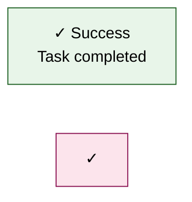
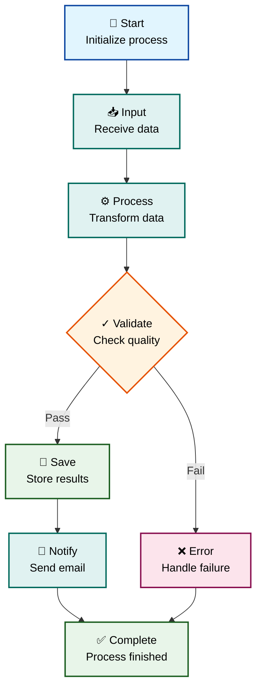
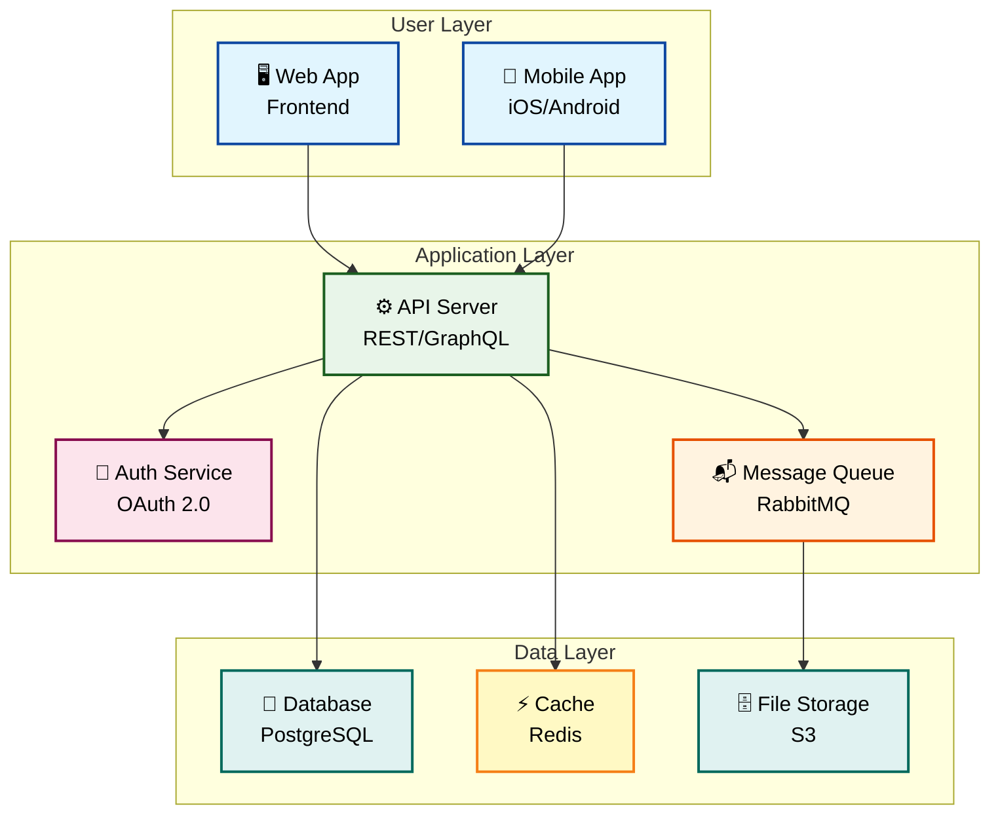
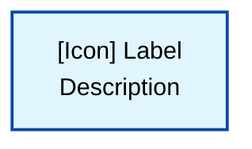

# Diagram Icons and Visual Elements

Complete icon library and visual element guide for creating professional, accessible diagrams in Mermaid and Visio.

---

## Overview

This skill provides a comprehensive icon library and visual element guide for diagram creation. All icons listed in this skill are **Unicode emoji and symbols** that are freely available and require no licensing.

**Important:** This skill uses Unicode characters (emoji), NOT Flaticon or other commercial icon libraries. All icons are part of the Unicode standard and are free to use without attribution requirements.

**Based on:** Visio 508 Compliant Template accessibility standards (color palette and structure only)

---

## Licensing and Attribution

### Unicode Icons (Used in This Skill)

**All icons in this skill are Unicode emoji/symbols:**
- ✅ **Free to use** - No licensing required
- ✅ **No attribution needed** - Part of Unicode standard
- ✅ **Universal compatibility** - Works in all modern systems
- ✅ **Accessible** - Screen reader compatible

**Unicode Standard:** https://unicode.org/emoji/charts/full-emoji-list.html

### Flaticon and Commercial Icons (NOT Used Here)

**If you choose to use Flaticon or other commercial icons:**
- ⚠️ **Attribution required** - Must credit the author
- ⚠️ **License restrictions** - Check Free vs Premium license
- ⚠️ **Flaticon Free License** requires: "Icon by [Author Name] from www.flaticon.com"
- ⚠️ **Flaticon Premium License** - No attribution required but paid subscription needed

**This skill does NOT use Flaticon icons.** All icons are Unicode characters that are freely available without licensing restrictions.

---

## When to Use

- Creating flowcharts and process diagrams
- Building system architecture diagrams
- Designing user journey maps
- Developing organizational charts
- Any diagram requiring visual clarity and accessibility

---

## Icon Categories

### 1. Status and State Icons

**Success/Complete:**
```
✓   U+2713  Check mark
✅  U+2705  White heavy check mark
✔️  U+2714  Heavy check mark
☑️  U+2611  Ballot box with check
🟢  U+1F7E2  Green circle
```

**Error/Failed:**
```
✗   U+2717  Ballot X
❌  U+274C  Cross mark
✖️  U+2716  Heavy multiplication X
⛔  U+26D4  No entry
🔴  U+1F534  Red circle
```

**Warning/Caution:**
```
⚠️  U+26A0  Warning sign
⚡  U+26A1  High voltage
🔔  U+1F514  Bell
⚡️  U+26A1  Lightning bolt
🟡  U+1F7E1  Yellow circle
```

**Information:**
```
ℹ️  U+2139  Information source
💡  U+1F4A1  Light bulb
📌  U+1F4CC  Pushpin
📍  U+1F4CD  Round pushpin
🔵  U+1F535  Blue circle
```

**In Progress:**
```
⏳  U+23F3  Hourglass
⌛  U+231B  Hourglass done
🔄  U+1F504  Counterclockwise arrows
♻️  U+267B  Recycling symbol
🟠  U+1F7E0  Orange circle
```

---

### 2. Action and Control Icons

**Navigation:**
```
▶️  U+25B6  Play button
◀️  U+25C0  Reverse button
⏭️  U+23ED  Next track
⏮️  U+23EE  Previous track
➡️  U+27A1  Right arrow
⬅️  U+2B05  Left arrow
⬆️  U+2B06  Up arrow
⬇️  U+2B07  Down arrow
↗️  U+2197  Up-right arrow
↘️  U+2198  Down-right arrow
```

**Process Control:**
```
▶️  U+25B6  Start/Play
⏸️  U+23F8  Pause
⏹️  U+23F9  Stop
⏯️  U+23EF  Play/Pause
⏺️  U+23FA  Record
🔄  U+1F504  Refresh/Reload
♻️  U+267B  Recycle/Retry
🔃  U+1F503  Clockwise arrows
```

**CRUD Operations:**
```
➕  U+2795  Plus (Create)
✏️  U+270F  Pencil (Edit)
🗑️  U+1F5D1  Wastebasket (Delete)
👁️  U+1F441  Eye (View/Read)
📋  U+1F4CB  Clipboard (Copy)
📌  U+1F4CC  Pin (Save)
```

---

### 3. Data and Storage Icons

**Files and Documents:**
```
📁  U+1F4C1  File folder
📂  U+1F4C2  Open file folder
🗂️  U+1F5C2  Card index dividers
📄  U+1F4C4  Page facing up
📝  U+1F4DD  Memo
📋  U+1F4CB  Clipboard
📑  U+1F4D1  Bookmark tabs
🗒️  U+1F5D2  Spiral notepad
```

**Storage and Database:**
```
💾  U+1F4BE  Floppy disk
💿  U+1F4BF  Optical disc
📀  U+1F4C0  DVD
🗄️  U+1F5C4  File cabinet
🗃️  U+1F5C3  Card file box
💽  U+1F4BD  Minidisc
🗂️  U+1F5C2  Database/Archive
```

**Data Transfer:**
```
📤  U+1F4E4  Outbox tray
📥  U+1F4E5  Inbox tray
📨  U+1F4E8  Incoming envelope
📩  U+1F4E9  Envelope with arrow
📮  U+1F4EE  Postbox
📬  U+1F4EC  Open mailbox
```

---

### 4. Technology and Systems

**Devices:**
```
🖥️  U+1F5A5  Desktop computer
💻  U+1F4BB  Laptop computer
⌨️  U+2328  Keyboard
🖱️  U+1F5B1  Computer mouse
🖨️  U+1F5A8  Printer
📱  U+1F4F1  Mobile phone
📞  U+1F4DE  Telephone receiver
☎️  U+260E  Telephone
```

**Network and Connectivity:**
```
🌐  U+1F310  Globe with meridians
🔗  U+1F517  Link symbol
⛓️  U+26D3  Chains
📡  U+1F4E1  Satellite antenna
📶  U+1F4F6  Antenna bars
🔌  U+1F50C  Electric plug
🔋  U+1F50B  Battery
```

**Cloud and Servers:**
```
☁️  U+2601  Cloud
🌩️  U+1F329  Cloud with lightning
⛈️  U+26C8  Thunder cloud
🖧  U+1F5A7  Network server
🗄️  U+1F5C4  Server rack
```

---

### 5. People and Roles

**Users:**
```
👤  U+1F464  Bust in silhouette
👥  U+1F465  Busts in silhouette
👨  U+1F468  Man
👩  U+1F469  Woman
🧑  U+1F9D1  Person
👨‍💼  U+1F468+200D+1F4BC  Man office worker
👩‍💼  U+1F469+200D+1F4BC  Woman office worker
```

**Roles:**
```
👨‍💻  U+1F468+200D+1F4BB  Man technologist
👩‍💻  U+1F469+200D+1F4BB  Woman technologist
🧑‍💻  U+1F9D1+200D+1F4BB  Technologist
👨‍🔧  U+1F468+200D+1F527  Man mechanic
👩‍🔧  U+1F469+200D+1F527  Woman mechanic
👨‍⚕️  U+1F468+200D+2695  Man health worker
👩‍⚕️  U+1F469+200D+2695  Woman health worker
```

**Groups:**
```
👨‍👩‍👧‍👦  Family
👥  U+1F465  Group
🏢  U+1F3E2  Office building
🏛️  U+1F3DB  Classical building
🏭  U+1F3ED  Factory
```

---

### 6. Security and Access

**Security:**
```
🔐  U+1F510  Locked with key
🔒  U+1F512  Locked
🔓  U+1F513  Unlocked
🔑  U+1F511  Key
🗝️  U+1F5DD  Old key
🛡️  U+1F6E1  Shield
🔏  U+1F50F  Lock with pen
```

**Authentication:**
```
✅  U+2705  Verified
🆔  U+1F194  ID button
👁️  U+1F441  Eye (visibility)
🔍  U+1F50D  Magnifying glass
🔎  U+1F50E  Magnifying glass right
🎫  U+1F3AB  Ticket (token)
```

---

### 7. Process and Workflow

**Settings and Configuration:**
```
⚙️  U+2699  Gear
🔧  U+1F527  Wrench
🛠️  U+1F6E0  Hammer and wrench
🔩  U+1F529  Nut and bolt
⚒️  U+2692  Hammer and pick
🔨  U+1F528  Hammer
```

**Analytics and Metrics:**
```
📊  U+1F4CA  Bar chart
📈  U+1F4C8  Chart increasing
📉  U+1F4C9  Chart decreasing
📐  U+1F4D0  Triangular ruler
📏  U+1F4CF  Straight ruler
🎯  U+1F3AF  Direct hit (target)
```

**Goals and Milestones:**
```
🏁  U+1F3C1  Chequered flag
🎯  U+1F3AF  Target
✨  U+2728  Sparkles
⭐  U+2B50  Star
🌟  U+1F31F  Glowing star
🏆  U+1F3C6  Trophy
🎖️  U+1F396  Military medal
```

---

### 8. Time and Scheduling

**Time:**
```
⏰  U+23F0  Alarm clock
⏱️  U+23F1  Stopwatch
⏲️  U+23F2  Timer clock
🕐  U+1F550  One o'clock
📅  U+1F4C5  Calendar
📆  U+1F4C6  Tear-off calendar
🗓️  U+1F5D3  Spiral calendar
```

**Duration:**
```
⌛  U+231B  Hourglass done
⏳  U+23F3  Hourglass not done
⏱️  U+23F1  Stopwatch
⏲️  U+23F2  Timer
```

---

### 9. Communication

**Messaging:**
```
💬  U+1F4AC  Speech balloon
🗨️  U+1F5E8  Left speech bubble
💭  U+1F4AD  Thought balloon
🗯️  U+1F5EF  Right anger bubble
📢  U+1F4E2  Loudspeaker
📣  U+1F4E3  Megaphone
```

**Email:**
```
✉️  U+2709  Envelope
📧  U+1F4E7  E-mail
📨  U+1F4E8  Incoming envelope
📩  U+1F4E9  Envelope with arrow
📬  U+1F4EC  Open mailbox
📭  U+1F4ED  Closed mailbox
```

---

### 10. Location and Geography

**Places:**
```
📍  U+1F4CD  Round pushpin
📌  U+1F4CC  Pushpin
🗺️  U+1F5FA  World map
🌍  U+1F30D  Earth globe
🏢  U+1F3E2  Office building
🏠  U+1F3E0  House
🏭  U+1F3ED  Factory
```

---

## Icon Usage Guidelines

### Best Practices

**1. Always Pair Icons with Text:**


**2. Use Consistent Icon Sets:**
- Stick to one style throughout a diagram
- Don't mix emoji with text symbols randomly
- Maintain visual hierarchy

**3. Size and Spacing:**
- Icons should be same size as text
- Add space after icon: `✓ Success` not `✓Success`
- Use `<br/>` for multi-line labels

**4. Accessibility:**
- Never rely on icon alone for meaning
- Always include text description
- Use Section 508 compliant colors

---

## Mermaid Icon Examples

### Example 1: Process Flow with Icons



### Example 2: System Architecture with Icons



### Example 3: User Journey with Icons

```mermaid
flowchart LR
    Visit["👤 Visit<br/>Land on site"]
    Browse["👁️ Browse<br/>View products"]
    Select["🎯 Select<br/>Choose item"]
    Cart["🛒 Add to Cart<br/>Review order"]
    Checkout["💳 Checkout<br/>Enter payment"]
    Confirm["✅ Confirm<br/>Order placed"]
    Ship["📦 Ship<br/>Delivery"]
    
    Visit --> Browse
    Browse --> Select
    Select --> Cart
    Cart --> Checkout
    Checkout --> Confirm
    Confirm --> Ship
    
    style Visit fill:#e1f5fe,stroke:#0d47a1,stroke-width:2px,color:#000
    style Browse fill:#e1f5fe,stroke:#0d47a1,stroke-width:2px,color:#000
    style Select fill:#fff3e0,stroke:#e65100,stroke-width:2px,color:#000
    style Cart fill:#fff3e0,stroke:#e65100,stroke-width:2px,color:#000
    style Checkout fill:#fff9c4,stroke:#f57f17,stroke-width:2px,color:#000
    style Confirm fill:#e8f5e9,stroke:#1b5e20,stroke-width:2px,color:#000
    style Ship fill:#e8f5e9,stroke:#1b5e20,stroke-width:2px,color:#000
```



---

## Icon Selection Guide

### By Use Case

**Status Indicators:**
- ✅ Success/Complete
- ❌ Error/Failed
- ⚠️ Warning
- ℹ️ Information
- ⏳ In Progress

**Actions:**
- ➕ Create/Add
- ✏️ Edit/Update
- 🗑️ Delete/Remove
- 👁️ View/Read
- 📋 Copy

**Data Operations:**
- 📥 Input/Import
- 📤 Output/Export
- 💾 Save/Store
- 🔄 Sync/Refresh
- 🔍 Search/Find

**System Components:**
- 🖥️ Server/Computer
- 💾 Database
- ⚙️ Service/API
- 🔐 Security
- 📡 Network

**People/Roles:**
- 👤 User
- 👨‍💻 Developer
- 👨‍💼 Admin
- 👥 Team
- 🏢 Organization

---

## Quick Reference

### Most Common Icons

```
✓ ✅ ❌ ⚠️ ℹ️ 📌 🔐 💾 ⚙️ 🖥️ 
👤 📊 🎯 ✨ 📝 📁 🔄 ➡️ 📧 🔍
```

### Mermaid Icon Template



---

## Related Skills

- **[skill_section_508_color_palette](skill_section_508_color_palette.md)** - Section 508 color palette
- **[skill_mermaid_section_508](skill_mermaid_section_508.md)** - Mermaid Section 508 compliance
- **[skill_mermaid_diagrams](skill_mermaid_diagrams.md)** - Mermaid syntax reference
- **[skill_visio_section_508](skill_visio_section_508.md)** - Visio Section 508 compliance

---

## Important Notes

### About Visio Template

**What we used from Visio 508 Compliant Template:**
- ✅ Section 508 accessibility standards
- ✅ Color palette guidelines
- ✅ Diagram structure best practices
- ✅ Accessibility compliance requirements

**What we did NOT use:**
- ❌ Flaticon icons (if any were in the template)
- ❌ Commercial icon libraries
- ❌ Proprietary graphics

**All icons in this skill are Unicode emoji** selected to match the accessibility and visual clarity standards established by the Visio Template.

### If You Need Commercial Icons

**For Flaticon icons:**
1. Visit https://www.flaticon.com
2. Download icons with appropriate license
3. Add attribution: "Icon by [Author] from www.flaticon.com"
4. Check license restrictions for commercial use

**For other icon libraries:**
- Font Awesome: https://fontawesome.com (Free & Pro versions)
- Material Icons: https://fonts.google.com/icons (Apache 2.0 license)
- Heroicons: https://heroicons.com (MIT license)
- Bootstrap Icons: https://icons.getbootstrap.com (MIT license)

---

## Changelog

- **2026-03-01:** Created diagram icons skill with Unicode emoji library
- **2026-03-01:** Added licensing clarification and attribution guidelines

---

**Location:** `G:\My Drive\06_Skills\documentation\skill_diagram_icons.md`  
**Category:** Documentation  
**Difficulty:** Beginner  
**Icons:** Unicode Standard (free, no attribution required)  
**Accessibility Standards:** Based on Visio 508 Compliant Template

