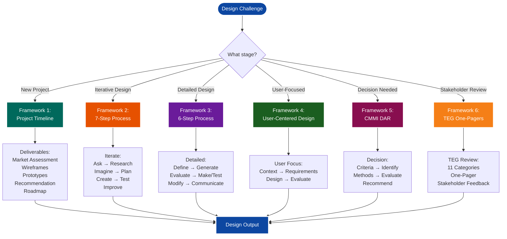
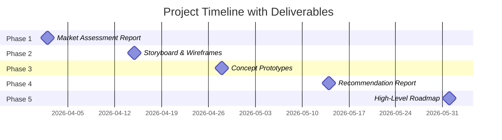
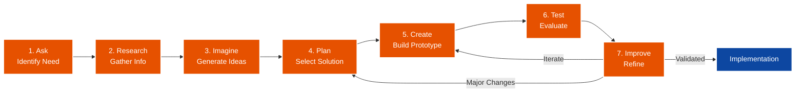
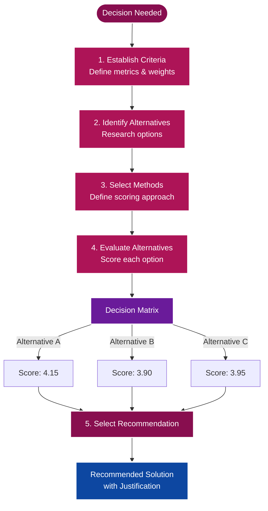
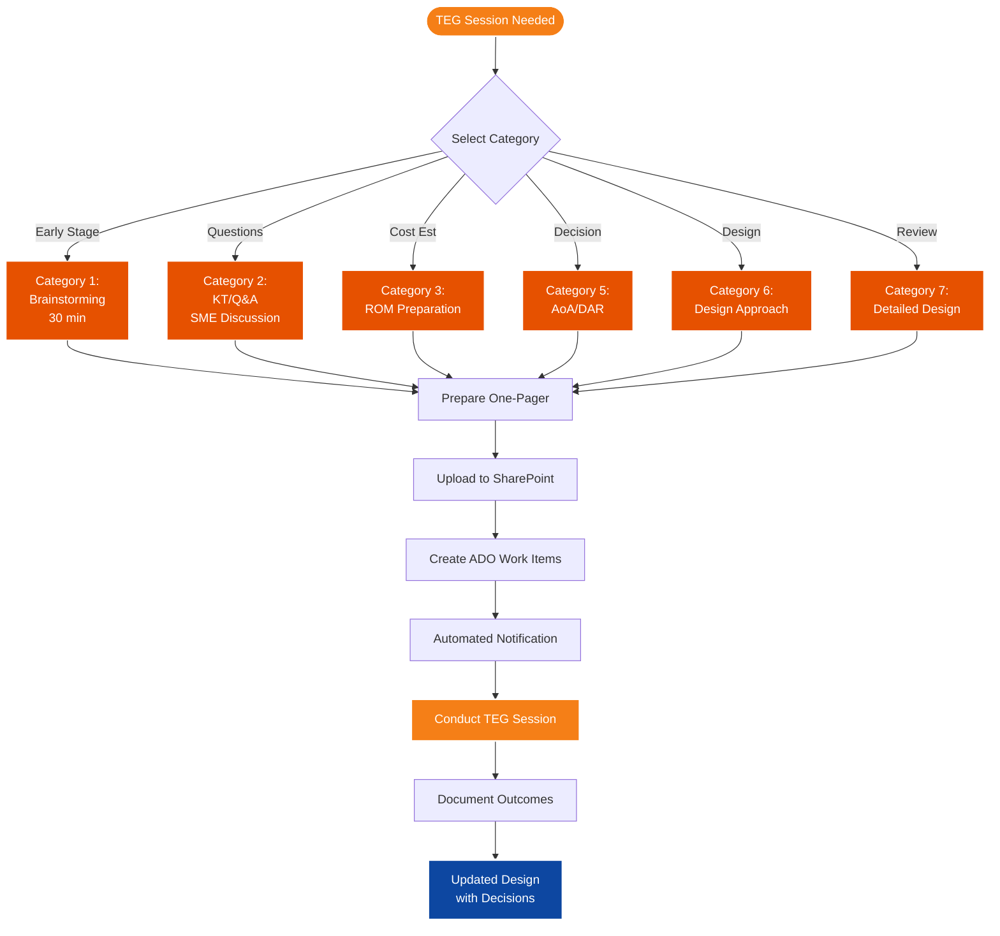
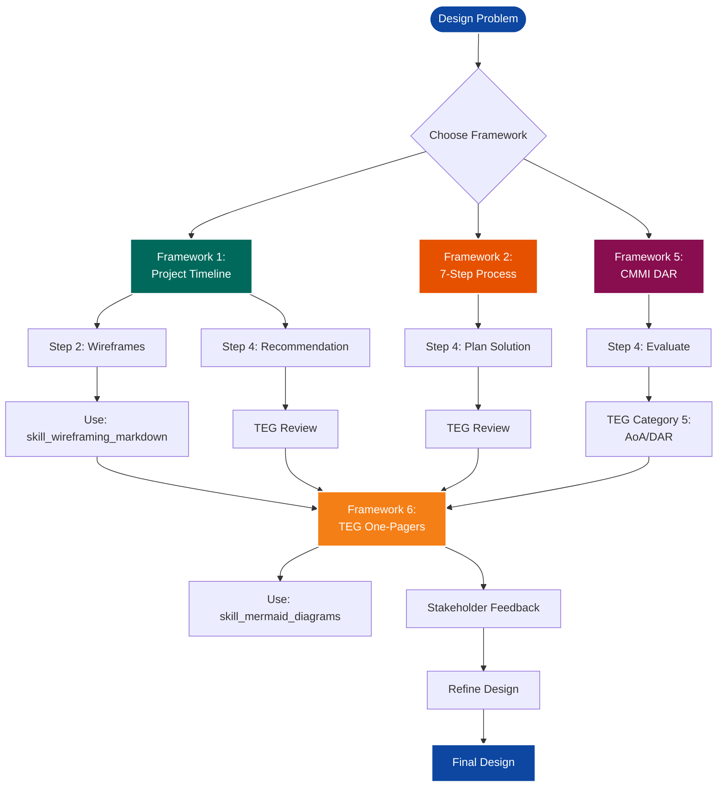

# SKILL: Engineering Design Process

**Actionable workflow for systematic product development, technical design decisions, and solution evaluation using proven engineering methodologies.**

**Last Updated:** March 1, 2026  
**Version:** 1.1.0  
**Category:** Documentation

---

## What This Skill Does

Provides comprehensive design process frameworks for:
- Product development and feature design
- Technical architecture decisions
- Vendor/tool evaluation and selection
- Prototype development workflows
- Stakeholder communication and deliverables
- TEG (Technical Engineering Group) design reviews

**Combines 6 proven methodologies:**
1. Project Timeline with Deliverables
2. Classic 7-Step Engineering Design Process
3. Detailed 6-Step Design Process
4. User-Centered Design (UCD)
5. CMMI Decision Analysis and Resolution (DAR)
6. TEG One-Pagers (11 categories for design reviews)

## When to Use This Skill

- **User says:** "Design a new feature/product"
- **User says:** "Evaluate technical solutions"
- **User says:** "Choose between alternatives"
- **User says:** "Create a prototype"
- **Trigger:** New product development, architecture decisions, tool selection

## What You'll Need

- Problem statement or business need
- Stakeholder requirements
- Evaluation criteria
- Resources for prototyping/testing
- Decision-making authority or input

---

## Visual Overview: All 6 Frameworks

### Framework Selection Guide



---

### Framework 1: Project Timeline Overview



---

### Framework 2: 7-Step Engineering Design Process



---

### Framework 5: CMMI DAR Process



---

### Framework 6: TEG One-Pager Workflow



---

### Framework Integration Map



---

## Framework 1: Project Timeline with Deliverables

**Purpose:** Structured timeline for product development with specific milestones

### Step 1: Market Assessment Report

**Timeline:** Week 1 (e.g., 4/2)

**Deliverables:**
- Market research findings
- Competitive analysis
- User needs assessment
- Problem statement
- Opportunity sizing

**Activities:**
- Interview stakeholders
- Analyze market trends
- Review competitor solutions
- Identify gaps and opportunities
- Document business case

**Output:** Market assessment report with recommendations

---

### Step 2: Storyboard & Wireframes

**Timeline:** Week 3 (e.g., 4/15)

**Deliverables:**
- User journey storyboards
- Low-fidelity wireframes
- User flow diagrams
- Interaction patterns

**Activities:**
- Map user journeys
- Create wireframes (use `skill_wireframing_markdown.md`)
- Define user interactions
- Validate with stakeholders
- Document design rationale

**Output:** Storyboard and wireframe package

**Integration:** Use `skill_wireframing_markdown.md` for creating wireframes in markdown

---

### Step 3: Concept Prototypes

**Timeline:** Week 5 (e.g., 4/28)

**Deliverables:**
- Interactive prototypes
- Technical feasibility study
- User testing plan
- Initial feedback report

**Activities:**
- Build clickable prototypes
- Conduct technical spike
- Perform user testing
- Gather feedback
- Iterate on design

**Output:** Validated concept prototype

---

### Step 4: Recommendation Report

**Timeline:** Week 8 (e.g., 5/14)

**Deliverables:**
- Evaluation of alternatives
- Decision matrix
- Recommended solution
- Implementation plan
- Risk assessment

**Activities:**
- Compare alternatives
- Apply decision criteria
- Calculate scores/weights
- Document trade-offs
- Present recommendations

**Output:** Recommendation report with best alternatives

---

### Step 5: High-Level Roadmap

**Timeline:** Week 11 (e.g., 6/1)

**Deliverables:**
- Product roadmap
- Implementation timeline
- Resource requirements
- Success metrics
- Milestone plan

**Activities:**
- Define phases
- Estimate effort
- Identify dependencies
- Set milestones
- Establish metrics

**Output:** High-level roadmap for implementation

---

## Framework 2: Classic 7-Step Engineering Design Process

**Purpose:** Iterative design process for engineering solutions

### 1. Ask - Identify the Need and Constraints

**Objective:** Understand the problem and limitations

**Activities:**
- Define the problem statement
- Identify stakeholders
- Document constraints (budget, time, technical)
- List requirements (functional, non-functional)
- Establish success criteria

**Questions to answer:**
- What problem are we solving?
- Who is affected by this problem?
- What are the constraints?
- What does success look like?

**Output:** Problem definition document

---

### 2. Research - Research the Problems

**Objective:** Gather information and understand context

**Activities:**
- Literature review
- Competitive analysis
- User research
- Technical research
- Best practices review

**Methods:**
- User interviews
- Surveys
- Market analysis
- Technical documentation review
- Expert consultation

**Output:** Research findings report

---

### 3. Imagine - Imagine Possible Solutions

**Objective:** Generate creative solution alternatives

**Activities:**
- Brainstorming sessions
- Ideation workshops
- Sketching concepts
- Mind mapping
- Analogous thinking

**Techniques:**
- Brainstorming (divergent thinking)
- SCAMPER method
- Six Thinking Hats
- Crazy 8s sketching
- Affinity mapping

**Output:** List of potential solutions

---

### 4. Plan - Select a Promising Solution

**Objective:** Choose the best solution to pursue

**Activities:**
- Evaluate alternatives
- Apply decision criteria
- Risk assessment
- Feasibility analysis
- Stakeholder alignment

**Tools:**
- Decision matrix
- SWOT analysis
- Cost-benefit analysis
- Risk matrix
- Pugh matrix

**Output:** Selected solution with justification

---

### 5. Create - Create Prototypes

**Objective:** Build tangible representation of solution

**Activities:**
- Design specifications
- Build prototype
- Create mockups
- Develop proof of concept
- Document design

**Prototype types:**
- Paper prototypes
- Wireframes (use `skill_wireframing_markdown.md`)
- Clickable prototypes
- Working prototypes
- Proof of concept code

**Output:** Prototype ready for testing

---

### 6. Test - Test and Evaluate the Prototype

**Objective:** Validate design with users and stakeholders

**Activities:**
- User testing
- Performance testing
- Usability testing
- Technical validation
- Stakeholder review

**Metrics to track:**
- User satisfaction
- Task completion rate
- Error rate
- Performance metrics
- Technical feasibility

**Output:** Test results and findings

---

### 7. Improve - Improve the Design

**Objective:** Refine based on feedback

**Activities:**
- Analyze test results
- Identify issues
- Prioritize improvements
- Implement changes
- Re-test

**Iteration:**
- Return to Step 5 (Create) if major changes needed
- Return to Step 4 (Plan) if solution doesn't work
- Proceed to implementation if validated

**Output:** Refined design ready for implementation

---

## Framework 3: Detailed 6-Step Design Process

**Purpose:** Comprehensive design process with detailed activities

### 1. Define the Problems

**Components:**
- **Needs assessment** - What do users need?
- **Problem statement** - Clear articulation of the problem
- **Design criteria & goals** - What makes a good solution?
- **Background research** - Context and constraints

**Activities:**
- Conduct needs assessment
- Write problem statement
- Define design criteria
- Research background
- Document constraints

**Output:** Problem definition package

---

### 2. Generate Possible Solutions

**Techniques:**
- **Brainstorming** - Group ideation
- **Idea trigger method** - Stimulus-based ideation
- **Thumbnail sketching** - Quick visual concepts
- **Creative thinking** - Lateral thinking techniques

**Process:**
1. Set up ideation session
2. Generate ideas without judgment
3. Build on others' ideas
4. Sketch concepts
5. Document all ideas

**Output:** Comprehensive list of solution concepts

---

### 3. Evaluate Possible Solutions

**Evaluation criteria:**
- Do ideas meet design criteria?
- List advantages/disadvantages
- Select best design alternatives
- Use decision matrix to evaluate

**Decision Matrix Template:**

| Solution | Criteria 1 (Weight) | Criteria 2 (Weight) | Criteria 3 (Weight) | Total Score |
|----------|---------------------|---------------------|---------------------|-------------|
| Option A | Score × Weight      | Score × Weight      | Score × Weight      | Sum         |
| Option B | Score × Weight      | Score × Weight      | Score × Weight      | Sum         |
| Option C | Score × Weight      | Score × Weight      | Score × Weight      | Sum         |

**Scoring:** 1-5 scale (1=poor, 5=excellent)

**Output:** Ranked alternatives with scores

---

### 4. Make and Test a Model

**Deliverables:**
- **Detailed technical drawings** - Architecture diagrams
- **Prototype or scale model** - Working model
- **Performance/user tests** - Validation testing
- **Computer models** - Simulations or digital prototypes

**Testing types:**
- Functional testing
- Performance testing
- Usability testing
- Integration testing
- Stress testing

**Output:** Tested prototype with results

---

### 5. Modify and Improve the Design

**Activities:**
- **Fix problems** - Address identified issues
- **Improve design** - Enhance based on feedback
- **Do more testing** - Validate improvements

**Iteration cycle:**
1. Identify issues from testing
2. Prioritize fixes
3. Implement improvements
4. Re-test
5. Repeat until criteria met

**Output:** Improved design

---

### 6. Communicate Final Design

**Documentation:**
- **Final technical drawings** - Complete specifications
- **Technical manuals** - How to build/use
- **Maintenance documentation** - How to maintain

**Deliverables:**
- Architecture diagrams (use `skill_mermaid_diagrams.md`)
- API documentation
- User guides
- Maintenance procedures
- Training materials

**Output:** Complete design documentation package

---

## Framework 4: User-Centered Design (UCD)

**Purpose:** Design process focused on user needs and usability

### 1. Specify the Context of Use

**Identify:**
- **People** - Who will use the product?
- **Purpose** - What will they use it for?
- **Conditions** - Under what conditions will they use it?

**User research methods:**
- User interviews
- Contextual inquiry
- Personas
- User journey mapping
- Environment analysis

**Output:** Context of use specification

---

### 2. Specify Requirements

**Requirements types:**
- **Business requirements** - What must the business achieve?
- **User goals** - What must users accomplish?
- **Functional requirements** - What must the system do?
- **Non-functional requirements** - Performance, security, etc.

**Documentation:**
- User stories
- Use cases
- Requirements specification
- Acceptance criteria

**Output:** Requirements document

---

### 3. Create Design Solutions

**Iterative approach:**
- **Rough concept** - Initial sketches and ideas
- **Low-fidelity prototype** - Wireframes and mockups
- **High-fidelity prototype** - Detailed designs
- **Complete design** - Final specifications

**Stages:**
1. Conceptual design
2. Wireframing (use `skill_wireframing_markdown.md`)
3. Visual design
4. Interaction design
5. Final design

**Output:** Design solutions at appropriate fidelity

---

### 4. Evaluate Designs

**Evaluation methods:**
- **Usability testing** - Test with actual users
- **Heuristic evaluation** - Expert review
- **A/B testing** - Compare alternatives
- **Analytics review** - Data-driven insights

**Usability testing process:**
1. Define test objectives
2. Recruit participants
3. Create test scenarios
4. Conduct tests
5. Analyze results
6. Document findings

**Output:** Evaluation report with recommendations

**Iteration:** Return to Step 3 based on findings

---

## Framework 5: CMMI Decision Analysis and Resolution (DAR)

**Purpose:** Formal decision-making process for evaluating alternatives

**Integration:** Use with TEG one-pagers (Framework 6) for stakeholder review

### Step 1: Establish Criteria

**Objective:** Define how alternatives will be evaluated

**Activities:**
- Identify evaluation criteria
- Define metrics for each criterion
- Assign weights to criteria
- Document evaluation method

**Example criteria:**
- Cost
- Performance
- Scalability
- Ease of use
- Vendor support
- Community activity
- Integration capability

**Output:** Evaluation criteria with weights

---

### Step 2: Identify Alternative Solutions

**Objective:** Find all viable options

**Activities:**
- Market research
- Vendor identification
- Product discovery
- Initial screening
- Shortlist creation

**Example process:**
1. Identify 15 products
2. Check if active and popular
3. Shortlist 8 products
4. Verify viability

**Output:** List of alternative solutions

---

### Step 3: Select Evaluation Methods

**Objective:** Determine how to measure criteria

**Activities:**
- Define scoring method
- Apply weights to metrics
- Create evaluation framework
- Document process

**Scoring methods:**
- Numerical scoring (1-5, 1-10)
- Weighted scoring
- Binary (yes/no)
- Qualitative assessment

**Output:** Evaluation methodology

---

### Step 4: Evaluate Alternatives

**Objective:** Score each alternative against criteria

**Activities:**
- Apply evaluation criteria
- Use metrics to score
- Document findings
- Calculate weighted scores

**Evaluation Matrix:**

| Alternative | Criterion 1 (30%) | Criterion 2 (25%) | Criterion 3 (20%) | Criterion 4 (15%) | Criterion 5 (10%) | Total |
|-------------|-------------------|-------------------|-------------------|-------------------|-------------------|-------|
| Solution A  | 4 (1.2)          | 5 (1.25)         | 3 (0.6)          | 4 (0.6)          | 5 (0.5)          | 4.15  |
| Solution B  | 5 (1.5)          | 3 (0.75)         | 4 (0.8)          | 3 (0.45)         | 4 (0.4)          | 3.90  |
| Solution C  | 3 (0.9)          | 4 (1.0)          | 5 (1.0)          | 5 (0.75)         | 3 (0.3)          | 3.95  |

**Output:** Scored evaluation matrix

---

### Step 5: Select Recommendation

**Objective:** Choose the best solution based on evaluation

**Activities:**
- Review scores
- Consider qualitative factors
- Assess risks
- Make recommendation
- Document rationale

**Decision factors:**
- Highest score
- Risk tolerance
- Strategic fit
- Implementation feasibility
- Stakeholder preference

**Output:** Recommendation with justification

**Example:** "We selected TYK based on highest score (4.15) and best fit for our integration requirements."

---

## Complete Workflow Example: Tool Selection

### Scenario: Select API Gateway Solution

**Step 1: Define the Problem (Framework 2, Step 1)**
- Need: Secure API gateway for microservices
- Constraints: Budget $50K, 6-month timeline
- Requirements: OAuth2, rate limiting, analytics

**Step 2: Establish Criteria (Framework 5, Step 1)**

| Criterion | Weight | Description |
|-----------|--------|-------------|
| Performance | 30% | Throughput and latency |
| Features | 25% | OAuth2, rate limiting, analytics |
| Cost | 20% | Total cost of ownership |
| Support | 15% | Vendor support quality |
| Community | 10% | Active community and plugins |

**Step 3: Research Solutions (Framework 2, Step 2)**
- Identify 15 API gateway products
- Research features and capabilities
- Check community activity
- Review documentation

**Step 4: Shortlist Alternatives (Framework 5, Step 2)**
- Kong
- Tyk
- AWS API Gateway
- Apigee
- Azure API Management
- MuleSoft
- WSO2
- NGINX Plus

**Step 5: Evaluate (Framework 5, Step 4)**

| Solution | Performance (30%) | Features (25%) | Cost (20%) | Support (15%) | Community (10%) | Total |
|----------|-------------------|----------------|------------|---------------|-----------------|-------|
| Kong     | 4 (1.2)          | 5 (1.25)      | 3 (0.6)    | 4 (0.6)      | 5 (0.5)        | 4.15  |
| Tyk      | 5 (1.5)          | 4 (1.0)       | 4 (0.8)    | 4 (0.6)      | 4 (0.4)        | 4.30  |
| AWS      | 5 (1.5)          | 3 (0.75)      | 3 (0.6)    | 5 (0.75)     | 3 (0.3)        | 3.90  |

**Step 6: Prototype (Framework 2, Step 5)**
- Set up Tyk proof of concept
- Test OAuth2 integration
- Measure performance
- Validate features

**Step 7: Test (Framework 2, Step 6)**
- Load testing
- Security testing
- Integration testing
- User acceptance testing

**Step 8: Recommend (Framework 5, Step 5)**
- **Selected:** Tyk
- **Score:** 4.30 (highest)
- **Rationale:** Best performance, good features, reasonable cost
- **Next steps:** Procurement and implementation

**Step 9: Roadmap (Framework 1, Step 5)**
- Month 1: Procurement and setup
- Month 2: Development environment
- Month 3: Integration and testing
- Month 4: Staging deployment
- Month 5: Production deployment
- Month 6: Monitoring and optimization

---

## Framework 6: TEG One-Pagers (Technical Engineering Group)

**Purpose:** Structured one-page documents for technical design reviews and stakeholder discussions

**Use Cases:**
- Design reviews and feedback
- Brainstorming technical solutions
- Knowledge sharing and SME discussions
- ROM (Rough Order of Magnitude) preparation
- Architecture and design validation

**Integration:** Use with Framework 5 (DAR) for Analysis of Alternatives discussions

---

### TEG Session Types

#### 1. Time-Boxed Brainstorming (30 minutes)

**Purpose:**
- Flush out designs or processes
- Generate design alternatives
- Identify gaps in designs
- Get early feedback

**Format:**
- Strictly limited to 30 minutes
- Can be rescheduled if needed
- TEG team moderates participation
- Requires upfront preparation

**When to use:**
- Early-stage design exploration
- Multiple design alternatives to evaluate
- Need quick feedback on approach
- Identify missing considerations

---

#### 2. Discussion and Feedback Session (Standard Duration)

**Purpose:**
- Detailed design reviews
- ROM presentations
- Knowledge sharing
- Architecture presentations
- Decision analysis

**Format:**
- Standard TEG time slot (Tuesdays/Thursdays 2:30-4:00 PM)
- Comprehensive review and discussion
- Detailed feedback and recommendations

**When to use:**
- Completed design ready for review
- ROM cost estimation review
- Architecture validation
- Tool/vendor selection (AoA/DAR)

---

### TEG One-Pager Categories

#### Category 1: Brainstorming Session

**Required Sections:**

**Problem Statement**
- Clearly define the problem
- Examples:
  - "Brainstorming multiple design approaches for [project/release]"
  - "Brainstorming Topic XYZ"

**Outcome Expectation**
- Flush out one or more design options
- Clean up design document for client review
- Get early feedback for future TEG session

**Overview of Topic and Options**
- Current understanding of subject matter
- Previous brainstorming outcomes/decisions
- Design options being considered

**Reference Materials**
- Links to documentation (internal/external)
- Background materials
- Related designs or specifications

**Sections to Complete During Session**
Choose relevant sections:
- Design considerations
- Impacted systems (solutions, subsystems, modules, ETLs, pipelines, reports)
- Downstream/upstream impacts
- Testing requirements
- Constraints and risks
- Design details and flow diagrams

---

#### Category 2: KT/Q&A Session/SME Discussion

**Required Sections:**

**Outcome Expectation**
- Getting answers to specific questions
- Knowledge transfer objectives

**Questions/Topics**
- Document all questions clearly
- Organize by topic area
- Prioritize questions

**Recap**
- Document KT details received
- Action items from discussion

**Reference Materials**
- Links to documentation for SME review
- Background materials

**Special Notes:**
- Work with TEG Scrum Master for scheduling
- Allows SME to prepare materials in advance
- May require follow-up meetings

---

#### Category 3: ROM Preparation (Analysis and Design)

**Template:** TEG ROM Template V1.3.xlsx

**Required Sections:**

**ROM Title**
- Clear, descriptive title

**Problem Statement**
- Business need or technical challenge
- Current state issues

**Proposed Solution**
- High-level approach
- Key components

**Scope**
- In-scope items
- Out-of-scope items
- Assumptions

**Design Approach**
- Architecture overview
- Technical approach
- Integration points

**Effort Estimation**
- Development effort
- Testing effort
- Deployment effort
- Breakdown by component

**Risks and Dependencies**
- Technical risks
- Dependencies on other systems/teams
- Mitigation strategies

---

#### Category 4: Knowledge Sharing

**Required Sections:**

**Topic Overview**
- What knowledge is being shared
- Why it's relevant

**Key Learnings**
- Main takeaways
- Best practices
- Lessons learned

**Applicability**
- Where this knowledge applies
- Who should use it

**Reference Materials**
- Documentation links
- Examples
- Related resources

---

#### Category 5: Analysis of Alternatives (AoA) / Decision Analysis and Resolution (DAR)

**Use Framework 5 (CMMI DAR) with TEG one-pager format**

**Required Sections:**

**Decision to be Made**
- Clear statement of decision needed

**Evaluation Criteria**
- Criteria with weights
- Scoring methodology

**Alternatives Considered**
- List of options
- Brief description of each

**Evaluation Matrix**
- Scored comparison of alternatives
- Weighted totals

**Recommendation**
- Selected alternative
- Justification
- Next steps

**Reference Materials**
- Vendor documentation
- Proof of concept results
- Technical specifications

---

#### Category 6: Design Approach

**Required Sections:**

**Problem Statement**
- What problem does this design solve?

**Design Overview**
- High-level architecture
- Key components
- Integration points

**Design Considerations**
- Performance requirements
- Scalability needs
- Security considerations
- Maintainability

**Impacted Systems**
- Upstream systems
- Downstream systems
- Integration points

**Risks and Constraints**
- Technical risks
- Budget/timeline constraints
- Technical debt considerations

**Reference Materials**
- Architecture diagrams (use `skill_mermaid_diagrams.md`)
- Wireframes (use `skill_wireframing_markdown.md`)
- Related designs

---

#### Category 7: Detailed Design Presentation / OIT Presentation Review

**Required Sections:**

**Executive Summary**
- Problem statement
- Proposed solution
- Key benefits

**Detailed Design**
- Architecture diagrams
- Component specifications
- Data flow diagrams
- Sequence diagrams

**Implementation Plan**
- Phases and milestones
- Resource requirements
- Timeline

**Testing Strategy**
- Test approach
- Test scenarios
- Acceptance criteria

**Risks and Mitigation**
- Identified risks
- Mitigation strategies
- Contingency plans

**Presentation Materials**
- Slides for client review
- Technical appendix
- Q&A preparation

---

#### Category 8: Initial Kick-Off for New Task Order

**Required Sections:**

**Project Overview**
- Scope and objectives
- Deliverables
- Timeline

**Team Structure**
- Roles and responsibilities
- Key stakeholders
- Communication plan

**Technical Approach**
- High-level architecture
- Technology stack
- Development methodology

**Success Criteria**
- Acceptance criteria
- Performance metrics
- Quality standards

**Next Steps**
- Immediate actions
- Milestone planning
- Risk identification

---

#### Category 9: Demo of New Tool or Software

**Required Sections:**

**Tool Overview**
- What is the tool?
- What problem does it solve?

**Demo Scenarios**
- Use case 1
- Use case 2
- Use case 3

**Key Features**
- Feature highlights
- Benefits
- Limitations

**Integration Considerations**
- How it fits into current architecture
- Integration requirements
- Dependencies

**Next Steps**
- Evaluation plan
- Proof of concept
- Decision timeline

---

#### Category 10: Knowledge Sharing of New Tool or Software

**Required Sections:**

**Tool/Technology Overview**
- Description
- Use cases
- Industry adoption

**Architecture Deep-Dive**
- How it works
- Key components
- Integration patterns

**Evaluation Criteria**
- Performance
- Scalability
- Cost
- Support

**Pros and Cons**
- Advantages
- Disadvantages
- Trade-offs

**Recommendation**
- Should we adopt?
- Use cases for our environment
- Next steps

---

#### Category 11: Idea Backlog - Technical Approach or Design Alternatives

**Required Sections:**

**Idea Description**
- What is the idea?
- Why is it valuable?

**Technical Feasibility**
- Is it technically possible?
- What are the challenges?

**Design Alternatives**
- Option 1
- Option 2
- Option 3

**Evaluation**
- Pros and cons of each alternative
- Recommended approach

**Next Steps**
- Proof of concept
- Further research
- Decision needed

---

### TEG One-Pager Workflow

#### Step 1: Select Category

**Choose appropriate category:**
1. Brainstorming - Early-stage ideation
2. KT/Q&A - Knowledge transfer
3. ROM Preparation - Cost estimation
4. Knowledge Sharing - Lessons learned
5. AoA/DAR - Decision analysis
6. Design Approach - Architecture review
7. Detailed Design - Comprehensive review
8. Kick-Off - New project initiation
9. Tool Demo - Demonstration
10. Tool Knowledge Sharing - Deep-dive
11. Idea Backlog - Feasibility assessment

---

#### Step 2: Prepare One-Pager

**Use category template:**
- Include all required sections
- Add reference materials
- Create diagrams (use `skill_mermaid_diagrams.md`)
- Add wireframes if needed (use `skill_wireframing_markdown.md`)

**Keep it concise:**
- One-page summary (can have appendices)
- Clear problem statement
- Specific outcome expectations
- Actionable next steps

---

#### Step 3: Upload to SharePoint

**Location:** HEAT SharePoint TEG folder

**Ensure:**
- Document is accessible to team
- Proper naming convention
- All links work
- Diagrams are visible

---

#### Step 4: Create ADO Work Items

**Azure DevOps TEG Board:**
1. Create backlog item
2. Create associated task
3. Add one-pager link to "One Page Link" field
4. Populate "Tentative Completion Date" field

---

#### Step 5: Automated Notification

**System sends:**
- Automated email on session day
- Topic details
- One-pager link
- Meeting details

---

#### Step 6: Conduct TEG Session

**During session:**
- Present one-pager
- Facilitate discussion
- Capture feedback
- Document decisions
- Identify action items

---

#### Step 7: Document Outcomes

**After session:**
- Update one-pager with decisions
- Document action items
- Update ADO work items
- Share outcomes with stakeholders

---

### TEG One-Pager Template

```markdown
# TEG One-Pager: [Title]

**Category:** [Select from 11 categories]  
**Presenter:** [Name]  
**Date:** [TEG Session Date]  
**Session Type:** [Brainstorming / Discussion]

---

## Problem Statement

[Clear articulation of the problem or topic]

---

## Outcome Expectation

[What you want to achieve from this TEG session]

---

## Overview

[High-level overview of the topic, design, or decision]

---

## [Category-Specific Sections]

[Include required sections based on category selected]

---

## Reference Materials

- [Link to documentation]
- [Link to diagrams]
- [Link to related designs]

---

## Questions for TEG

1. [Question 1]
2. [Question 2]
3. [Question 3]

---

## Next Steps

1. [Action item 1]
2. [Action item 2]
3. [Action item 3]
```

---

### Integration with Design Frameworks

**TEG + Framework 1 (Project Timeline):**
- Use TEG for Step 2 (Storyboard & Wireframes) review
- Use TEG for Step 4 (Recommendation Report) validation

**TEG + Framework 2 (7-Step Process):**
- Use TEG for Step 4 (Plan) - Design Approach review
- Use TEG for Step 6 (Test) - Feedback session

**TEG + Framework 5 (CMMI DAR):**
- Use Category 5 (AoA/DAR) for alternative evaluation
- Present evaluation matrix in TEG session
- Get stakeholder input on decision

**TEG + Wireframing:**
- Include wireframes in one-pager (use `skill_wireframing_markdown.md`)
- Present UI mockups during TEG session

**TEG + Diagrams:**
- Include architecture diagrams (use `skill_mermaid_diagrams.md`)
- Present flow diagrams during TEG session

---

## Best Practices

### Design Process

1. **Start with the problem** - Don't jump to solutions
2. **Involve stakeholders early** - Get buy-in from the start
3. **Iterate frequently** - Test and refine continuously
4. **Document decisions** - Capture rationale for future reference
5. **Use data** - Make evidence-based decisions

### Evaluation Criteria

1. **Make criteria specific** - Avoid vague criteria
2. **Limit to 5-7 criteria** - Too many dilutes focus
3. **Assign realistic weights** - Reflect true priorities
4. **Use consistent scoring** - Define scale clearly
5. **Include qualitative factors** - Not everything is quantifiable

### Prototyping

1. **Start low-fidelity** - Paper, wireframes, sketches
2. **Test early and often** - Don't wait for perfection
3. **Focus on key interactions** - Not every detail
4. **Get real user feedback** - Not just stakeholder opinions
5. **Iterate based on data** - Not assumptions

### Communication

1. **Tailor to audience** - Technical vs. business stakeholders
2. **Use visuals** - Diagrams, wireframes, prototypes
3. **Tell a story** - Connect problem to solution
4. **Show alternatives** - Demonstrate due diligence
5. **Be clear about trade-offs** - No solution is perfect

---

## Integration with Other Skills

### Wireframing (Step 2: Storyboard & Wireframes)
**Use:** `skill_wireframing_markdown.md`
- Create ASCII wireframes for documentation
- Build prototypes with Excalidraw
- Embed wireframes in design docs

### Diagrams (Step 6: Communicate Final Design)
**Use:** `skill_mermaid_diagrams.md`
- Architecture diagrams
- Process flows
- Decision trees
- System diagrams

### Documentation (Throughout Process)
**Use:** `skill_feature_documentation.md`
- Document requirements
- Write specifications
- Create user guides
- Maintain design docs

### Project Management
**Use:** `skill_daily_planning.md`
- Track design milestones
- Manage deliverables
- Coordinate stakeholders
- Monitor progress

---

## AI Agent Instructions

**When user requests design process guidance:**

1. **Identify design stage** - Problem definition, ideation, evaluation, etc.
2. **Select appropriate framework** - Based on context and needs
3. **Provide relevant steps** - Specific to current stage
4. **Suggest tools and templates** - Decision matrix, wireframes, etc.
5. **Recommend next steps** - Clear path forward

**Output format:**
```
✅ Design stage: [Problem Definition/Ideation/Evaluation/etc.]
📋 Framework: [Which framework to use]
🔧 Steps to follow: [Specific steps]
📊 Tools needed: [Templates, skills, resources]
➡️ Next steps: [Clear actions]
```

**For tool/vendor selection:**
- Use Framework 5 (CMMI DAR)
- Create evaluation matrix
- Provide scoring template
- Suggest criteria based on context

**For feature design:**
- Use Framework 1 (Project Timeline)
- Provide deliverable checklist
- Integrate wireframing skill
- Include testing plan

**For architecture decisions:**
- Use Framework 2 (7-Step Process)
- Focus on research and evaluation
- Create decision documentation
- Provide diagram templates

---

## Templates

### Decision Matrix Template

```markdown
## Decision Matrix: [Decision Name]

**Date:** [Date]  
**Decision Owner:** [Name]

### Criteria and Weights

| Criterion | Weight | Description |
|-----------|--------|-------------|
| [Criterion 1] | [%] | [Description] |
| [Criterion 2] | [%] | [Description] |
| [Criterion 3] | [%] | [Description] |

### Evaluation

| Alternative | Criterion 1 | Criterion 2 | Criterion 3 | Total Score |
|-------------|-------------|-------------|-------------|-------------|
| [Option A]  | [Score]     | [Score]     | [Score]     | [Total]     |
| [Option B]  | [Score]     | [Score]     | [Score]     | [Total]     |
| [Option C]  | [Score]     | [Score]     | [Score]     | [Total]     |

### Recommendation

**Selected:** [Option]  
**Score:** [Total]  
**Rationale:** [Why this option]

### Next Steps

1. [Action 1]
2. [Action 2]
3. [Action 3]
```

---

### Design Brief Template

```markdown
## Design Brief: [Project Name]

### Problem Statement
[Clear articulation of the problem]

### Goals and Objectives
- [Goal 1]
- [Goal 2]
- [Goal 3]

### Target Users
- [User persona 1]
- [User persona 2]

### Constraints
- **Budget:** [Amount]
- **Timeline:** [Duration]
- **Technical:** [Limitations]

### Success Criteria
- [Criterion 1]
- [Criterion 2]
- [Criterion 3]

### Deliverables
1. [Deliverable 1] - [Date]
2. [Deliverable 2] - [Date]
3. [Deliverable 3] - [Date]
```

---

## Related Skills

- **skill_wireframing_markdown.md** - Create wireframes and prototypes for TEG one-pagers
- **skill_mermaid_diagrams.md** - Architecture and process diagrams for TEG presentations
- **skill_feature_documentation.md** - Document design decisions
- **skill_daily_planning.md** - Manage design project timeline
- **skill_user_commands.md** - Quick reference for design workflows
- **skill_teg_discussion_templates.md** - Detailed TEG process and templates
- **skill_teg_discussion_template_alt.md** - Alternative TEG template format

---

## Changelog

- **2026-03-01:** Created engineering design process skill from Amplenote notes
- **2026-03-01:** Consolidated 5 design frameworks into single skill
- **2026-03-01:** Added complete workflow example (tool selection)
- **2026-03-01:** Included templates for decision matrix and design brief
- **2026-03-01:** Integrated with wireframing, diagrams, and documentation skills
- **2026-03-01:** Added Framework 6: TEG One-Pagers with 11 categories
- **2026-03-01:** Integrated TEG discussion templates and workflow
- **2026-03-01:** Added TEG one-pager template and integration guidance

---

**Location:** `${SKILLS_ROOT}/documentation/skill_engineering_design_process.md`  
**Category:** Documentation  
**Complexity:** Intermediate to Advanced  
**Requires:** Problem definition, stakeholder access, evaluation criteria  
**Best For:** Product development, technical decisions, vendor selection  
**Not For:** Routine tasks, simple decisions, urgent fixes
