# Mermaid Diagrams

**Last Updated:** March 1, 2026  
**Purpose:** Create diagrams using Mermaid syntax and convert them to Section 508 compliant Visio files.

---

## Overview

Mermaid is a JavaScript-based diagramming and charting tool that uses text-based syntax to create diagrams. This skill covers Mermaid syntax patterns and provides tools for converting Mermaid diagrams to accessible Visio files.

---

## Setup: VS Code & Windsurf Extension

To preview Mermaid diagrams in VS Code or Windsurf, install the required extension:

### Install Extension

1. Open Extensions panel (`Ctrl+Shift+X`)
2. Search for **"Markdown Preview Mermaid Support"** by Matt Bierner
3. Click Install

### Usage

**Preview in Markdown:**
1. Create or open a `.md` file with Mermaid code blocks
2. Press `Ctrl+Shift+V` to open Markdown preview
3. Mermaid diagrams render automatically

**Side-by-side editing:**
1. Open your `.md` file
2. Press `Ctrl+K V` (or right-click → "Open Preview to the Side")
3. Edit on the left, see live updates on the right

**Example:**

````markdown
# My Diagram

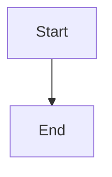
````

**Troubleshooting:**
- Ensure code blocks use ` ```mermaid ` (not `mmd` or `mer`)
- Reload window if diagrams don't render: `Ctrl+Shift+P` → "Reload Window"

---

## 1. Mermaid Syntax Reference

### 1.1 Flowcharts

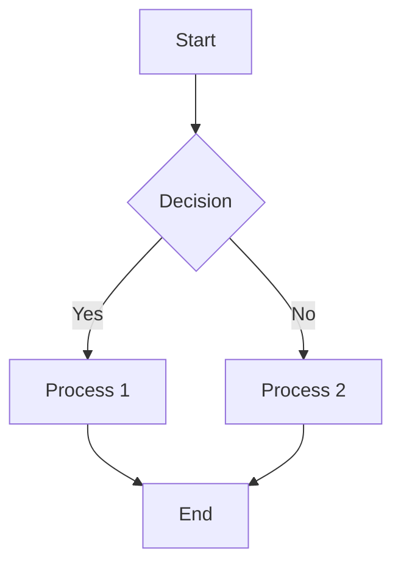

**Syntax:**
- `flowchart TD` - Top Down (also: `LR` Left-Right, `RL` Right-Left, `BT` Bottom-Top)
- `A[Text]` - Rectangle node
- `A(Text)` - Rounded rectangle
- `A{Text}` - Diamond (decision)
- `A([Text])` - Stadium shape
- `A[[Text]]` - Subroutine
- `A[(Text)]` - Database
- `A((Text))` - Circle
- `-->` - Arrow
- `---|Text|` - Arrow with label
- `-.->` - Dotted arrow
- `==>` - Thick arrow

### 1.2 Sequence Diagrams

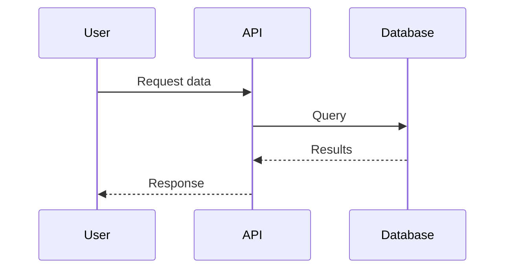

**Syntax:**
- `participant Name` - Define participant
- `->>` - Solid arrow
- `-->>` - Dotted arrow
- `-x` - Cross at end
- `activate/deactivate` - Show lifeline activation

### 1.3 Class Diagrams

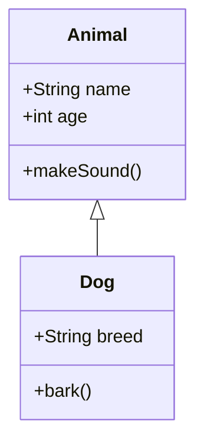

**Syntax:**
- `class Name` - Define class
- `+` - Public
- `-` - Private
- `#` - Protected
- `<|--` - Inheritance
- `*--` - Composition
- `o--` - Aggregation
- `-->` - Association

### 1.4 State Diagrams

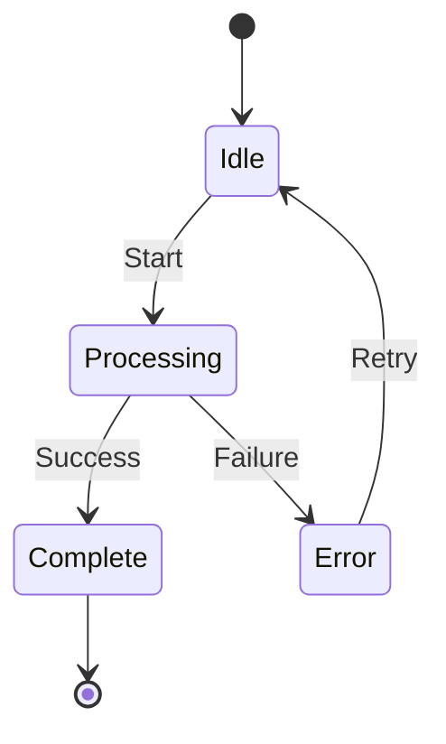

### 1.5 Entity Relationship Diagrams

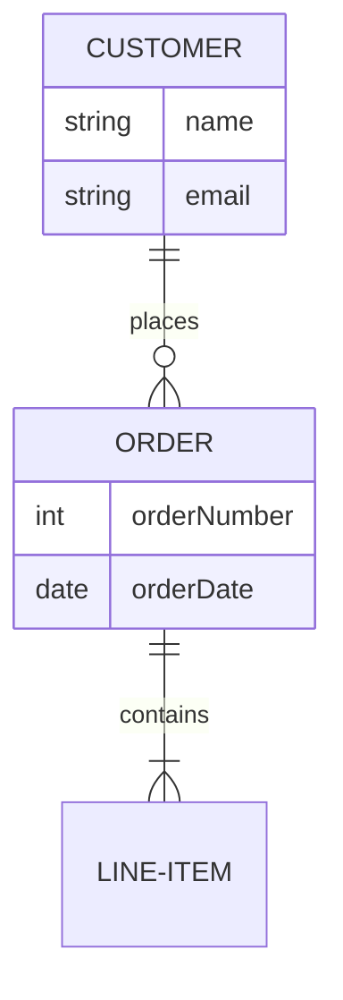

**Relationships:**
- `||--||` - One to one
- `||--o{` - One to many
- `}o--o{` - Many to many

### 1.6 Gantt Charts

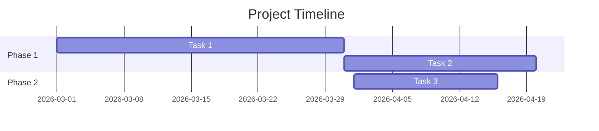

### 1.7 Git Graphs

```mermaid
gitgraph
    commit
    branch develop
    checkout develop
    commit
    checkout main
    merge develop
    commit
```

---

## 2. Best Practices

### 2.1 Accessibility Considerations

When creating diagrams that will be converted to Visio:

- **Use descriptive labels** - Avoid single letters or abbreviations
- **Add meaningful text** - Don't rely solely on colors or shapes
- **Keep it simple** - Complex diagrams may not convert cleanly
- **Use standard shapes** - Stick to basic flowchart/diagram elements

### 2.2 Styling

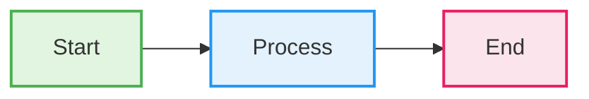

**Styling syntax:**
- `:::className` - Apply class to node
- `classDef` - Define class styles
- `fill` - Background color
- `stroke` - Border color
- `stroke-width` - Border thickness

### 2.3 Subgraphs

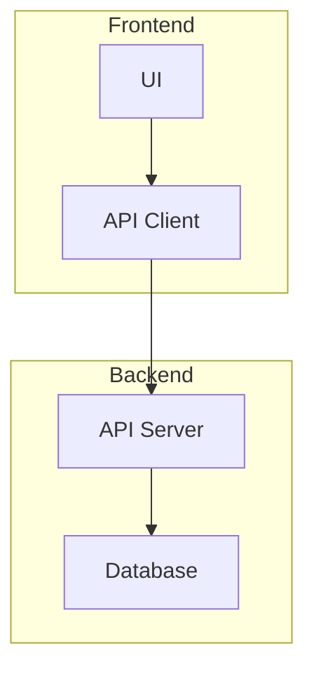

---

## 3. Converting Mermaid to Visio

### 3.1 Using the Conversion Tool

The `mermaid-to-visio` tool converts Mermaid syntax to Section 508 compliant Visio files.

**Location:** `G:\My Drive\06_Skills\_tools\mermaid-to-visio.py`

**Usage:**

```powershell
cd "G:\My Drive\06_Skills\_tools"
python mermaid-to-visio.py input.mmd output.vsdx
```

**Options:**
- `--style` - Apply predefined style (default: section508)
- `--palette` - Color palette (default: accessible)
- `--font` - Font family (default: Segoe UI)
- `--font-size` - Base font size (default: 11)

**Example:**

```powershell
python mermaid-to-visio.py diagram.mmd diagram.vsdx --style section508 --palette accessible
```

### 3.2 Conversion Process

The tool performs the following steps:

1. **Parse Mermaid syntax** - Extract nodes, edges, and structure
2. **Apply Section 508 styling** - Use approved color palette and typography
3. **Generate Visio shapes** - Create accessible shapes with proper alt text
4. **Set reading order** - Ensure logical flow for screen readers
5. **Add legend** - Include color/shape legend if needed
6. **Export** - Save as .vsdx file

### 3.3 Section 508 Compliance

The conversion tool automatically applies:

- **Approved color palette** - From Section 508 Color Palette Style Guide
- **Sufficient contrast** - Minimum 4.5:1 for text
- **Alt text** - Descriptive text for all shapes
- **Text labels** - No color-only meaning
- **Clean typography** - Segoe UI, 11-12pt minimum
- **Logical reading order** - Top-to-bottom, left-to-right

### 3.4 Post-Conversion Steps

After conversion:

1. **Review in Visio** - Open the .vsdx file and verify layout
2. **Adjust spacing** - Fine-tune alignment if needed
3. **Add title** - Include diagram title with alt text
4. **Validate accessibility** - Check contrast and reading order
5. **Export to PDF** - Create accessible PDF deliverable

See [visio-section-508.md](visio-section-508.md) for detailed Visio accessibility guidelines.

---

## 4. Common Patterns

### 4.1 System Architecture

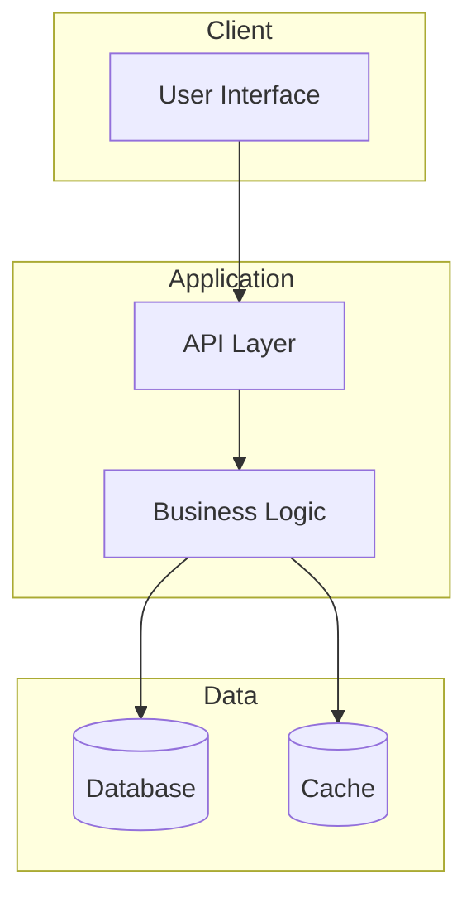

### 4.2 Process Flow

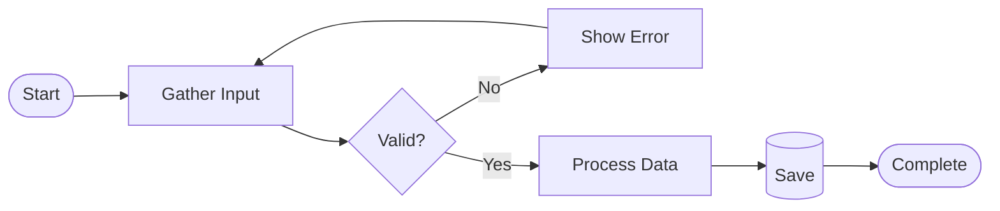

### 4.3 Data Model

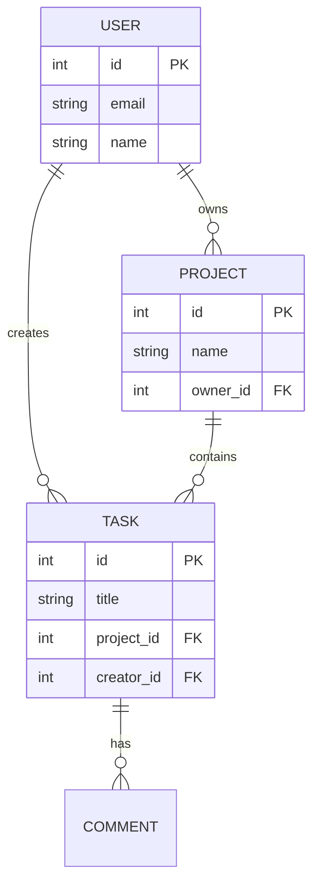

### 4.4 Deployment Pipeline

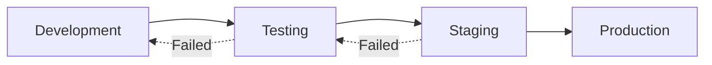

---

## 5. Integration with Other Skills

### 5.1 Documentation Skills

- Use with [feature-documentation.md](feature-documentation.md) for technical specs
- Include diagrams in [teg-discussion-templates.md](teg-discussion-templates.md)

### 5.2 Development Skills

- Document architecture in [salesforce-development.md](../development/salesforce-development.md)
- Visualize workflows in [azure-devops-automation.md](../development/azure-devops-automation.md)

### 5.3 Visio Skills

- Convert to Visio using [visio-section-508.md](visio-section-508.md) guidelines
- Create grant diagrams following [visio-grant-lifecycle-diagram.md](visio-grant-lifecycle-diagram.md)

---

## 6. Resources

### 6.1 Official Documentation

- [Mermaid Official Docs](https://mermaid.js.org/)
- [Mermaid Live Editor](https://mermaid.live/)

### 6.2 Related Skills

- [visio-section-508.md](visio-section-508.md) - Section 508 Visio guidelines
- [feature-documentation.md](feature-documentation.md) - Documentation standards

### 6.3 Tools

- **Mermaid Live Editor** - Test and preview diagrams online
- **VS Code Extension** - Mermaid Preview for real-time editing
- **mermaid-to-visio.py** - Conversion tool (see `_tools/` directory)

---

## 7. Troubleshooting

### 7.1 Syntax Errors

**Problem:** Diagram doesn't render  
**Solution:** Check for:
- Missing semicolons or line breaks
- Unmatched brackets
- Invalid node IDs (no spaces, special chars)

### 7.2 Conversion Issues

**Problem:** Shapes don't convert properly  
**Solution:**
- Simplify complex subgraphs
- Use standard shape types
- Avoid excessive styling

### 7.3 Accessibility Issues

**Problem:** Low contrast in converted Visio  
**Solution:**
- Use `--palette accessible` flag
- Manually adjust colors in Visio
- Follow Section 508 color guide

---

**Last Updated:** March 1, 2026  
**Related Skills:** [visio-section-508.md](visio-section-508.md), [feature-documentation.md](feature-documentation.md)  
**Location:** `G:\My Drive\06_Skills\documentation\mermaid-diagrams.md`
