# Mermaid from Visio - Reverse Engineering Diagrams

**Last Updated:** March 1, 2026  
**Purpose:** Convert existing Visio diagrams to Mermaid syntax for version control and text-based editing.

---

## Overview

This skill covers converting Visio diagrams (.vsdx) to Mermaid text syntax. This is useful for:
- Version controlling diagrams in Git
- Enabling text-based editing and collaboration
- Creating lightweight, portable diagram documentation
- Reverse engineering existing Visio diagrams

**Reverse Workflow:** Visio (.vsdx) → Mermaid (.mmd) → Text/Markdown

---

## Why Convert Visio to Mermaid?

### Advantages of Mermaid

**Version Control:**
- Text-based format works with Git
- Easy to see changes in diffs
- Merge conflicts are manageable

**Portability:**
- No special software needed to view
- Renders in GitHub, VS Code, many tools
- Lightweight file size

**Collaboration:**
- Easy to edit in any text editor
- Can be embedded in documentation
- Simple to share and review

**Automation:**
- Can be generated programmatically
- Easy to update with scripts
- Integrates with CI/CD pipelines

### When to Use This Conversion

- ✅ Migrating legacy Visio diagrams to text format
- ✅ Creating editable versions of received Visio files
- ✅ Adding diagrams to Git-based documentation
- ✅ Simplifying diagram maintenance
- ❌ Complex diagrams with custom shapes (may lose fidelity)
- ❌ Diagrams requiring exact pixel positioning

---

## Conversion Methods

### Method 1: Manual Conversion (Recommended for Accuracy)

**Best for:** Small to medium diagrams, ensuring accuracy

**Process:**

1. **Open Visio diagram**
2. **Identify diagram type:**
   - Flowchart → `flowchart TB` or `flowchart LR`
   - Sequence diagram → `sequenceDiagram`
   - Entity relationship → `erDiagram`
   - State diagram → `stateDiagram-v2`
   - Gantt chart → `gantt`

3. **Map shapes to Mermaid syntax:**

**Flowchart Shapes:**
```
Visio Rectangle → Mermaid: A[Text]
Visio Diamond → Mermaid: A{Decision?}
Visio Rounded Rectangle → Mermaid: A(Text)
Visio Circle → Mermaid: A((Text))
Visio Hexagon → Mermaid: A{{Text}}
```

4. **Map connectors:**
```
Visio Arrow → Mermaid: A --> B
Visio Line → Mermaid: A --- B
Visio Dotted Arrow → Mermaid: A -.-> B
Visio Thick Arrow → Mermaid: A ==> B
```

5. **Add labels:**
```
Visio Connector Label → Mermaid: A -->|Label| B
```

**Example:**

**Visio Diagram:**
- Rectangle "Start" → Diamond "Check?" → Rectangle "Process" → Circle "End"

**Mermaid Conversion:**
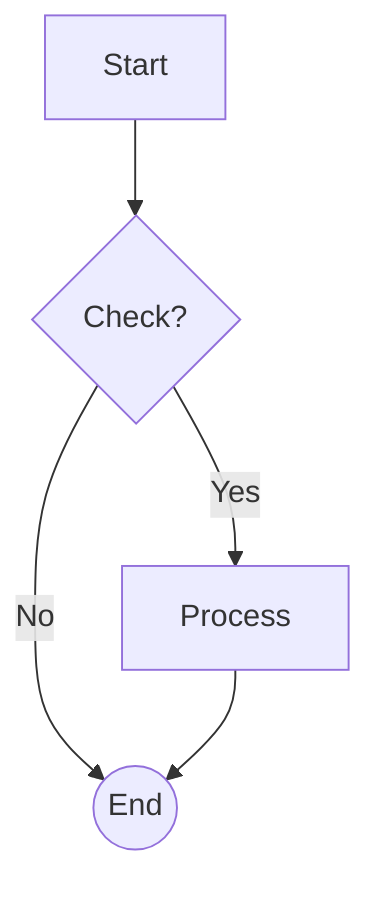

---

### Method 2: Semi-Automated Conversion

**Best for:** Large diagrams, initial draft

**Tools:**
- Python script to parse .vsdx XML
- Extract shapes and connections
- Generate Mermaid syntax

**Limitations:**
- May not capture all formatting
- Custom shapes need manual mapping
- Requires validation and cleanup

---

## Step-by-Step Conversion Guide

### Step 1: Analyze the Visio Diagram

**Open the diagram and note:**
- Diagram type (flowchart, sequence, etc.)
- Number of shapes
- Connection types
- Special formatting (colors, styles)
- Text labels

### Step 2: Choose Mermaid Diagram Type

**Flowchart:**
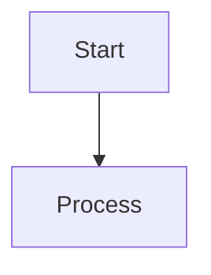

**Sequence Diagram:**
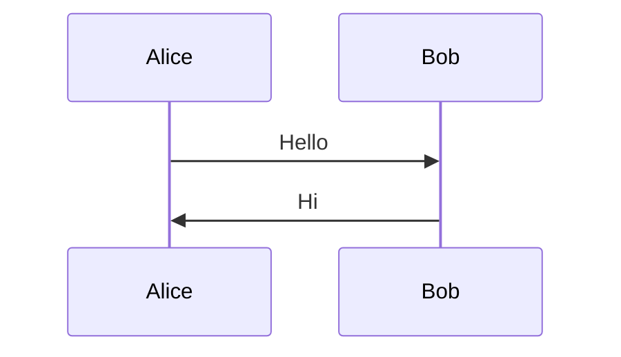

**State Diagram:**
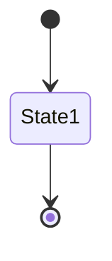

**Entity Relationship:**
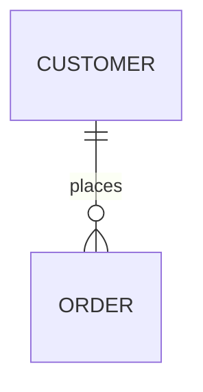

**Gantt Chart:**
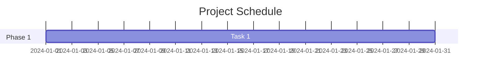

### Step 3: Create Mermaid Skeleton

Start with basic structure:

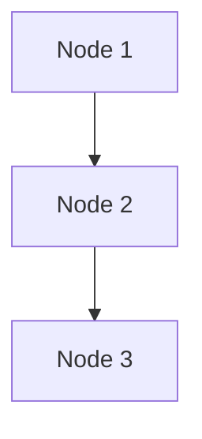

### Step 4: Add Details

**Add styling:**
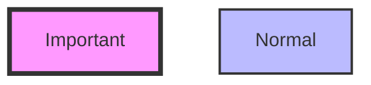

**Add subgraphs:**
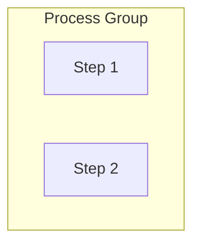

**Add classes:**
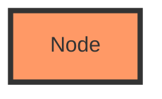

### Step 5: Validate and Refine

**Test rendering:**
- Use Mermaid Live Editor: https://mermaid.live
- Check in VS Code with Mermaid extension
- Verify in GitHub markdown preview

**Common issues:**
- Special characters in labels (escape with quotes)
- Long labels (use `<br/>` for line breaks)
- Complex connections (simplify if needed)

---

## Common Visio to Mermaid Mappings

### Flowchart Shapes

| Visio Shape | Mermaid Syntax | Use Case |
|-------------|----------------|----------|
| Process (Rectangle) | `A[Text]` | Standard process step |
| Decision (Diamond) | `A{Text?}` | Yes/No decision point |
| Terminator (Rounded) | `A([Text])` | Start/End points |
| Data (Parallelogram) | `A[/Text/]` | Input/Output |
| Document | `A[Text]` | Document reference |
| Database | `A[(Text)]` | Database operation |
| Circle | `A((Text))` | Connection point |
| Hexagon | `A{{Text}}` | Preparation step |

### Connector Types

| Visio Connector | Mermaid Syntax | Meaning |
|-----------------|----------------|---------|
| Solid Arrow | `A --> B` | Direct flow |
| Dotted Arrow | `A -.-> B` | Optional/async flow |
| Thick Arrow | `A ==> B` | Emphasized flow |
| Line (no arrow) | `A --- B` | Association |
| Labeled Arrow | `A -->|Label| B` | Conditional flow |
| Bidirectional | `A <--> B` | Two-way flow |

### Colors and Styling

**Visio colors → Mermaid styles:**

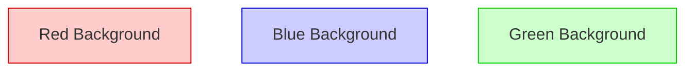

---

## Conversion Examples

### Example 1: Simple Process Flow

**Visio Description:**
- Start (rounded rectangle)
- Check Input (diamond)
- Process Data (rectangle)
- Save (database shape)
- End (rounded rectangle)

**Mermaid Conversion:**

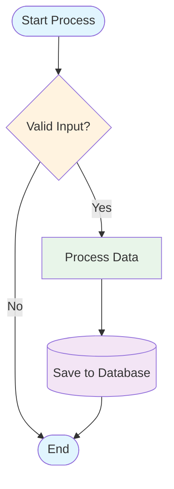

### Example 2: Swimlane Diagram

**Visio Description:**
- User lane: Submit Request
- System lane: Validate, Process
- Admin lane: Approve

**Mermaid Conversion:**

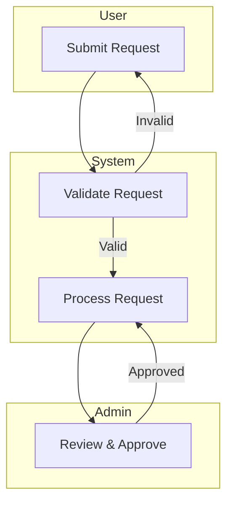

### Example 3: Decision Tree

**Visio Description:**
- Multiple decision points with yes/no branches

**Mermaid Conversion:**

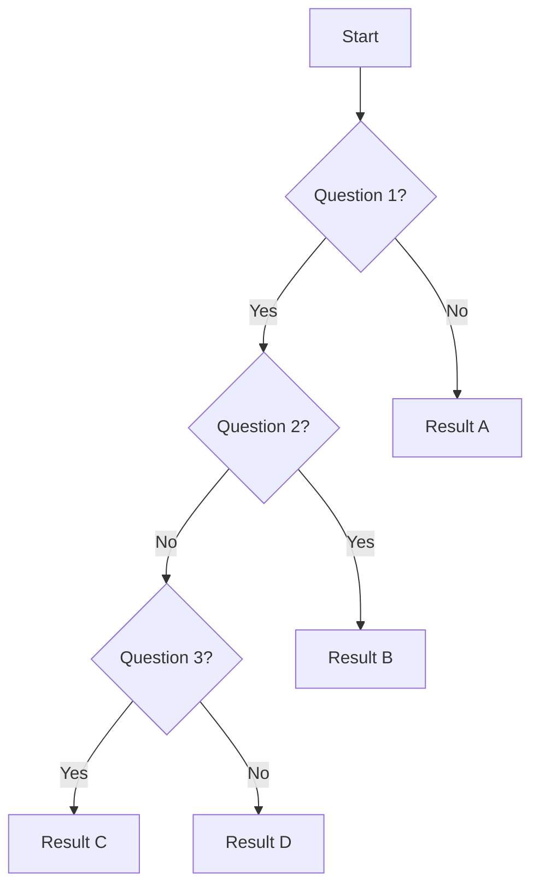

---

## Automated Conversion Script

**Python script to extract basic structure from .vsdx:**

```python
#!/usr/bin/env python3
"""
Visio to Mermaid Converter
Extracts basic structure from .vsdx files and generates Mermaid syntax.

Usage:
    python visio_to_mermaid.py input.vsdx output.mmd
"""

import zipfile
import xml.etree.ElementTree as ET
from pathlib import Path
import argparse

def extract_visio_structure(vsdx_path):
    """Extract shapes and connections from Visio file"""
    shapes = []
    connections = []
    
    with zipfile.ZipFile(vsdx_path, 'r') as zip_ref:
        # Read page XML
        page_xml = zip_ref.read('visio/pages/page1.xml')
        root = ET.fromstring(page_xml)
        
        # Extract shapes (simplified - actual implementation more complex)
        for shape in root.findall('.//{http://schemas.microsoft.com/office/visio/2012/main}Shape'):
            shape_id = shape.get('ID')
            text = shape.find('.//{http://schemas.microsoft.com/office/visio/2012/main}Text')
            shape_text = text.text if text is not None else f"Shape{shape_id}"
            shapes.append({'id': shape_id, 'text': shape_text})
        
        # Extract connections (simplified)
        for connect in root.findall('.//{http://schemas.microsoft.com/office/visio/2012/main}Connect'):
            from_id = connect.get('FromSheet')
            to_id = connect.get('ToSheet')
            connections.append({'from': from_id, 'to': to_id})
    
    return shapes, connections

def generate_mermaid(shapes, connections):
    """Generate Mermaid syntax from extracted data"""
    mermaid = ["graph TB"]
    
    # Add shapes
    for shape in shapes:
        node_id = f"N{shape['id']}"
        text = shape['text'].replace('"', '\\"')
        mermaid.append(f"    {node_id}[{text}]")
    
    # Add connections
    for conn in connections:
        from_node = f"N{conn['from']}"
        to_node = f"N{conn['to']}"
        mermaid.append(f"    {from_node} --> {to_node}")
    
    return '\n'.join(mermaid)

def main():
    parser = argparse.ArgumentParser(description='Convert Visio to Mermaid')
    parser.add_argument('input', help='Input .vsdx file')
    parser.add_argument('output', help='Output .mmd file')
    
    args = parser.parse_args()
    
    print(f"Converting {args.input} to Mermaid...")
    shapes, connections = extract_visio_structure(args.input)
    mermaid_code = generate_mermaid(shapes, connections)
    
    Path(args.output).write_text(mermaid_code)
    print(f"✓ Mermaid diagram saved to {args.output}")
    print("\nNote: This is a basic conversion. Review and refine the output.")

if __name__ == '__main__':
    main()
```

**Note:** This is a simplified example. Full implementation requires handling:
- Shape types and geometry
- Connector routing
- Text formatting
- Colors and styles
- Layers and groups

---

## Best Practices

### Do's

✅ **Start simple** - Convert basic structure first, add details later  
✅ **Use Mermaid Live Editor** - Test as you convert  
✅ **Document assumptions** - Note what was simplified  
✅ **Version control** - Commit both .vsdx and .mmd files  
✅ **Add comments** - Use `%% Comment` in Mermaid  
✅ **Test rendering** - Check in multiple viewers

### Don'ts

❌ **Don't expect perfect conversion** - Some manual work required  
❌ **Don't convert complex custom shapes** - Simplify first  
❌ **Don't ignore validation** - Always test the output  
❌ **Don't lose the original** - Keep .vsdx as reference  
❌ **Don't over-style** - Keep Mermaid simple and maintainable

---

## Troubleshooting

### Issue: Complex shapes don't convert well

**Solution:** Simplify to basic shapes or use closest Mermaid equivalent

### Issue: Layout doesn't match Visio

**Solution:** Mermaid auto-layouts. Use subgraphs to group related items.

### Issue: Special characters in labels

**Solution:** Escape with quotes: `A["Text with special chars!"]`

### Issue: Too many nodes

**Solution:** Break into multiple diagrams or use subgraphs

### Issue: Colors not preserved

**Solution:** Add style definitions manually

---

## Related Skills

- [skill_mermaid_diagrams.md](skill_mermaid_diagrams.md) - Mermaid syntax reference
- [skill_visio_via_mermaid.md](skill_visio_via_mermaid.md) - Reverse workflow (Mermaid → Visio)
- [skill_visio_section_508.md](skill_visio_section_508.md) - Accessible Visio diagrams
- [skill_feature_documentation.md](skill_feature_documentation.md) - Documentation standards

---

## Quick Reference

**Conversion Workflow:**
1. Open Visio diagram
2. Identify diagram type
3. Map shapes to Mermaid syntax
4. Map connections
5. Add styling
6. Validate in Mermaid Live Editor
7. Refine and document

**Common Commands:**
```bash
# Manual conversion - create .mmd file
notepad diagram.mmd

# Test in Mermaid Live Editor
# https://mermaid.live

# Automated conversion (if script available)
python visio_to_mermaid.py input.vsdx output.mmd
```

---

**Last Updated:** March 1, 2026  
**Location:** `G:\My Drive\06_Skills\documentation\skill_mermaid_from_visio.md`
