# Mermaid Section 508 Compliance

**Last Updated:** March 1, 2026  
**Purpose:** Create Section 508-compliant Mermaid diagrams with accessible colors, proper contrast, and text-based meaning.

---

## Overview

This skill provides Section 508 accessibility guidelines for Mermaid diagrams, ensuring they are readable by all users including those with visual impairments or color blindness.

**Key Requirements:**
- No color-only meaning
- Minimum 4.5:1 contrast ratio
- Text labels for all information
- Accessible color palette

---

## Section 508 Color Palette for Mermaid

### Approved Colors (WCAG AA Compliant)

**Primary Colors (4.5:1+ contrast with white text):**

```
Navy Blue:    #0d47a1  (Primary)
Forest Green: #1b5e20  (Success/Positive)
Burgundy:     #880e4f  (Warning/Important)
Dark Teal:    #00695c  (Info/Secondary)
Dark Orange:  #e65100  (Action/Alert)
```

**Light Colors (4.5:1+ contrast with black text):**

```
Light Blue:   #e1f5fe  (Background/Highlight)
Light Green:  #e8f5e9  (Success background)
Light Pink:   #fce4ec  (Warning background)
Light Teal:   #e0f2f1  (Info background)
Light Orange: #fff3e0  (Action background)
Light Yellow: #fff9c4  (Caution background)
```

**Neutral Colors:**

```
Black:        #000000  (Text on light backgrounds)
White:        #ffffff  (Text on dark backgrounds)
Dark Gray:    #424242  (Secondary text)
Medium Gray:  #757575  (Borders)
Light Gray:   #f5f5f5  (Subtle backgrounds)
```

---

## Section 508 Compliance Rules

### Rule 1: No Color-Only Meaning

**❌ Bad - Color conveys meaning:**
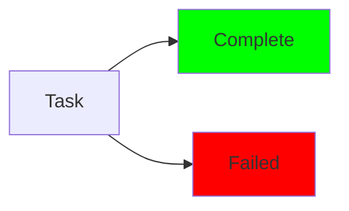

**✅ Good - Text + icons convey meaning:**
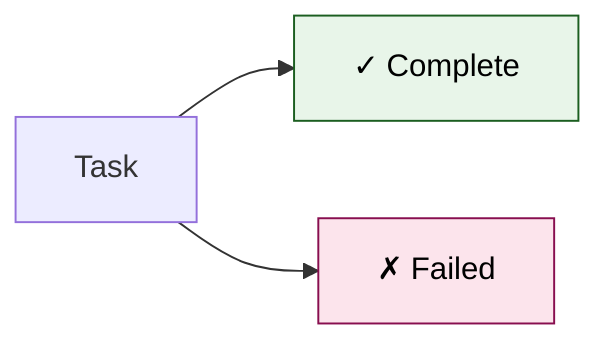

### Rule 2: Minimum 4.5:1 Contrast

**Text on backgrounds must have sufficient contrast:**

**✅ Compliant combinations:**
- Black text (#000000) on light backgrounds (#e1f5fe, #e8f5e9, #fff3e0)
- White text (#ffffff) on dark backgrounds (#0d47a1, #1b5e20, #880e4f)

**❌ Non-compliant:**
- Light gray text on white background
- Yellow text on white background
- Light blue text on dark blue background

### Rule 3: Text Labels Required

**All nodes must have descriptive text:**

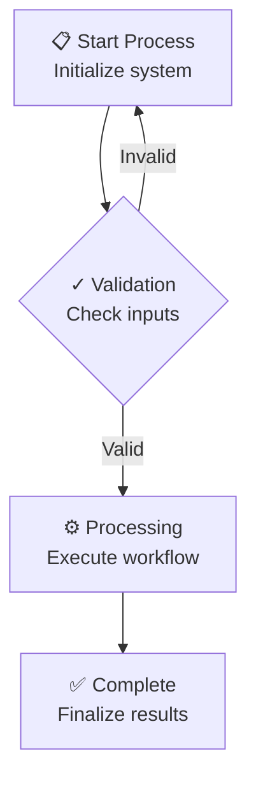

### Rule 4: Accessible Typography

**Use clear, readable text:**
- Avoid all-caps for long text
- Use sentence case or title case
- Keep labels concise
- Use line breaks (`<br/>`) for long text

---

## Section 508 Mermaid Templates

### Template 1: Flowchart (Accessible)

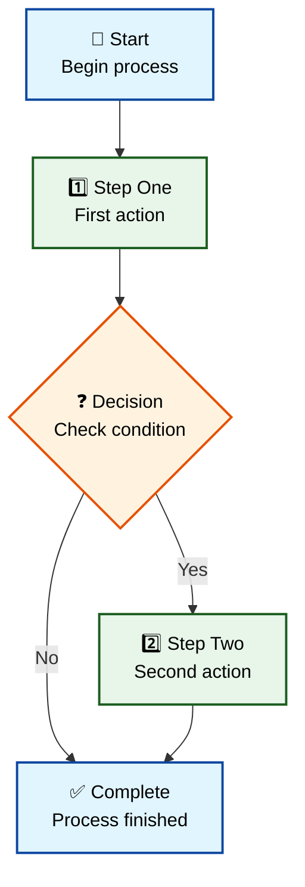

### Template 2: System Architecture (Accessible)

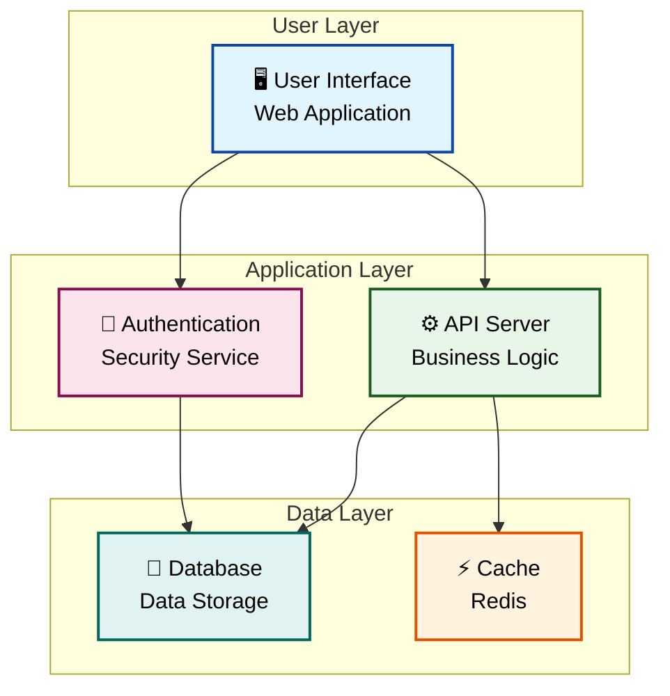

### Template 3: State Diagram (Accessible)

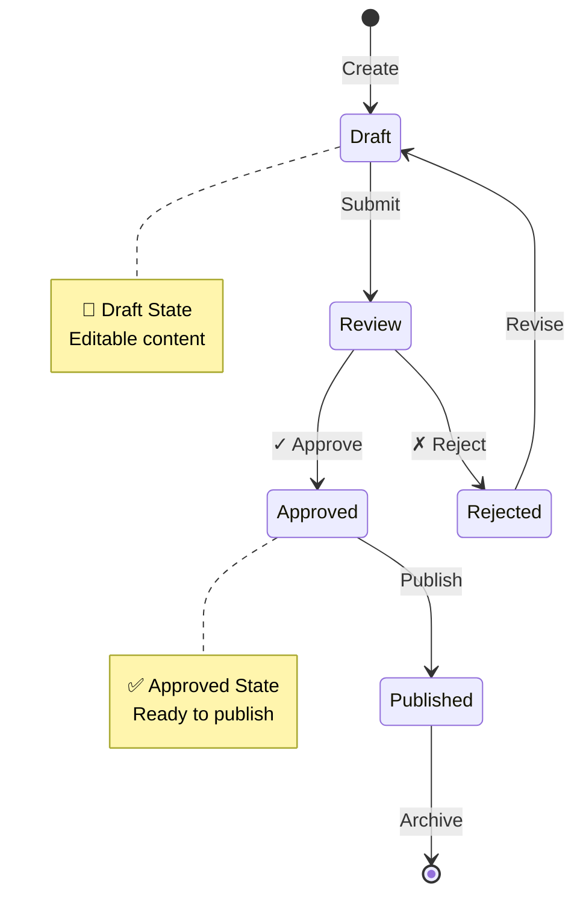

### Template 4: Sequence Diagram (Accessible)

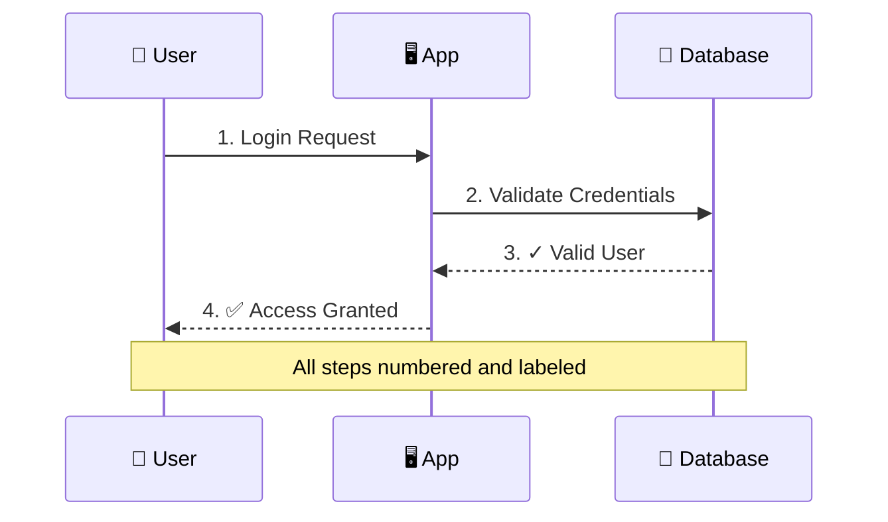

---

## Color Palette Reference

### Complete Section 508 Palette

**Dark Backgrounds (use white text):**

| Color | Hex | Use Case | Mermaid Style |
|-------|-----|----------|---------------|
| Navy Blue | #0d47a1 | Primary/Start/End | `fill:#0d47a1,stroke:#01579b,color:#fff` |
| Forest Green | #1b5e20 | Success/Complete | `fill:#1b5e20,stroke:#0d3d0f,color:#fff` |
| Burgundy | #880e4f | Warning/Error | `fill:#880e4f,stroke:#560027,color:#fff` |
| Dark Teal | #00695c | Information | `fill:#00695c,stroke:#003d33,color:#fff` |
| Dark Orange | #e65100 | Action/Alert | `fill:#e65100,stroke:#bf360c,color:#fff` |

**Light Backgrounds (use black text):**

| Color | Hex | Use Case | Mermaid Style |
|-------|-----|----------|---------------|
| Light Blue | #e1f5fe | Primary highlight | `fill:#e1f5fe,stroke:#0d47a1,color:#000` |
| Light Green | #e8f5e9 | Success highlight | `fill:#e8f5e9,stroke:#1b5e20,color:#000` |
| Light Pink | #fce4ec | Warning highlight | `fill:#fce4ec,stroke:#880e4f,color:#000` |
| Light Teal | #e0f2f1 | Info highlight | `fill:#e0f2f1,stroke:#00695c,color:#000` |
| Light Orange | #fff3e0 | Action highlight | `fill:#fff3e0,stroke:#e65100,color:#000` |
| Light Yellow | #fff9c4 | Caution highlight | `fill:#fff9c4,stroke:#f57f17,color:#000` |

---

## Accessibility Icons

**Use these Unicode icons to enhance meaning:**

```
✓ ✅ ✔️  - Success, complete, approved
✗ ❌ ✖️  - Error, failed, rejected
❓ ❔ ⁉️  - Question, decision, unknown
⚠️ ⚡ 🔔  - Warning, alert, attention
📌 📍 🎯  - Start, important, focus
🔐 🔒 🔑  - Security, locked, authentication
💾 💿 📀  - Data, storage, database
⚙️ 🔧 🛠️  - Settings, tools, configuration
📊 📈 📉  - Analytics, metrics, reports
🖥️ 💻 📱  - Devices, systems, interfaces
👤 👥 👨‍💼  - User, users, person
📝 📄 📋  - Document, form, list
🔄 ♻️ 🔃  - Refresh, cycle, repeat
```

---

## Validation Checklist

**Before finalizing a Mermaid diagram:**

- [ ] All nodes have descriptive text labels
- [ ] Icons or symbols supplement color coding
- [ ] Text contrast meets 4.5:1 minimum
- [ ] No meaning conveyed by color alone
- [ ] Colors from approved Section 508 palette
- [ ] Text is readable at normal size
- [ ] Arrows and connections are labeled when needed
- [ ] Diagram has a title or caption
- [ ] Complex diagrams have a text description

---

## Common Mistakes to Avoid

### Mistake 1: Using Pure Red/Green for Status

**❌ Bad:**
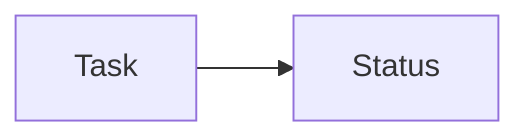

**✅ Good:**
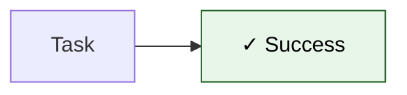

### Mistake 2: Low Contrast Text

**❌ Bad:**
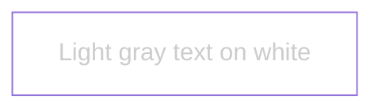

**✅ Good:**
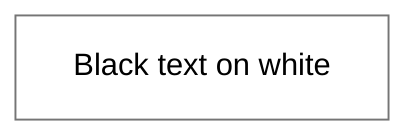

### Mistake 3: Color-Only Coding

**❌ Bad:**
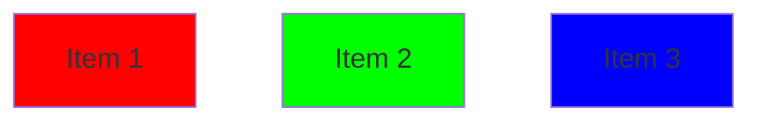

**✅ Good:**
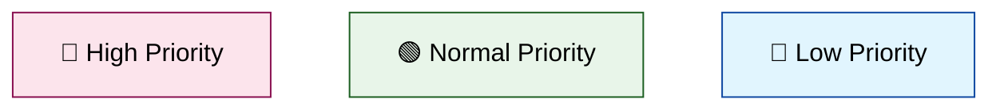

---

## Testing for Accessibility

### Color Blindness Simulation

**Test your diagrams with:**
- Chrome DevTools (Rendering > Emulate vision deficiencies)
- Online tools: Coblis Color Blindness Simulator
- Check for Deuteranopia (red-green), Protanopia, Tritanopia

### Contrast Checking

**Use these tools:**
- WebAIM Contrast Checker: https://webaim.org/resources/contrastchecker/
- Chrome DevTools (Inspect element > Contrast ratio)
- Ensure all text meets WCAG AA (4.5:1) or AAA (7:1)

---

## Export Guidelines

### For Documentation

**When embedding in Markdown:**
- Include alt text description
- Provide text summary of diagram
- Use accessible color palette

**Example:**

```markdown
## System Architecture

![System architecture diagram showing three layers: User Layer with Web UI, 
Application Layer with API and Auth services, and Data Layer with Database 
and Cache. Arrows show data flow between components.]

[Mermaid diagram code here]

**Text Description:** The system consists of three layers. The User Layer 
contains the Web Application interface. The Application Layer includes the 
API Server for business logic and Authentication Service for security. The 
Data Layer has the Database for storage and Redis Cache for performance.
```

---

## Related Skills

- [skill_visio_section_508.md](skill_visio_section_508.md) - Section 508 for Visio diagrams
- [skill_mermaid_diagrams.md](skill_mermaid_diagrams.md) - Mermaid syntax reference
- [skill_section_508_compliance.md](../system/skill_section_508_compliance.md) - General Section 508 guidelines

---

## Quick Reference

**Section 508 Mermaid Style Template:**

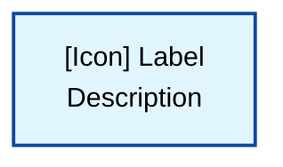

**Key Points:**
- Use icons + text (not color alone)
- Light fills with dark borders
- Black text on light backgrounds
- White text on dark backgrounds
- 2px stroke width for visibility

---

**Last Updated:** March 1, 2026  
**Location:** `G:\My Drive\06_Skills\documentation\skill_mermaid_section_508.md`
