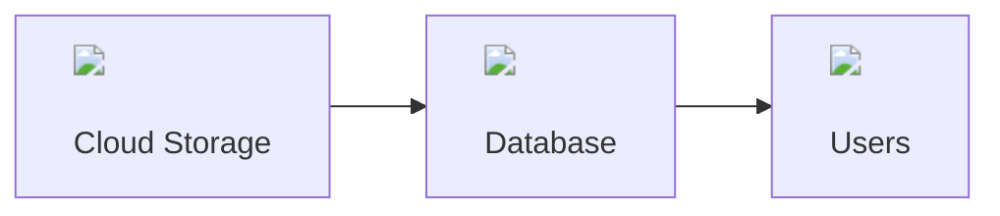
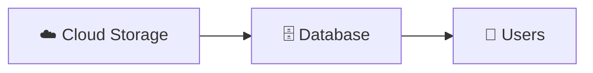
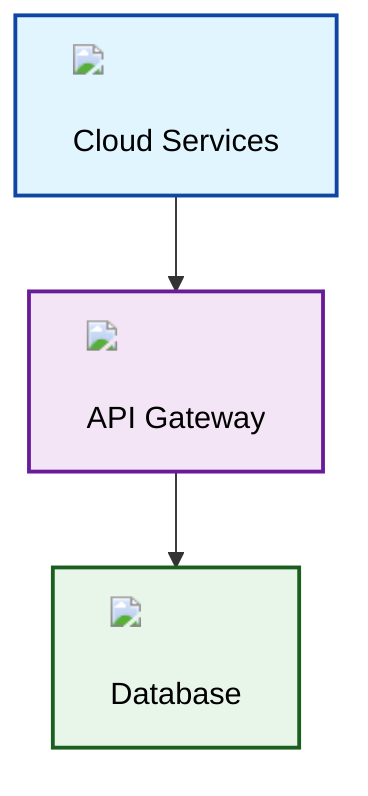
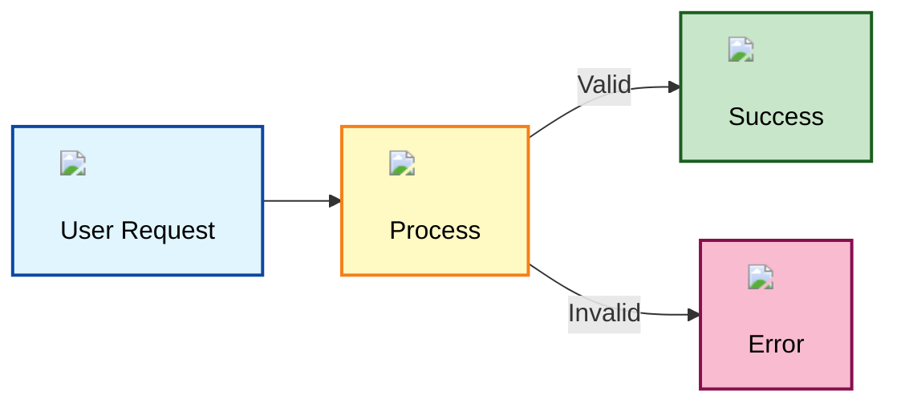
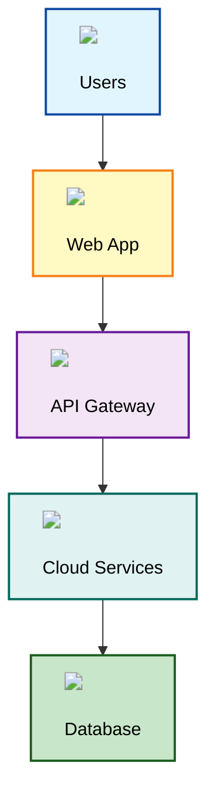
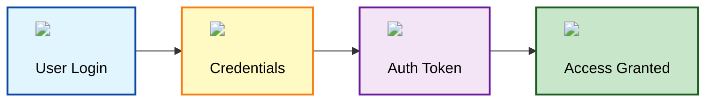
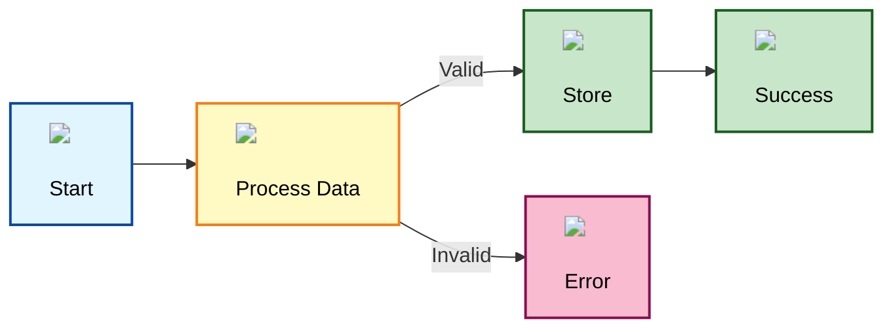

# SKILL: Using Visio Template Icons in Mermaid Diagrams

**Actionable workflow for incorporating Visio Template Visio icons into Mermaid diagrams with Section 508 compliance.**

**Last Updated:** March 1, 2026  
**Version:** 1.0.0  
**Category:** Documentation

---

## What This Skill Does

Provides workflows and techniques for:
- Embedding Visio Template icon images in Mermaid diagrams
- Maintaining Section 508 accessibility compliance
- Using exported PNG icons from Visio Template template
- Creating professional diagrams with standardized iconography

## When to Use This Skill

- **User says:** "Add Visio Template icons to my Mermaid diagram"
- **User says:** "Show me available icons for diagrams"
- **User says:** "Make my diagram use official Visio Template icons"
- **User creates:** Mermaid diagrams requiring Visio Template branding
- **Trigger:** Need to enhance Mermaid diagrams with visual icons

## What You'll Need

- Exported Visio Template icon PNG files in `${SKILLS_ROOT}/documentation/Visio Template_icons/`
- Mermaid diagram syntax knowledge
- Section 508 color palette compliance
- Markdown rendering environment that supports images

---

## Workflow: Add Visio Template Icons to Mermaid Diagrams

### Step 1: Choose Icons from Library

**Browse available icons:**

See the [Icon Preview Gallery](#icon-preview-gallery) below for all 95 available icons.

**Categories:**
- Status & Indicators (9 icons)
- Cloud & Network (8 icons)
- Database & Storage (8 icons)
- People & Roles (5 icons)
- Security (3 icons)
- Communication (4 icons)
- Favorites (6 icons)
- Shapes (14 icons)
- Flowchart (9 icons)
- Arrows (10 icons)
- Containers (6 icons)
- Diagrams (2 icons)
- Reference (3 icons)
- ER Diagram (2 icons)
- Other (5 icons)

### Step 2: Reference Icons in Mermaid

**Technique 1: Use HTML img tags in node labels**



**Technique 2: Use emoji approximations (fallback)**



**Technique 3: Combine icons with Section 508 colors**



### Step 3: Ensure Section 508 Compliance

**Always include:**

1. **Text labels** - Don't rely on icons alone
2. **Color contrast** - Use approved color palette
3. **Alt text** - Add descriptive labels
4. **Icon + text** - Combine for clarity

**Example with full compliance:**



### Step 4: Test Rendering

**Verify in your environment:**

1. Check that images render correctly
2. Verify icon paths are accessible
3. Test on different screen sizes
4. Validate color contrast ratios

---

## Icon Preview Gallery

**All 95 exported Visio Template icons with visual previews:**

### Status and Indicators (9)

| Icon | Filename | Use Case |
|------|----------|----------|
|  | `Error_icon.png` | Error states, failures |
|  | `Question_icon.png` | Questions, help needed |
|  | `Information_icon.png` | Information, notes |
|  | `Status_icons.png` | Multiple status indicators |
|  | `Flags.png` | Priority, markers |
|  | `NO_sign.png` | Prohibited, not allowed |
|  | `Help.png` | Help, assistance |
|  | `Information.png` | Info indicator |
|  | `Best_Practices.png` | Best practices, excellence |

### Cloud and Network (8)

| Icon | Filename | Use Case |
|------|----------|----------|
|  | `Cloud.png` | Cloud services, storage |
|  | `Cloud.1070.png` | Cloud variant |
|  | `Cloud_Upload.png` | Upload to cloud |
|  | `Cloud_Download.png` | Download from cloud |
|  | `Network.png` | Network infrastructure |
|  | `Globe_Internet.png` | Internet, web |
|  | `API.png` | API endpoints, services |

### Database and Storage (8)

| Icon | Filename | Use Case |
|------|----------|----------|
|  | `Database.png` | Database systems |
|  | `Database.1075.png` | Database variant |
|  | `Database_Availability_Group.png` | HA databases |
|  | `Database_Mini_2.png` | Small database |
|  | `Database_mini_2_-_orange.png` | Orange database |
|  | `Database_Server_-_orange.png` | Database server |
|  | `Data.png` | Data storage |

### People and Roles (5)

| Icon | Filename | Use Case |
|------|----------|----------|
|  | `Personnel_Staff.png` | Staff, employees |
|  | `Users.png` | User accounts |
|  | `Administrator.png` | Admin roles |
|  | `Approver.png` | Approval roles |
|  | `Role_Group.png` | User groups |

### Security and Access (3)

| Icon | Filename | Use Case |
|------|----------|----------|
|  | `Key_Permissions_-_green.png` | Access, permissions |
|  | `Token.png` | Authentication tokens |
|  | `Credentials.png` | Login credentials |

### Communication (4)

| Icon | Filename | Use Case |
|------|----------|----------|
|  | `Chat.png` | Messaging, communication |
|  | `Chat.1099.png` | Chat variant |
|  | `Post.png` | Posts, messages |
|  | `Document.png` | Documents, files |

### Favorites and Highlights (6)

| Icon | Filename | Use Case |
|------|----------|----------|
|  | `Favorite.png` | Favorites, bookmarks |
|  | `Favorite.1095.png` | Favorite variant |
|  | `Star.png` | Ratings, important |
|  | `Star_label.png` | Tagged favorites |
|  | `Pin.png` | Pinned items |
|  | `Pin.1101.png` | Location pin |

### Shapes and Symbols (7)

| Icon | Filename | Use Case |
|------|----------|----------|
|  | `Heart.png` | Favorites, health |
|  | `Smiling_Face.png` | Positive feedback |
|  | `Lightning_Bolt.png` | Power, energy, fast |
|  | `Gear.png` | Settings, configuration |
|  | `Drop.png` | Water, liquid |

### Geometric Shapes (14)

| Icon | Filename | Use Case |
|------|----------|----------|
|  | `Circle.png` | Circle outline |
|  | `Circle.1012.png` | Circle variant |
|  | `Circle.1110.png` | Circle variant |
|  | `Ellipse.png` | Oval shape |
|  | `Rectangle.png` | Rectangle |
|  | `Rectangle.1107.png` | Rectangle variant |
|  | `Triangle.png` | Triangle |
|  | `Diamond.png` | Diamond/rhombus |
|  | `Pentagon.png` | Pentagon |
|  | `Semi_Circle.png` | Half circle |
|  | `Cone.png` | Cone shape |
|  | `6-Point_Star.png` | Star of David |
|  | `16-Point_Star.png` | Multi-point star |

### Flowchart Shapes (9)

| Icon | Filename | Use Case |
|------|----------|----------|
|  | `StartEnd.png` | Flow start/end |
|  | `StartEnd.1003.png` | Start/End variant |
|  | `Process.png` | Process steps |
|  | `Process_or_Simple_Box.png` | Basic process |
|  | `Subprocess.png` | Sub-routine |
|  | `On-page_reference.png` | Page reference |
|  | `Plain.png` | Plain shape |

### Arrows and Connectors (10)

| Icon | Filename | Use Case |
|------|----------|----------|
|  | `Simple_Arrow.png` | Basic arrow |
|  | `Modern_Arrow.png` | Stylized arrow |
|  | `Modern_Arrow.1012.png` | Arrow variant |
|  | `Simple_Double_Arrow.png` | Bidirectional |
|  | `Block_Arrow.png` | Thick arrow |
|  | `Line_Arrow.png` | Line with arrow |
|  | `Line_Double_Arrow.png` | Line both arrows |
|  | `Straight_Line.png` | Simple line |
|  | `Arrow_box.png` | Box with arrow |

### Containers and Layouts (6)

| Icon | Filename | Use Case |
|------|----------|----------|
|  | `Swimlane.png` | Process swimlanes |
|  | `CFF_Container.png` | Grouping container |
|  | `Swimlane_List.png` | Multiple lanes |
|  | `Phase_List.png` | Project phases |
|  | `Layered_Box.png` | Stacked boxes |

### Diagrams and Charts (2)

| Icon | Filename | Use Case |
|------|----------|----------|
|  | `4-Phase_Circular_Motion.png` | 4-part cycle |
|  | `Inverted_Pyramid.png` | Hierarchy, funnel |

### Reference and Notes (3)

| Icon | Filename | Use Case |
|------|----------|----------|
|  | `Reference_oval.png` | Reference marker |
|  | `Reference_rectangle.png` | Reference box |
|  | `Yellow_note.png` | Notes, annotations |

### Entity Relationship (2)

| Icon | Filename | Use Case |
|------|----------|----------|
|  | `Entity_With_Attributes.png` | ER entity |
|  | `Primary_Key_Separator.png` | Attribute divider |

### Other Specialized (5)

| Icon | Filename | Use Case |
|------|----------|----------|
|  | `Component.png` | System component |
|  | `Enterprise_area.png` | Enterprise boundary |
|  | `Process_path.png` | Process pathway |
|  | `Topic.png` | Discussion topic |
|  | `Delete.png` | Delete action |

---

## Example Diagrams

### Example 1: Cloud Architecture



### Example 2: Security Flow



### Example 3: Data Processing



---

## Best Practices

### Icon Usage

✅ **Do:**
- Use icons to supplement text labels
- Keep icon sizes consistent (30-40px recommended)
- Combine icons with Section 508 colors
- Test rendering in target environment
- Provide text alternatives

❌ **Don't:**
- Rely on icons alone for meaning
- Use icons without text labels
- Mix icon sizes inconsistently
- Use non-Visio Template icons in official diagrams
- Forget color contrast requirements

### Section 508 Compliance

**Always ensure:**
1. Text labels accompany all icons
2. Color contrast meets 4.5:1 minimum
3. Icons are decorative, not informational alone
4. Diagrams work in black and white
5. Alt text is provided for images

---

## AI Agent Instructions

**When user requests Visio Template icons in Mermaid:**

1. **Show icon gallery** - Reference this skill's preview section
2. **Provide syntax** - Use HTML img tag technique
3. **Add Section 508 colors** - Include approved color styling
4. **Test accessibility** - Verify text labels and contrast
5. **Provide examples** - Show complete working diagrams

**Output format:**
```
📊 Icon: Visio Template_icons/{icon_name}.png
🎨 Section 508 Color: fill:#{color},stroke:#{stroke}
📝 Label: Always include text with icon
✅ Accessible: Icon + Text + Color contrast
```

---

## Related Skills

- **skill_Visio Template_visio_icons.md** - Visio Template icon library and extraction
- **Visio Template_ICON_GALLERY.md** - Complete icon reference
- **skill_mermaid_diagrams.md** - Mermaid diagram syntax
- **skill_mermaid_section_508.md** - Section 508 Mermaid compliance
- **skill_section_508_color_palette.md** - Approved color palette
- **skill_diagram_icons.md** - Unicode emoji alternatives

---

## Troubleshooting

### Icons Not Rendering

**Problem:** Images don't show in diagram  
**Solution:** 
- Verify path: `Visio Template_icons/{icon_name}.png`
- Check file exists in documentation folder
- Use relative path from markdown file location
- Test in different markdown renderer

### Icons Too Large/Small

**Problem:** Icon size inconsistent  
**Solution:**
- Use `width='30'` to `width='40'` for consistency
- Adjust based on diagram complexity
- Keep all icons same size within diagram

### Poor Contrast

**Problem:** Icons hard to see on colored backgrounds  
**Solution:**
- Use Section 508 approved light backgrounds
- Ensure 4.5:1 contrast ratio minimum
- Test with color blindness simulators
- Add stroke/border to icons if needed

---

## Changelog

- **2026-03-01:** Created skill for using Visio Template icons in Mermaid diagrams
- **2026-03-01:** Added visual preview gallery of all 95 exported icons
- **2026-03-01:** Included example diagrams with Section 508 compliance
- **2026-03-01:** Added AI agent instructions and best practices

---

**Location:** `${SKILLS_ROOT}/documentation/skill_mermaid_Visio Template_icons.md`  
**Category:** Documentation  
**Icons Available:** 95 PNG files  
**Section 508:** Compliant when used with approved colors  
**Requires:** Exported Visio Template icons in Visio Template_icons/ directory

