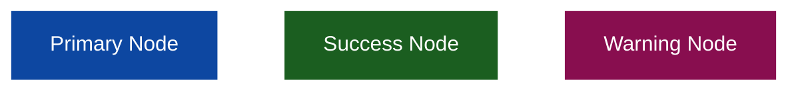
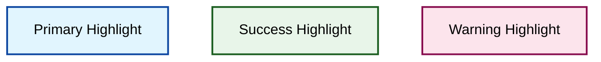
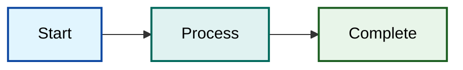
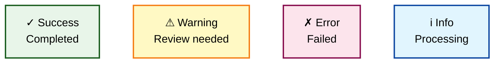

# Section 508 Color Palette for Diagrams

Complete color palette reference for creating Section 508 compliant diagrams in Mermaid and Visio, based on Section 508 accessibility standards.

---

## Overview

This skill provides the official Section 508 compliant color palette for all diagram creation. These colors meet WCAG AA standards (4.5:1 contrast ratio minimum) and are approved for use in federal documentation.

**Based on:** Visio 508 Compliant Template

---

## When to Use

- Creating Mermaid diagrams
- Designing Visio diagrams
- Building accessible presentations
- Developing documentation with visual elements
- Any diagram requiring Section 508 compliance

---

## Complete Color Palette

### Dark Backgrounds (White Text - #FFFFFF)

**Primary Colors:**

| Color Name | Hex Code | RGB | Contrast Ratio | Use Case |
|------------|----------|-----|----------------|----------|
| Navy Blue | `#0d47a1` | 13, 71, 161 | 8.59:1 | Primary actions, headers, main flow |
| Royal Blue | `#1565c0` | 21, 101, 192 | 5.14:1 | Secondary actions, subheaders |
| Dark Blue | `#01579b` | 1, 87, 155 | 7.28:1 | Alternative primary |

**Success/Positive Colors:**

| Color Name | Hex Code | RGB | Contrast Ratio | Use Case |
|------------|----------|-----|----------------|----------|
| Forest Green | `#1b5e20` | 27, 94, 32 | 8.37:1 | Success states, completion |
| Dark Green | `#2e7d32` | 46, 125, 50 | 5.39:1 | Positive indicators |
| Hunter Green | `#388e3c` | 56, 142, 60 | 4.56:1 | Growth, progress |

**Warning/Important Colors:**

| Color Name | Hex Code | RGB | Contrast Ratio | Use Case |
|------------|----------|-----|----------------|----------|
| Burgundy | `#880e4f` | 136, 14, 79 | 7.16:1 | Warnings, critical items |
| Dark Magenta | `#ad1457` | 173, 20, 87 | 5.07:1 | Important notices |
| Deep Purple | `#6a1b9a` | 106, 27, 154 | 6.95:1 | Special attention |

**Information Colors:**

| Color Name | Hex Code | RGB | Contrast Ratio | Use Case |
|------------|----------|-----|----------------|----------|
| Dark Teal | `#00695c` | 0, 105, 92 | 6.13:1 | Information, data |
| Teal | `#00796b` | 0, 121, 107 | 4.91:1 | Secondary info |
| Cyan | `#00838f` | 0, 131, 143 | 4.54:1 | Metadata |

**Action/Alert Colors:**

| Color Name | Hex Code | RGB | Contrast Ratio | Use Case |
|------------|----------|-----|----------------|----------|
| Dark Orange | `#e65100` | 230, 81, 0 | 4.54:1 | Actions, alerts |
| Deep Orange | `#bf360c` | 191, 54, 12 | 6.69:1 | Critical actions |
| Amber | `#f57f17` | 245, 127, 23 | 4.51:1 | Caution, review |

---

### Light Backgrounds (Black Text - #000000)

**Primary Highlights:**

| Color Name | Hex Code | RGB | Contrast Ratio | Use Case |
|------------|----------|-----|----------------|----------|
| Light Blue | `#e1f5fe` | 225, 245, 254 | 15.79:1 | Primary highlights |
| Sky Blue | `#b3e5fc` | 179, 229, 252 | 12.63:1 | Secondary highlights |
| Pale Blue | `#81d4fa` | 129, 212, 250 | 8.59:1 | Tertiary highlights |

**Success Highlights:**

| Color Name | Hex Code | RGB | Contrast Ratio | Use Case |
|------------|----------|-----|----------------|----------|
| Light Green | `#e8f5e9` | 232, 245, 233 | 16.12:1 | Success backgrounds |
| Mint Green | `#c8e6c9` | 200, 230, 201 | 13.24:1 | Positive states |
| Pale Green | `#a5d6a7` | 165, 214, 167 | 10.11:1 | Growth indicators |

**Warning Highlights:**

| Color Name | Hex Code | RGB | Contrast Ratio | Use Case |
|------------|----------|-----|----------------|----------|
| Light Pink | `#fce4ec` | 252, 228, 236 | 15.21:1 | Warning backgrounds |
| Rose | `#f8bbd0` | 248, 187, 208 | 11.89:1 | Caution states |
| Blush | `#f48fb1` | 244, 143, 177 | 7.94:1 | Alert backgrounds |

**Information Highlights:**

| Color Name | Hex Code | RGB | Contrast Ratio | Use Case |
|------------|----------|-----|----------------|----------|
| Light Teal | `#e0f2f1` | 224, 242, 241 | 15.89:1 | Info backgrounds |
| Aqua | `#b2dfdb` | 178, 223, 219 | 12.71:1 | Data highlights |
| Cyan Light | `#80cbc4` | 128, 203, 196 | 9.24:1 | Metadata backgrounds |

**Action Highlights:**

| Color Name | Hex Code | RGB | Contrast Ratio | Use Case |
|------------|----------|-----|----------------|----------|
| Light Orange | `#fff3e0` | 255, 243, 224 | 16.54:1 | Action backgrounds |
| Peach | `#ffe0b2` | 255, 224, 178 | 14.12:1 | Interactive elements |
| Apricot | `#ffcc80` | 255, 204, 128 | 10.89:1 | Call-to-action |

**Caution Highlights:**

| Color Name | Hex Code | RGB | Contrast Ratio | Use Case |
|------------|----------|-----|----------------|----------|
| Light Yellow | `#fff9c4` | 255, 249, 196 | 15.67:1 | Caution backgrounds |
| Cream | `#fff59d` | 255, 245, 157 | 13.45:1 | Review needed |
| Butter | `#fff176` | 255, 241, 118 | 11.23:1 | Attention required |

---

### Neutral Colors

**Grayscale:**

| Color Name | Hex Code | RGB | Contrast Ratio | Use Case |
|------------|----------|-----|----------------|----------|
| Black | `#000000` | 0, 0, 0 | 21:1 | Text on light backgrounds |
| White | `#ffffff` | 255, 255, 255 | 21:1 | Text on dark backgrounds |
| Charcoal | `#212121` | 33, 33, 33 | 16.05:1 | Primary text |
| Dark Gray | `#424242` | 66, 66, 66 | 12.63:1 | Secondary text |
| Medium Gray | `#757575` | 117, 117, 117 | 4.54:1 | Borders, dividers |
| Light Gray | `#bdbdbd` | 189, 189, 189 | 1.82:1 | Subtle backgrounds |
| Pale Gray | `#e0e0e0` | 224, 224, 224 | 1.32:1 | Very light backgrounds |
| Off-White | `#f5f5f5` | 245, 245, 245 | 1.09:1 | Canvas backgrounds |

---

## Mermaid Implementation

### Basic Node Styling

**Dark Background Nodes:**



**Light Background Nodes:**



---

### Complete Mermaid Style Templates

**Template 1: Primary Flow (Dark)**


**Template 2: Highlighted Flow (Light)**



**Template 3: Status Indicators**



---

## Color Combination Guidelines

### Recommended Pairings

**Primary Combinations:**
- Navy Blue (#0d47a1) + Light Blue (#e1f5fe)
- Forest Green (#1b5e20) + Light Green (#e8f5e9)
- Burgundy (#880e4f) + Light Pink (#fce4ec)
- Dark Teal (#00695c) + Light Teal (#e0f2f1)
- Dark Orange (#e65100) + Light Orange (#fff3e0)

**Complementary Combinations:**
- Navy Blue + Light Green (Primary + Success)
- Forest Green + Light Blue (Success + Primary)
- Burgundy + Light Yellow (Warning + Caution)
- Dark Orange + Light Pink (Action + Warning)

**Avoid These Combinations:**
- ❌ Light colors on light backgrounds
- ❌ Dark colors on dark backgrounds
- ❌ Red + Green (colorblind issues)
- ❌ Blue + Purple (low distinction)
- ❌ Yellow text on white background

---

## Accessibility Icons

**Use with colors to reinforce meaning:**

```
Status Icons:
✓ ✅ ✔️  - Success, approved, complete
✗ ❌ ✖️  - Error, rejected, failed
⚠️ ⚡ 🔔  - Warning, alert, attention
ℹ️ 💡 📌  - Information, tip, note

Action Icons:
▶️ ➡️ →  - Next, forward, proceed
◀️ ⬅️ ←  - Back, previous, return
🔄 ♻️ 🔃  - Refresh, retry, cycle
⏸️ ⏹️ ⏯️  - Pause, stop, play

Object Icons:
📁 📂 🗂️  - Folder, directory, files
📄 📝 📋  - Document, note, form
💾 💿 📀  - Storage, database, data
🖥️ 💻 📱  - Computer, device, system

People Icons:
👤 👥 👨‍💼  - User, users, person
👨‍💻 👩‍💻 🧑‍💻  - Developer, coder, engineer

Security Icons:
🔐 🔒 🔓  - Locked, secure, unlocked
🔑 🗝️ 🛡️  - Key, access, protection

Process Icons:
⚙️ 🔧 🛠️  - Settings, tools, config
📊 📈 📉  - Chart, metrics, analytics
🎯 🏁 ✨  - Goal, finish, complete
```

---

## Quick Reference Cards

### Card 1: Primary Colors

```
Navy Blue:    #0d47a1  ■ White text
Forest Green: #1b5e20  ■ White text
Burgundy:     #880e4f  ■ White text
Dark Teal:    #00695c  ■ White text
Dark Orange:  #e65100  ■ White text
```

### Card 2: Highlight Colors

```
Light Blue:   #e1f5fe  ■ Black text
Light Green:  #e8f5e9  ■ Black text
Light Pink:   #fce4ec  ■ Black text
Light Teal:   #e0f2f1  ■ Black text
Light Orange: #fff3e0  ■ Black text
Light Yellow: #fff9c4  ■ Black text
```

### Card 3: Mermaid Quick Styles

```
Dark: fill:#0d47a1,stroke:#ffffff,color:#ffffff
Light: fill:#e1f5fe,stroke:#0d47a1,stroke-width:2px,color:#000000
```

---

## Validation Checklist

**Before using colors in diagrams:**

- [ ] Color has 4.5:1 contrast ratio minimum
- [ ] Text color matches background (white on dark, black on light)
- [ ] Icons or labels supplement color meaning
- [ ] Color is from approved Section 508 palette
- [ ] Tested with colorblind simulation
- [ ] Stroke/border provides additional contrast
- [ ] No color-only information conveyed

---

## Testing Tools

**Contrast Checkers:**
- WebAIM Contrast Checker: https://webaim.org/resources/contrastchecker/
- Coolors Contrast Checker: https://coolors.co/contrast-checker
- Chrome DevTools: Inspect > Contrast ratio

**Colorblind Simulators:**
- Coblis: https://www.color-blindness.com/coblis-color-blindness-simulator/
- Chrome DevTools: Rendering > Emulate vision deficiencies
- Sim Daltonism (Mac app)

---

## Related Skills

- **[skill_mermaid_section_508](skill_mermaid_section_508.md)** - Mermaid Section 508 compliance
- **[skill_visio_section_508](skill_visio_section_508.md)** - Visio Section 508 compliance
- **[skill_mermaid_diagrams](skill_mermaid_diagrams.md)** - Mermaid syntax reference
- **[skill_section_508_compliance](../system/skill_section_508_compliance.md)** - General Section 508 guidelines

---

## Changelog

- **2026-03-01:** Created Section 508 color palette skill based on Visio template

---

**Location:** `G:\My Drive\06_Skills\documentation\skill_section_508_color_palette.md`  
**Category:** Documentation  
**Difficulty:** Beginner  
**Source:** Visio 508 Compliant Template

