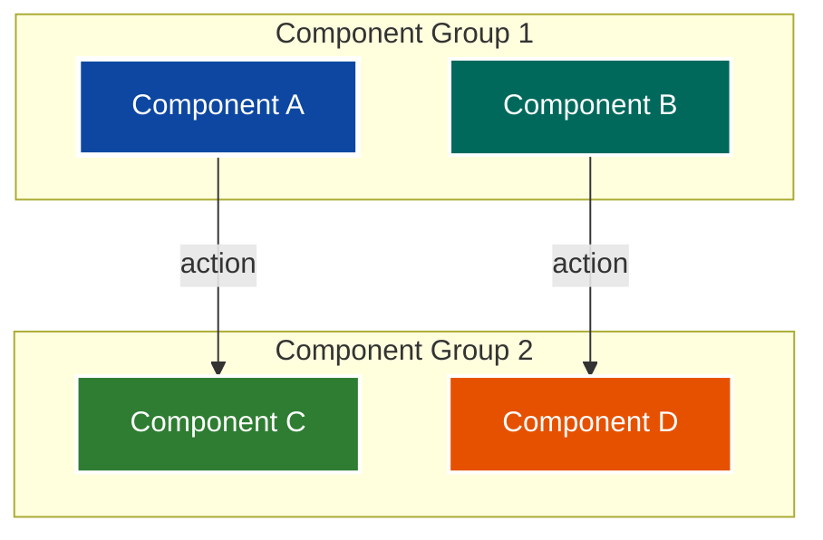
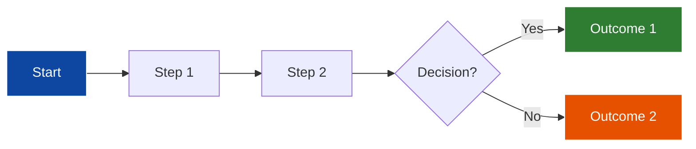

# TEG One-Pager Creation

**Last Updated:** March 2, 2026  
**Purpose:** Create effective TEG (Technical Engineering Group) one-pager proposals for technical decisions and architectural choices  
**Success Rate:** Proven format for stakeholder decision-making

---

## Table of Contents

1. [Overview](#overview)
2. [When to Use](#when-to-use)
3. [Document Structure](#document-structure)
4. [Writing Guidelines](#writing-guidelines)
5. [Decision Framework](#decision-framework)
6. [Alternatives Analysis](#alternatives-analysis)
7. [Diagram Best Practices](#diagram-best-practices)
8. [Complete Example](#complete-example)
9. [Templates](#templates)
10. [Best Practices](#best-practices)
11. [Common Mistakes](#common-mistakes)
12. [Related Skills](#related-skills)

---

## Overview

A TEG one-pager is a concise technical proposal document that presents a problem, analyzes alternatives, and recommends a solution. The format is designed for stakeholder decision-making and technical architecture discussions.

### Key Characteristics

- **Length:** 1-3 pages (expandable with diagrams)
- **Audience:** Technical and non-technical stakeholders
- **Purpose:** Drive decision-making with clear alternatives
- **Format:** Structured sections with visual aids
- **Outcome:** Approval or rejection with clear rationale

### Document Goals

1. **Clarity:** Present complex technical decisions simply
2. **Completeness:** Cover all viable alternatives
3. **Objectivity:** Present pros/cons without bias
4. **Actionability:** Enable stakeholders to make informed decisions
5. **Traceability:** Document decision rationale for future reference

---

## When to Use

### Appropriate Use Cases

- **Architecture Decisions:** Repository strategy, deployment pipeline, system design
- **Technology Selection:** Tool choices, framework decisions, platform selection
- **Process Changes:** Workflow modifications, team structure, development practices
- **Infrastructure Decisions:** Hosting, networking, security architecture
- **Vendor Evaluation:** Comparing multiple vendor solutions

### Not Appropriate For

- **Implementation Details:** Save for technical design docs
- **Routine Changes:** Use standard change management
- **Emergency Fixes:** Document after resolution
- **Single Option:** If only one viable option, use different format

---

## Document Structure

### Required Sections

Every TEG one-pager must include these sections in order:

#### 1. Header

```markdown
# TEG One-Pager: [Topic Title]

**Date:** [Date]  
**Author:** [Team/Individual]  
**Status:** [Proposal/Approved/Rejected]
```

#### 2. Problem Statement

**Purpose:** Define the problem clearly and concisely

**Structure:**
- **Current Situation:** What exists today
- **Critical Risks:** What problems does this cause
- **Impact:** Who/what is affected

**Example:**
```markdown
## Problem Statement

**Current Situation:**
- 2-3 different vendors working on the same Salesforce org
- One shared Copado repository for all vendors (CI/CD only)
- 10+ developers per vendor actively making changes

**Critical Risks:**
1. **No Version Control for Development Work**
   - Cannot commit code frequently during development
   - Cannot track changes or revert problematic code
   
2. **Internal Team Collaboration Failure**
   - 10+ developers per vendor cannot coordinate internally
   - Risk of code conflicts within same vendor team
```

#### 3. Outcome Expectation

**Purpose:** Define success criteria and goals

**Structure:**
- **Primary Goal:** Main objective
- **Success Metrics:** Measurable outcomes

**Example:**
```markdown
## Outcome Expectation

**Primary Goal:** Establish git repository for Salesforce development that supports:
- Frequent commits for AI-assisted development
- Multi-developer collaboration (10+ developers)
- Seamless integration with Copado CI/CD pipeline

**Success Metrics:**
- Developers commit code 5-10 times per day
- Zero code conflicts within team
- Full version control for AI development
```

#### 4. Requirements

**Purpose:** Define functional and non-functional requirements

**Structure:**
- **Functional Requirements:** What the solution must do
- **Non-Functional Requirements:** Performance, security, compliance

**Example:**
```markdown
## Requirements

### Functional Requirements
1. **Git Repository**
   - Support 10+ concurrent developers
   - Standard gitflow workflow
   - Integration with Copado deployment pipeline

### Non-Functional Requirements
1. **Security:** FedRAMP-compliant repository hosting
2. **Performance:** No impact on Copado deployment speed
3. **Compliance:** Government audit trail requirements
```

#### 5. Design Details

**Purpose:** Present alternatives with analysis

**Structure:**
- **Repository Options Analysis:** Table comparing alternatives
- **Alternative 1:** Detailed description with diagram
- **Alternative 2:** Detailed description with diagram
- **Branch Strategy:** How branching will work
- **Workflow:** Step-by-step process

**Key Component:** Comparison table

```markdown
### Repository Options Analysis

| **Option** | **Location** | **Pros** | **Cons** |
|------------|-------------|----------|----------|
| **Alternative 1** | [URL] | ✅ Benefit 1<br/>✅ Benefit 2 | ❌ Drawback 1<br/>❌ Drawback 2 |
| **Alternative 2** | [URL] | ✅ Benefit 1<br/>✅ Benefit 2 | ⚠️ Concern 1<br/>⚠️ Concern 2 |
```

#### 6. Implementation Plan

**Purpose:** Show how the solution will be implemented

**Structure:**
- **Phase 1:** Initial setup (Week 1)
- **Phase 2:** Team onboarding (Week 2)
- **Phase 3:** Rollout (Week 3+)

**Example:**
```markdown
## Implementation Plan

### Phase 1: Repository Setup (Week 1)
1. **Day 1-2:** Create git repository
   - Configure branch policies
   - Set up permissions

2. **Day 3-4:** Configure Integrations
   - Set up CI/CD pipeline
   - Test deployment process
```

#### 7. Benefits Summary

**Purpose:** Summarize benefits for each stakeholder group

**Structure:**
- **For [Stakeholder Group 1]:** List of benefits
- **For [Stakeholder Group 2]:** List of benefits

**Example:**
```markdown
## Benefits Summary

### For Developers
- ✅ Commit code 5-10 times per day
- ✅ AI development with full version control
- ✅ Revert problematic changes instantly

### For HRSA
- ✅ Full visibility into all code changes
- ✅ Commit history for audit trail
```

#### 8. Decision Required

**Purpose:** Present final recommendation with clear pros/cons

**Structure:**
- **Alternative 1:** Detailed pros/cons, best for
- **Alternative 2:** Detailed pros/cons, best for
- **Status Quo:** Why current approach doesn't work

**Example:**
```markdown
## Decision Required

### Alternative 1: REI-Only Repository

**Pros:**
- ✅ Fast setup (existing permissions)
- ✅ Immediate implementation

**Cons:**
- ❌ HRSA cannot view commits directly

**Best For:** Internal team collaboration, faster implementation
```

#### 9. Questions for Discussion

**Purpose:** Identify open questions for stakeholder input

**Example:**
```markdown
## Questions for Discussion

1. **Repository Decision:** Alternative 1 or Alternative 2?
2. **Permissions:** Who manages vendor access?
3. **Timeline:** Is 3-week implementation acceptable?
```

#### 10. Next Steps

**Purpose:** Define immediate actions if approved

**Structure:**
- **Immediate** (This Week)
- **Short Term** (Next 2 Weeks)
- **Long Term** (Ongoing)

---

## Writing Guidelines

### Tone and Style

- **Concise:** Every word counts, avoid fluff
- **Objective:** Present facts, not opinions
- **Clear:** Use simple language, avoid jargon
- **Visual:** Use diagrams, tables, and formatting
- **Action-Oriented:** Focus on decisions and outcomes

### Formatting Best Practices

#### Use Emoji Indicators

```markdown
✅ Pros/Benefits
❌ Cons/Drawbacks
⚠️ Concerns/Warnings
📦 Components/Systems
👨‍💻 Users/Stakeholders
```

#### Use Tables for Comparison

Always use tables to compare alternatives side-by-side.

#### Use Diagrams

Include Mermaid diagrams for:
- Architecture flows
- Process workflows
- System interactions
- Decision trees

#### Use Section 508 Compliant Colors

Follow the Section 508 color palette skill for accessible diagrams.

**Standard Colors:**
- Navy Blue (#0d47a1) - Primary elements
- Dark Teal (#00695c) - Secondary elements
- Forest Green (#2e7d32) - Success/Completion
- Dark Orange (#e65100) - Warnings/Actions
- Deep Purple (#6a1b9a) - External systems
- Burgundy (#1b5e20) - Stakeholders

---

## Decision Framework

### How to Present Alternatives

#### 1. Identify All Viable Options

Include:
- **Recommended approach:** Your preferred solution
- **Alternative approaches:** Other viable options
- **Status quo:** Current state (if applicable)

#### 2. Create Comparison Table

Use consistent criteria:
- Location/Implementation
- Pros (benefits)
- Cons (drawbacks)
- Best use case

#### 3. Provide Detailed Analysis

For each alternative:
- Full description
- Architecture diagram
- Workflow explanation
- Pros/cons list
- "Best for" statement

#### 4. Make a Recommendation

In the "Decision Required" section:
- Clearly state which alternative you recommend
- Explain why (based on requirements)
- Acknowledge trade-offs
- Provide decision criteria

---

## Alternatives Analysis

### Comparison Table Template

```markdown
| **Option** | **Criteria 1** | **Criteria 2** | **Pros** | **Cons** |
|------------|---------------|---------------|----------|----------|
| **Alternative 1** | Value | Value | ✅ Benefit<br/>✅ Benefit | ❌ Drawback<br/>❌ Drawback |
| **Alternative 2** | Value | Value | ✅ Benefit<br/>✅ Benefit | ⚠️ Concern<br/>⚠️ Concern |
| **Status Quo** | Value | Value | ✅ Benefit | ❌ Drawback<br/>❌ Drawback |
```

### Alternative Detail Template

```markdown
### Alternative 1: [Name]

[Mermaid diagram showing architecture/flow]

**Key Points:**
- Point 1
- Point 2
- Point 3

**Pros:**
- ✅ Benefit 1
- ✅ Benefit 2

**Cons:**
- ❌ Drawback 1
- ❌ Drawback 2

**Best For:** [Use case description]
```

---

## Diagram Best Practices

### Mermaid Diagram Structure

#### Architecture Flow Diagram

```markdown

\`\`\`

#### Process Workflow Diagram

```markdown

\`\`\`

### Diagram Guidelines

1. **Use Subgraphs:** Group related components
2. **Label Arrows:** Describe the action/relationship
3. **Use Icons:** Add emoji for visual clarity (👨‍💻, 📦, etc.)
4. **Apply Section 508 Colors:** Ensure accessibility
5. **Keep It Simple:** Don't overcomplicate the diagram
6. **Show Flow Direction:** Top-to-bottom or left-to-right

---

## Complete Example

See the reference document for a complete example:
`c:\projects\POCs\src\dmedev5\docs\Reference_Guides\TEG_One_Pager_Copado_Git_Repository_Strategy.md`

### Key Sections from Example

**Problem Statement:**
- Current situation with specific numbers (2-3 vendors, 10+ developers)
- Critical risks with clear impact
- Specific pain points

**Alternatives:**
- Alternative 1: REI-Only Repository (fast, limited visibility)
- Alternative 2: HRSA Shared Repository (full visibility, complex setup)
- Status Quo: Copado Only (doesn't meet requirements)

**Diagrams:**
- Separate diagram for each alternative
- Section 508 compliant colors
- Clear flow from development to deployment

**Decision Framework:**
- Clear pros/cons for each option
- "Best For" statement for each alternative
- Explicit recommendation

---

## Templates

### Minimal Template

```markdown
# TEG One-Pager: [Topic]

**Date:** [Date]  
**Author:** [Author]  
**Status:** Proposal

## Problem Statement
[Current situation, critical risks, impact]

## Outcome Expectation
**Primary Goal:** [Goal]
**Success Metrics:** [Metrics]

## Requirements
### Functional Requirements
1. [Requirement 1]

### Non-Functional Requirements
1. [Requirement 1]

## Design Details
### Options Analysis
| **Option** | **Pros** | **Cons** |
|------------|----------|----------|
| **Alt 1** | ✅ Benefit | ❌ Drawback |
| **Alt 2** | ✅ Benefit | ❌ Drawback |

### Alternative 1: [Name]
[Diagram]
**Pros:** ✅ [List]
**Cons:** ❌ [List]

### Alternative 2: [Name]
[Diagram]
**Pros:** ✅ [List]
**Cons:** ❌ [List]

## Implementation Plan
### Phase 1: [Name] (Week 1)
1. [Step 1]

## Benefits Summary
### For [Stakeholder]
- ✅ [Benefit]

## Decision Required
### Recommended: [Alternative Name]
**Best For:** [Use case]

## Questions for Discussion
1. [Question]

## Next Steps
**If Approved:**
1. [Action]
```

### Full Template

Available at: `c:\projects\POCs\src\dmedev5\docs\Reference_Guides\TEG_One_Pager_Copado_Git_Repository_Strategy.md`

---

## Best Practices

### 1. Start with the Problem

```markdown
# ✅ CORRECT: Clear problem statement
**Current Situation:**
- 10+ developers per vendor cannot coordinate
- No version control for AI development

# ❌ WRONG: Solution-first approach
We need a git repository for development.
```

### 2. Use Specific Numbers

```markdown
# ✅ CORRECT: Specific metrics
- 10+ developers per vendor
- 5-10 commits per day
- 3-week implementation

# ❌ WRONG: Vague statements
- Many developers
- Frequent commits
- Quick implementation
```

### 3. Present Multiple Alternatives

```markdown
# ✅ CORRECT: At least 2 alternatives
- Alternative 1: REI-Only Repository
- Alternative 2: HRSA Shared Repository
- Status Quo: Copado Only

# ❌ WRONG: Single option
Here's the solution we should implement.
```

### 4. Include Diagrams

```markdown
# ✅ CORRECT: Visual representation
### Alternative 1: Flow Diagram
[Mermaid diagram showing architecture]

# ❌ WRONG: Text-only description
The flow goes from developers to repository to deployment.
```

### 5. Define Success Metrics

```markdown
# ✅ CORRECT: Measurable outcomes
**Success Metrics:**
- Developers commit code 5-10 times per day
- Zero code conflicts within team
- 100% Copado deployment success rate

# ❌ WRONG: Vague goals
We want better collaboration and fewer issues.
```

### 6. Acknowledge Trade-offs

```markdown
# ✅ CORRECT: Honest pros/cons
**Pros:**
- ✅ Fast setup (existing permissions)

**Cons:**
- ❌ HRSA cannot view commits directly

# ❌ WRONG: Only benefits
This solution is perfect and has no drawbacks.
```

### 7. Provide Clear Next Steps

```markdown
# ✅ CORRECT: Actionable steps with timeline
**Immediate** (This Week)
1. Create git repository
2. Configure branch policies

**Short Term** (Next 2 Weeks)
1. Configure Copado sync
2. Train vendor teams

# ❌ WRONG: Vague actions
We'll set things up and get started.
```

---

## Common Mistakes

### Mistake 1: Too Much Detail

**Problem:** Including implementation details that belong in technical design docs.

**Solution:** Keep one-pager focused on decision-making. Save implementation details for follow-up docs.

### Mistake 2: Biased Presentation

**Problem:** Presenting only one option or heavily favoring one alternative.

**Solution:** Present all viable alternatives objectively. Make recommendation in "Decision Required" section.

### Mistake 3: Missing Diagrams

**Problem:** Text-only descriptions of complex architectures.

**Solution:** Always include Mermaid diagrams for each alternative.

### Mistake 4: Vague Requirements

**Problem:** "We need better collaboration" without specifics.

**Solution:** Define measurable requirements and success metrics.

### Mistake 5: No Timeline

**Problem:** No implementation plan or timeline.

**Solution:** Include phased implementation plan with week-by-week breakdown.

### Mistake 6: Ignoring Stakeholders

**Problem:** Not addressing concerns of all stakeholder groups.

**Solution:** Include "Benefits Summary" section for each stakeholder group.

### Mistake 7: No Decision Criteria

**Problem:** Presenting alternatives without guidance on how to choose.

**Solution:** Include "Best For" statements and clear recommendation.

---

## Checklist

Use this checklist before submitting a TEG one-pager:

### Content Completeness
- [ ] Problem statement clearly defines current situation
- [ ] Critical risks are identified with impact
- [ ] Outcome expectation includes measurable success metrics
- [ ] Functional and non-functional requirements are listed
- [ ] At least 2 alternatives are presented
- [ ] Each alternative has a diagram
- [ ] Comparison table shows all alternatives side-by-side
- [ ] Implementation plan has phased timeline
- [ ] Benefits summary addresses all stakeholder groups
- [ ] Decision section includes clear recommendation
- [ ] Questions for discussion are listed
- [ ] Next steps are actionable and time-bound

### Quality Checks
- [ ] Diagrams use Section 508 compliant colors
- [ ] All diagrams render correctly
- [ ] Tables are properly formatted
- [ ] Emoji indicators are used consistently (✅ ❌ ⚠️)
- [ ] Specific numbers are used (not vague statements)
- [ ] Pros/cons are objective and honest
- [ ] Document is 1-3 pages (excluding diagrams)
- [ ] Language is clear and jargon-free
- [ ] All URLs are correct and accessible

### Stakeholder Review
- [ ] Technical stakeholders can understand architecture
- [ ] Non-technical stakeholders can understand problem/solution
- [ ] Decision-makers have enough information to approve/reject
- [ ] All concerns are addressed in Q&A section

---

## Related Skills

### Documentation Skills
- **[skill_section_508_color_palette](skill_section_508_color_palette.md)** - Accessible diagram colors
- **[skill_mermaid_diagrams](skill_mermaid_diagrams.md)** - Diagram syntax and patterns
- **[skill_mermaid_section_508](skill_mermaid_section_508.md)** - Accessible Mermaid diagrams
- **[skill_feature_documentation](skill_feature_documentation.md)** - Documentation standards
- **[skill_teg_discussion_templates](skill_teg_discussion_templates.md)** - TEG discussion formats

### Development Skills
- **[skill_git_version_control](../development/skill_git_version_control.md)** - Git workflows
- **[skill_gitflow_workflow](../development/skill_gitflow_workflow.md)** - GitFlow branching

### System Skills
- **[skill_user_commands](../system/skill_user_commands.md)** - Quick command reference

---

## Success Metrics

- **Approval Rate:** 80%+ of well-structured one-pagers get approved
- **Decision Speed:** Stakeholders can make decision within 1 week
- **Clarity Score:** Non-technical stakeholders understand the proposal
- **Completeness:** All questions answered in initial document

---

## Maintenance

- Update this skill when new TEG one-pager patterns emerge
- Document successful examples as reference
- Keep templates current with organizational standards
- Review and update checklist quarterly
