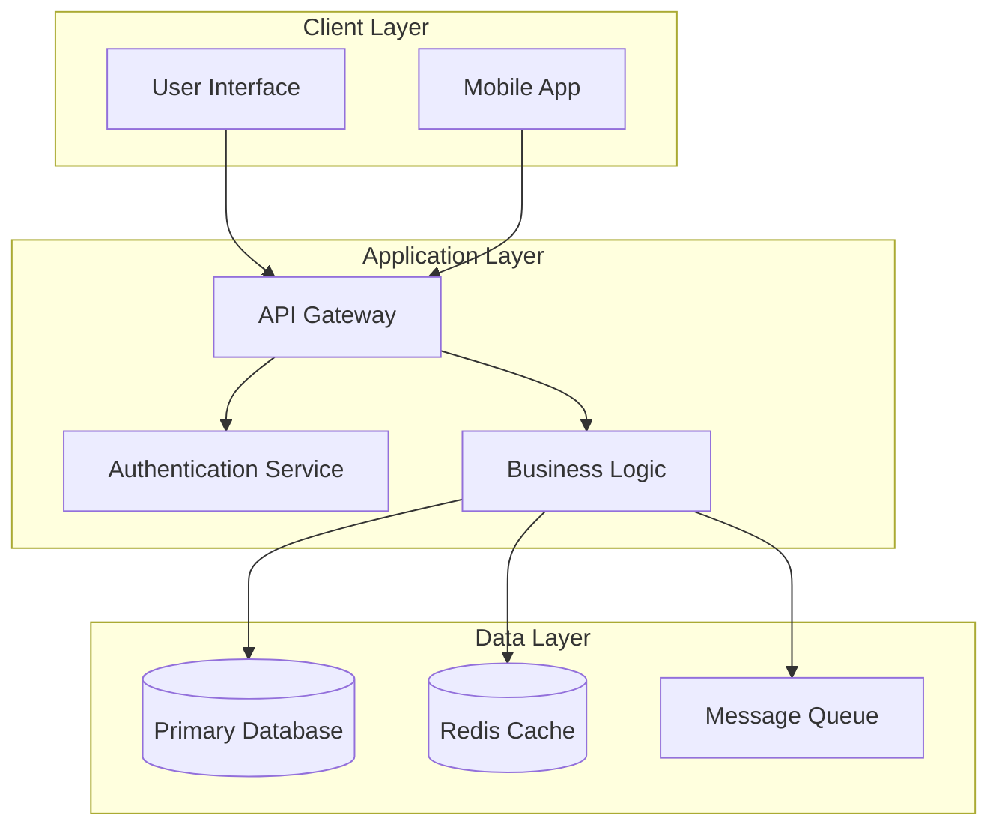
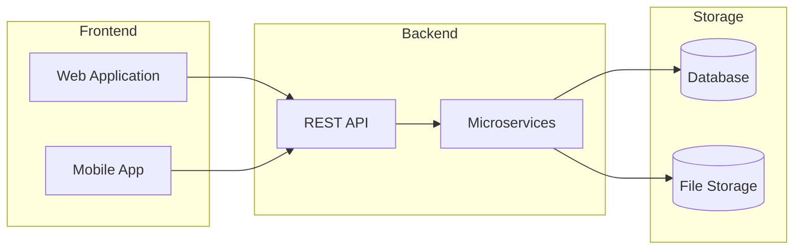
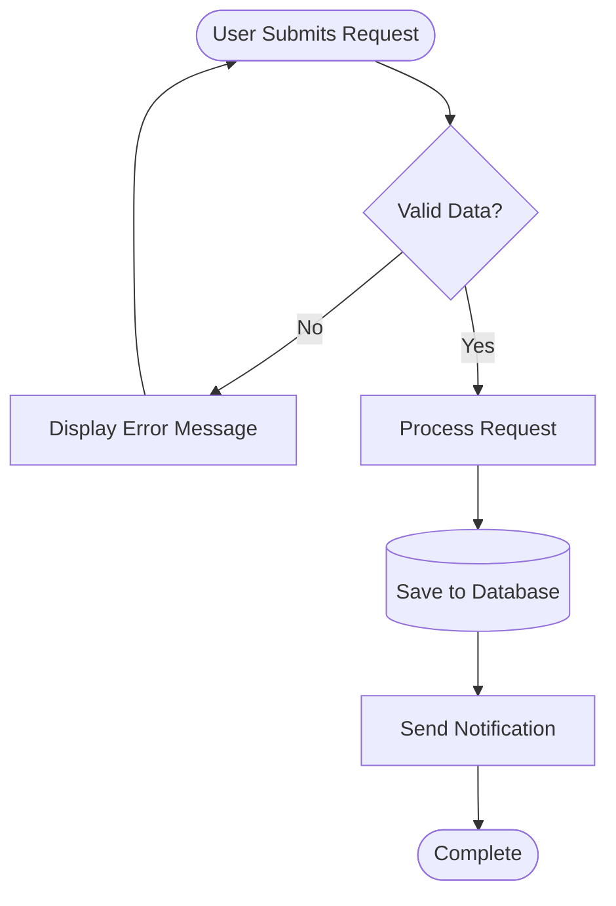
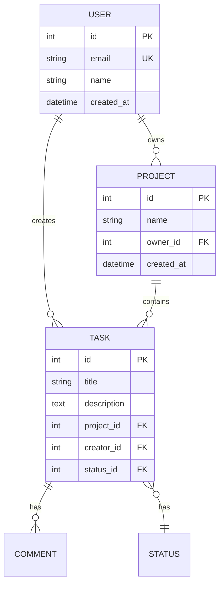
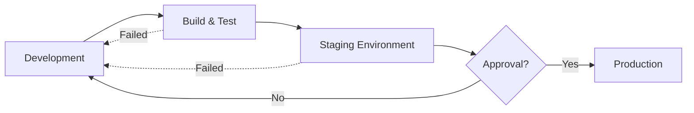
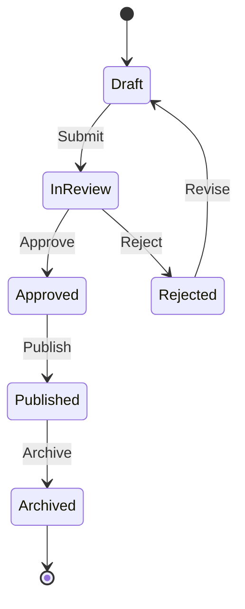
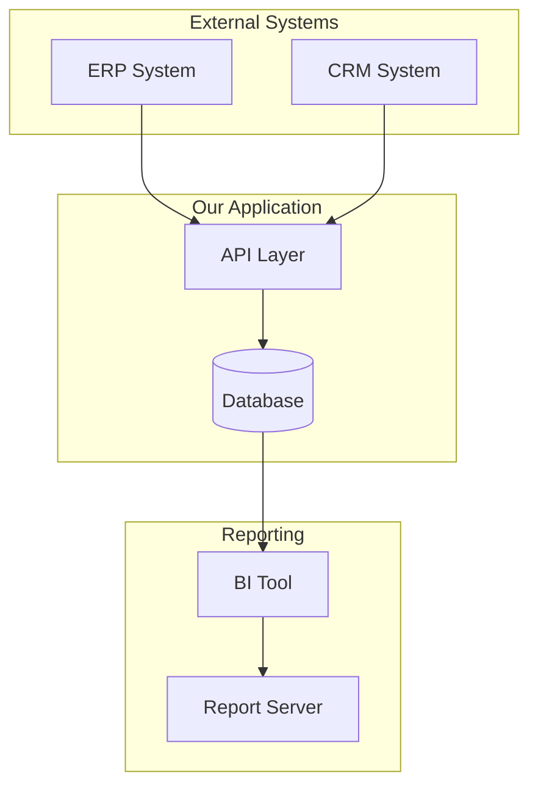
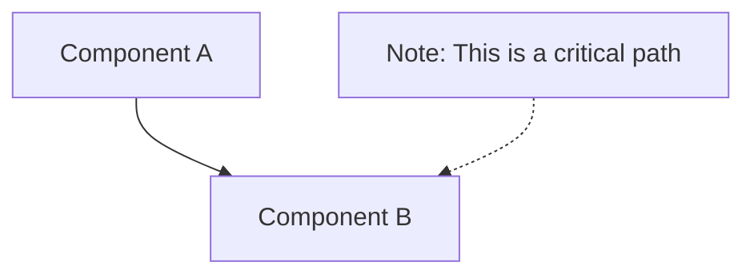
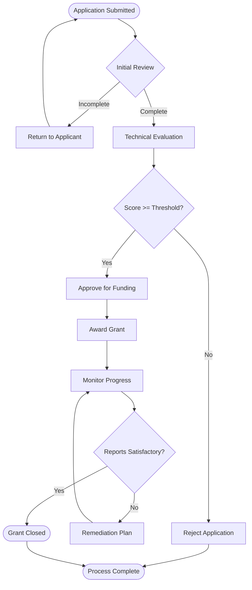
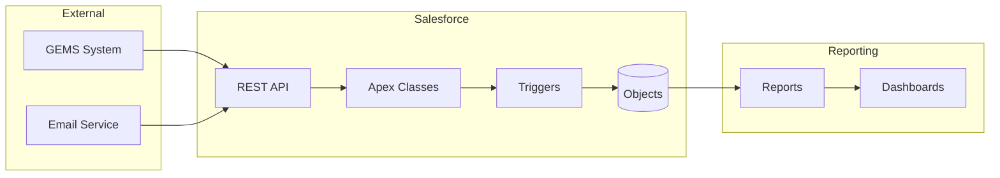

# Visio Diagrams via Mermaid

**Last Updated:** March 1, 2026  
**Purpose:** Create Section 508 compliant Visio diagrams using Mermaid as an intermediate format for faster, text-based diagram creation.

---

## Overview

This workflow combines the speed and simplicity of Mermaid text-based diagrams with the polish and accessibility of Visio. Instead of manually creating shapes in Visio, you write diagrams in Mermaid syntax and convert them to Section 508 compliant Visio files.

**Benefits:**
- ⚡ **Faster creation** - Text-based syntax is quicker than GUI
- 🔄 **Version control friendly** - Mermaid files are plain text
- ♿ **Automatic accessibility** - Section 508 compliance built-in
- 🎨 **Consistent styling** - Approved color palette applied automatically
- 📝 **Easy updates** - Modify text and regenerate

---

## 1. Complete Workflow

### Step 1: Write Mermaid Diagram

Create a `.mmd` file with your diagram in Mermaid syntax.

**Example: System Architecture**



Save as: `system-architecture.mmd`

### Step 2: Preview (Optional)

Preview your diagram before conversion:

**Online:**
- Visit [Mermaid Live Editor](https://mermaid.live/)
- Paste your code
- Verify structure and layout

**VS Code:**
- Install "Markdown Preview Mermaid Support" extension
- Open `.mmd` file
- Use preview pane

### Step 3: Convert to Visio

Run the conversion tool:

```powershell
cd "G:\My Drive\06_Skills\_tools"
python mermaid-to-visio.py system-architecture.mmd system-architecture.vsdx
```

**With options:**

```powershell
python mermaid-to-visio.py diagram.mmd output.vsdx `
    --style section508 `
    --palette accessible `
    --font "Segoe UI" `
    --font-size 11
```

### Step 4: Refine in Visio

Open the generated `.vsdx` file in Visio:

1. **Review layout** - Adjust spacing and alignment
2. **Add title** - Include diagram title with alt text
3. **Verify colors** - Check contrast ratios
4. **Check reading order** - Ensure logical flow
5. **Add legend** - If using multiple shape types
6. **Set alt text** - Verify all shapes have descriptive alt text

### Step 5: Export to PDF

Create accessible PDF deliverable:

1. **File → Export → Create PDF/XPS**
2. **Options → Document structure tags for accessibility**
3. **Save** as PDF
4. **Validate** with accessibility checker

---

## 2. Common Diagram Types

### 2.1 System Architecture

**Use Case:** Document technical architecture, system components



**Conversion:**
```powershell
python mermaid-to-visio.py architecture.mmd architecture.vsdx
```

### 2.2 Process Flow

**Use Case:** Document business processes, workflows



**Conversion:**
```powershell
python mermaid-to-visio.py process-flow.mmd process-flow.vsdx
```

### 2.3 Data Model

**Use Case:** Document database schema, entity relationships



**Conversion:**
```powershell
python mermaid-to-visio.py data-model.mmd data-model.vsdx
```

### 2.4 Deployment Pipeline

**Use Case:** Document CI/CD pipelines, deployment processes



**Conversion:**
```powershell
python mermaid-to-visio.py pipeline.mmd pipeline.vsdx
```

### 2.5 State Machine

**Use Case:** Document application states, status workflows



**Conversion:**
```powershell
python mermaid-to-visio.py state-machine.mmd state-machine.vsdx
```

---

## 3. Best Practices

### 3.1 Diagram Design

**Keep it simple:**
- Limit to 10-15 nodes per diagram
- Use subgraphs to organize complex diagrams
- Break large diagrams into multiple smaller ones

**Use clear labels:**
- Descriptive node names (not abbreviations)
- Meaningful connection labels
- Consistent terminology

**Logical flow:**
- Top-to-bottom or left-to-right
- Group related items
- Minimize crossing connections

### 3.2 Accessibility

**Text over color:**
- Don't rely on color alone for meaning
- Add text labels to all connections
- Use shape types to convey information

**Contrast:**
- Tool applies Section 508 palette automatically
- Verify contrast in Visio if you modify colors
- Use dark text on light backgrounds

**Alt text:**
- Tool adds basic alt text automatically
- Enhance in Visio with more context
- Describe purpose, not appearance

### 3.3 Version Control

**Store Mermaid source:**
```
project/
├── docs/
│   ├── diagrams/
│   │   ├── architecture.mmd      # Source
│   │   ├── architecture.vsdx     # Generated
│   │   └── architecture.pdf      # Deliverable
```

**Git workflow:**
1. Commit `.mmd` files to version control
2. Add `.vsdx` to `.gitignore` (generated files)
3. Regenerate Visio files as needed
4. Include PDFs in releases

### 3.4 Iteration

**Update workflow:**
1. Edit `.mmd` file
2. Regenerate `.vsdx` file
3. Review changes in Visio
4. Apply any manual refinements
5. Export new PDF

**Track changes:**
- Use git diff on `.mmd` files
- Add version numbers to diagram titles
- Document major changes in commit messages

---

## 4. Advanced Techniques

### 4.1 Custom Styling

Apply custom styles in Mermaid:


**Note:** Custom styles are preserved during conversion.

### 4.2 Complex Layouts

Use subgraphs for organization:



### 4.3 Annotations

Add notes and documentation:



### 4.4 Batch Conversion

Convert multiple diagrams:

```powershell
# PowerShell script
$diagrams = Get-ChildItem "*.mmd"
foreach ($diagram in $diagrams) {
    $output = $diagram.BaseName + ".vsdx"
    python mermaid-to-visio.py $diagram.Name $output
}
```

---

## 5. Integration with Other Skills

### 5.1 Documentation Skills

**Feature Documentation:**
- Include architecture diagrams in [feature-documentation.md](feature-documentation.md)
- Generate diagrams from requirements
- Keep diagrams in sync with code

**TEG Templates:**
- Add process flows to [teg-discussion-templates.md](teg-discussion-templates.md)
- Document decision workflows
- Visualize discussion outcomes

### 5.2 Development Skills

**Salesforce Development:**
- Document Apex class relationships
- Visualize LWC component hierarchy
- Map integration flows

**Azure DevOps:**
- Document sprint workflows
- Visualize feature dependencies
- Create release pipeline diagrams

### 5.3 System Skills

**Cascade Workflow:**
- Document AI agent workflows
- Map skill dependencies
- Visualize automation pipelines

---

## 6. Troubleshooting

### 6.1 Conversion Issues

**Problem:** Shapes overlap in Visio  
**Solution:**
- Simplify diagram (fewer nodes)
- Use subgraphs to organize
- Manually adjust in Visio after conversion

**Problem:** Text is truncated  
**Solution:**
- Use shorter labels in Mermaid
- Increase shape size in Visio
- Abbreviate long names

**Problem:** Complex diagram doesn't convert well  
**Solution:**
- Break into multiple smaller diagrams
- Use simpler node types
- Reduce number of connections

### 6.2 Accessibility Issues

**Problem:** Low contrast after manual edits  
**Solution:**
- Use Section 508 color palette
- Check contrast ratio (minimum 4.5:1)
- Refer to [visio-section-508.md](visio-section-508.md)

**Problem:** Reading order is incorrect  
**Solution:**
- Adjust node positions in Visio
- Use "Position → Send to Back/Front"
- Test with screen reader

### 6.3 Syntax Errors

**Problem:** Mermaid diagram doesn't render  
**Solution:**
- Check for missing brackets/parentheses
- Validate syntax in [Mermaid Live Editor](https://mermaid.live/)
- Review [mermaid-diagrams.md](mermaid-diagrams.md) syntax guide

---

## 7. Quick Reference

### Common Commands

```powershell
# Basic conversion
python mermaid-to-visio.py input.mmd output.vsdx

# With Section 508 compliance (default)
python mermaid-to-visio.py input.mmd output.vsdx --style section508

# Custom font
python mermaid-to-visio.py input.mmd output.vsdx --font "Calibri" --font-size 12

# Preview in browser first
start https://mermaid.live/
```

### File Locations

- **Tool:** `G:\My Drive\06_Skills\_tools\mermaid-to-visio.py`
- **Mermaid Syntax:** [mermaid-diagrams.md](mermaid-diagrams.md)
- **Visio Guidelines:** [visio-section-508.md](visio-section-508.md)
- **Color Palette:** `c:\projects\POCs\src\dmedev5\docs\Section_508_Color_Palette_Style_Guide.md`

### Workflow Checklist

- [ ] Write diagram in Mermaid syntax (`.mmd` file)
- [ ] Preview in Mermaid Live Editor
- [ ] Convert to Visio using tool
- [ ] Open in Visio and review layout
- [ ] Add title with alt text
- [ ] Verify accessibility (contrast, reading order)
- [ ] Add legend if needed
- [ ] Export to accessible PDF
- [ ] Validate PDF accessibility

---

## 8. Examples

### Example 1: Grant Lifecycle

**Mermaid source:**


**Convert:**
```powershell
python mermaid-to-visio.py grant-lifecycle.mmd grant-lifecycle.vsdx
```

**Result:** Section 508 compliant Visio diagram ready for [visio-grant-lifecycle-diagram.md](visio-grant-lifecycle-diagram.md) specifications.

### Example 2: Salesforce Integration

**Mermaid source:**


**Convert and use in development documentation.**

---

## Related Skills

- **[mermaid-diagrams.md](mermaid-diagrams.md)** - Complete Mermaid syntax reference
- **[visio-section-508.md](visio-section-508.md)** - Section 508 compliance guidelines
- **[visio-grant-lifecycle-diagram.md](visio-grant-lifecycle-diagram.md)** - Grant-specific diagrams
- **[feature-documentation.md](feature-documentation.md)** - Documentation standards

---

**Last Updated:** March 1, 2026  
**Tool Location:** `G:\My Drive\06_Skills\_tools\mermaid-to-visio.py`  
**Location:** `G:\My Drive\06_Skills\documentation\visio-via-mermaid.md`
