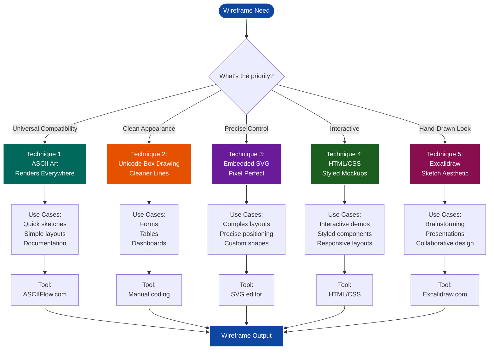
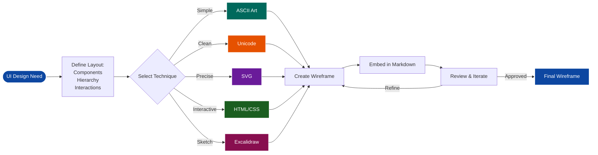
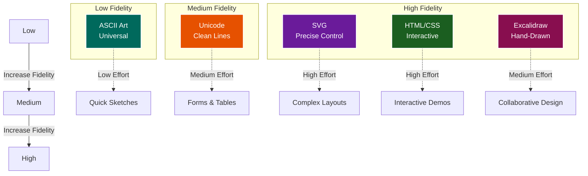
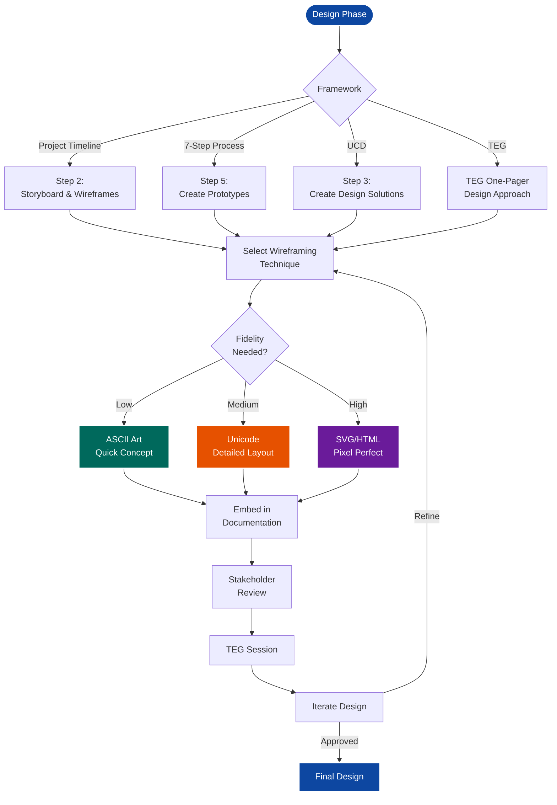

# SKILL: Wireframing in Markdown

**Actionable workflow for creating wireframes and UI mockups that render directly in markdown without external dependencies.**

**Last Updated:** March 1, 2026  
**Version:** 1.0.0  
**Category:** Documentation

---

## What This Skill Does

Provides techniques for creating wireframes and UI mockups that render in markdown:
- ASCII art wireframes (renders everywhere)
- Unicode box drawing (cleaner lines)
- Embedded SVG (precise control)
- HTML/CSS mockups (interactive)
- Excalidraw integration (hand-drawn aesthetic)

**Why not Mermaid?** Mermaid is designed for diagrams (flowcharts, sequences, etc.), not UI wireframes. It lacks the flexibility and precision needed for layout mockups.

## When to Use This Skill

- **User says:** "Create a wireframe for this UI"
- **User says:** "Show me what the interface will look like"
- **User says:** "Mock up this form/page/component"
- **User creates:** Documentation requiring UI examples
- **Trigger:** Need to visualize UI layouts in markdown

## What You'll Need

- Markdown editor (VS Code, Obsidian, GitHub, etc.)
- Optional: ASCIIFlow.com for visual ASCII editing
- Optional: Excalidraw.com for complex wireframes

---

## Visual Overview: Wireframing Techniques

### Technique Selection Guide



---

### Wireframing Workflow



---

### Complexity vs Fidelity Matrix



---

### Integration with Design Process



---

## Technique 1: ASCII Art Wireframes ⭐

**Best for:** Quick sketches, simple layouts, universal compatibility

### Basic Form Example

```
┌─────────────────────────────────────────────┐
│  Login Form                            [X]  │
├─────────────────────────────────────────────┤
│                                             │
│   Username: [____________________]          │
│                                             │
│   Password: [____________________]          │
│                                             │
│   [ ] Remember me                           │
│                                             │
│   [  Login  ]  [  Cancel  ]                 │
│                                             │
│   Forgot password?                          │
│                                             │
└─────────────────────────────────────────────┘
```

### Dashboard Layout Example

```
┌──────────────────────────────────────────────────────────┐
│  ☰ Menu    Dashboard                    🔔 👤 Settings  │
├──────────────────────────────────────────────────────────┤
│                                                          │
│  ┌────────────┐  ┌────────────┐  ┌────────────┐        │
│  │   Total    │  │   Active   │  │  Pending   │        │
│  │   Users    │  │   Tasks    │  │  Reviews   │        │
│  │   1,234    │  │     56     │  │     12     │        │
│  └────────────┘  └────────────┘  └────────────┘        │
│                                                          │
│  Recent Activity                                         │
│  ┌────────────────────────────────────────────────┐     │
│  │ • User submitted form                    2m ago│     │
│  │ • Review completed                       5m ago│     │
│  │ • New task assigned                     10m ago│     │
│  └────────────────────────────────────────────────┘     │
│                                                          │
└──────────────────────────────────────────────────────────┘
```

### Mobile App Wireframe

```
    ┌─────────────────┐
    │  9:41      📶🔋 │
    ├─────────────────┤
    │                 │
    │   ← Settings    │
    │                 │
    ├─────────────────┤
    │                 │
    │  Profile        │
    │  ┌───────────┐  │
    │  │   Photo   │  │
    │  └───────────┘  │
    │                 │
    │  Name           │
    │  [___________]  │
    │                 │
    │  Email          │
    │  [___________]  │
    │                 │
    │  Phone          │
    │  [___________]  │
    │                 │
    │  ┌───────────┐  │
    │  │   Save    │  │
    │  └───────────┘  │
    │                 │
    └─────────────────┘
```

### Workflow: Create ASCII Wireframe

**Step 1: Use ASCIIFlow (Recommended)**

1. Go to https://asciiflow.com/
2. Use drawing tools to create layout
3. Copy ASCII output
4. Paste into markdown code block

**Step 2: Manual ASCII Drawing**

```
Basic characters:
┌ ┐ └ ┘  - corners
─ │      - lines
├ ┤ ┬ ┴  - connectors
[ ]      - checkboxes
[____]   - input fields
```

**Step 3: Add to Markdown**

````markdown
```
┌─────────────────┐
│  Your wireframe │
└─────────────────┘
```
````

---

## Technique 2: Unicode Box Drawing ⭐

**Best for:** Professional-looking wireframes, cleaner lines

### Enhanced Card Layout

```
╔═══════════════════════════════════════════╗
║  Card Title                          [×]  ║
╠═══════════════════════════════════════════╣
║                                           ║
║  ┌─────────────────────────────────────┐  ║
║  │  Image Placeholder                  │  ║
║  │  (300x200)                          │  ║
║  └─────────────────────────────────────┘  ║
║                                           ║
║  Card Description                         ║
║  Lorem ipsum dolor sit amet...            ║
║                                           ║
║  ┌──────────┐  ┌──────────┐              ║
║  │  Action  │  │  Cancel  │              ║
║  └──────────┘  └──────────┘              ║
║                                           ║
╚═══════════════════════════════════════════╝
```

### Table Layout

```
╔════════════════════════════════════════════════════════╗
║  Data Table                                       [+]  ║
╠════════════════════════════════════════════════════════╣
║                                                        ║
║  ┌──────┬─────────────────┬──────────┬─────────────┐  ║
║  │  ID  │  Name           │  Status  │  Actions    │  ║
║  ├──────┼─────────────────┼──────────┼─────────────┤  ║
║  │  001 │  John Doe       │  Active  │  [Edit][×]  │  ║
║  │  002 │  Jane Smith     │  Pending │  [Edit][×]  │  ║
║  │  003 │  Bob Johnson    │  Active  │  [Edit][×]  │  ║
║  └──────┴─────────────────┴──────────┴─────────────┘  ║
║                                                        ║
║  Showing 1-3 of 150                        ← 1 2 3 →  ║
║                                                        ║
╚════════════════════════════════════════════════════════╝
```

### Unicode Character Reference

```
Single Line:
─ │ ┌ ┐ └ ┘ ├ ┤ ┬ ┴ ┼

Double Line:
═ ║ ╔ ╗ ╚ ╝ ╠ ╣ ╦ ╩ ╬

Mixed:
╒ ╕ ╘ ╛ ╞ ╡ ╤ ╧ ╪

Rounded:
╭ ╮ ╰ ╯

Dashed:
┄ ┆ ┈ ┊
```

---

## Technique 3: Embedded SVG

**Best for:** Precise layouts, scalable graphics, complex wireframes

### Simple Component Wireframe

```svg
<svg width="400" height="300" xmlns="http://www.w3.org/2000/svg">
  <!-- Header -->
  <rect x="10" y="10" width="380" height="50" fill="#f0f0f0" stroke="#333" stroke-width="2"/>
  <text x="20" y="40" font-family="Arial" font-size="18">Navigation Bar</text>
  
  <!-- Sidebar -->
  <rect x="10" y="70" width="100" height="220" fill="#e0e0e0" stroke="#333" stroke-width="2"/>
  <text x="20" y="95" font-family="Arial" font-size="12">Menu</text>
  <line x1="20" y1="105" x2="90" y2="105" stroke="#333" stroke-width="1"/>
  <text x="20" y="125" font-family="Arial" font-size="10">Item 1</text>
  <text x="20" y="145" font-family="Arial" font-size="10">Item 2</text>
  <text x="20" y="165" font-family="Arial" font-size="10">Item 3</text>
  
  <!-- Content Area -->
  <rect x="120" y="70" width="270" height="220" fill="#ffffff" stroke="#333" stroke-width="2"/>
  <text x="130" y="95" font-family="Arial" font-size="14">Main Content</text>
  <rect x="130" y="110" width="240" height="30" fill="#f9f9f9" stroke="#999" stroke-width="1" stroke-dasharray="5,5"/>
  <text x="140" y="130" font-family="Arial" font-size="10" fill="#999">[Content Block]</text>
</svg>
```

### Button Component

```svg
<svg width="300" height="150" xmlns="http://www.w3.org/2000/svg">
  <!-- Primary Button -->
  <rect x="10" y="10" width="120" height="40" rx="5" fill="#007bff" stroke="#0056b3" stroke-width="2"/>
  <text x="70" y="35" font-family="Arial" font-size="14" fill="#ffffff" text-anchor="middle">Primary</text>
  
  <!-- Secondary Button -->
  <rect x="140" y="10" width="120" height="40" rx="5" fill="#6c757d" stroke="#545b62" stroke-width="2"/>
  <text x="200" y="35" font-family="Arial" font-size="14" fill="#ffffff" text-anchor="middle">Secondary</text>
  
  <!-- Disabled Button -->
  <rect x="10" y="60" width="120" height="40" rx="5" fill="#e9ecef" stroke="#dee2e6" stroke-width="2"/>
  <text x="70" y="85" font-family="Arial" font-size="14" fill="#6c757d" text-anchor="middle">Disabled</text>
  
  <!-- Outline Button -->
  <rect x="140" y="60" width="120" height="40" rx="5" fill="none" stroke="#007bff" stroke-width="2"/>
  <text x="200" y="85" font-family="Arial" font-size="14" fill="#007bff" text-anchor="middle">Outline</text>
</svg>
```

### Workflow: Create SVG Wireframe

**Step 1: Start with template**

```svg
<svg width="400" height="300" xmlns="http://www.w3.org/2000/svg">
  <!-- Your elements here -->
</svg>
```

**Step 2: Add shapes**

```svg
<!-- Rectangle -->
<rect x="10" y="10" width="100" height="50" fill="#f0f0f0" stroke="#333"/>

<!-- Circle -->
<circle cx="50" cy="50" r="30" fill="#e0e0e0" stroke="#333"/>

<!-- Line -->
<line x1="0" y1="0" x2="100" y2="100" stroke="#333"/>

<!-- Text -->
<text x="10" y="20" font-family="Arial" font-size="14">Label</text>
```

**Step 3: Embed in markdown**

````markdown
```svg
<svg width="400" height="300">
  <!-- Your wireframe -->
</svg>
```
````

---

## Technique 4: HTML/CSS Mockups

**Best for:** Interactive prototypes, styled components

### Form Component

```html
<div style="border: 2px solid #333; padding: 20px; width: 350px; font-family: Arial; background: #fff;">
  <h3 style="margin-top: 0; color: #333;">Contact Form</h3>
  
  <div style="margin-bottom: 15px;">
    <label style="display: block; margin-bottom: 5px; font-weight: bold;">Name</label>
    <input type="text" placeholder="Enter your name" 
           style="width: 100%; padding: 8px; border: 1px solid #ccc; border-radius: 4px;">
  </div>
  
  <div style="margin-bottom: 15px;">
    <label style="display: block; margin-bottom: 5px; font-weight: bold;">Email</label>
    <input type="email" placeholder="your@email.com" 
           style="width: 100%; padding: 8px; border: 1px solid #ccc; border-radius: 4px;">
  </div>
  
  <div style="margin-bottom: 15px;">
    <label style="display: block; margin-bottom: 5px; font-weight: bold;">Message</label>
    <textarea placeholder="Your message..." rows="4"
              style="width: 100%; padding: 8px; border: 1px solid #ccc; border-radius: 4px;"></textarea>
  </div>
  
  <button style="background: #007bff; color: white; padding: 10px 20px; border: none; border-radius: 4px; cursor: pointer;">
    Submit
  </button>
  <button style="background: #6c757d; color: white; padding: 10px 20px; border: none; border-radius: 4px; margin-left: 10px; cursor: pointer;">
    Cancel
  </button>
</div>
```

### Card Grid

```html
<div style="display: grid; grid-template-columns: repeat(3, 1fr); gap: 15px; padding: 20px; background: #f5f5f5;">
  <div style="border: 1px solid #ddd; padding: 15px; background: white; border-radius: 8px;">
    <div style="width: 100%; height: 120px; background: #e0e0e0; margin-bottom: 10px; border-radius: 4px; display: flex; align-items: center; justify-content: center; color: #999;">
      Image
    </div>
    <h4 style="margin: 10px 0;">Card Title 1</h4>
    <p style="color: #666; font-size: 14px;">Card description goes here...</p>
    <button style="background: #007bff; color: white; padding: 8px 16px; border: none; border-radius: 4px; margin-top: 10px;">
      Action
    </button>
  </div>
  
  <div style="border: 1px solid #ddd; padding: 15px; background: white; border-radius: 8px;">
    <div style="width: 100%; height: 120px; background: #e0e0e0; margin-bottom: 10px; border-radius: 4px; display: flex; align-items: center; justify-content: center; color: #999;">
      Image
    </div>
    <h4 style="margin: 10px 0;">Card Title 2</h4>
    <p style="color: #666; font-size: 14px;">Card description goes here...</p>
    <button style="background: #007bff; color: white; padding: 8px 16px; border: none; border-radius: 4px; margin-top: 10px;">
      Action
    </button>
  </div>
  
  <div style="border: 1px solid #ddd; padding: 15px; background: white; border-radius: 8px;">
    <div style="width: 100%; height: 120px; background: #e0e0e0; margin-bottom: 10px; border-radius: 4px; display: flex; align-items: center; justify-content: center; color: #999;">
      Image
    </div>
    <h4 style="margin: 10px 0;">Card Title 3</h4>
    <p style="color: #666; font-size: 14px;">Card description goes here...</p>
    <button style="background: #007bff; color: white; padding: 8px 16px; border: none; border-radius: 4px; margin-top: 10px;">
      Action
    </button>
  </div>
</div>
```

---

## Technique 5: Excalidraw Integration ⭐

**Best for:** Hand-drawn aesthetic, complex wireframes, collaborative design

### Workflow: Excalidraw to Markdown

**Step 1: Create wireframe in Excalidraw**

1. Go to https://excalidraw.com/
2. Use drawing tools to create wireframe
3. Use hand-drawn style for authentic wireframe look

**Step 2: Export as SVG**

1. Click hamburger menu (☰)
2. Select "Export image..."
3. Choose "SVG" format
4. Check "Embed scene" for editability
5. Download SVG file

**Step 3: Embed in markdown**

**Option A: Reference file**
```markdown

```

**Option B: Embed SVG directly**
```markdown

```

**Option C: Inline SVG** (for small wireframes)
- Open SVG in text editor
- Copy SVG code
- Paste into markdown

### Excalidraw Best Practices

**For wireframes:**
- Use rectangles for containers
- Use text for labels
- Use arrows for flow
- Use hand-drawn style (default)
- Keep it simple and clean

**Naming convention:**
```
wireframes/
├── login-form.svg
├── dashboard-layout.svg
├── user-profile.svg
└── settings-page.svg
```

---

## Complete Wireframe Example

### E-commerce Product Page

```
╔════════════════════════════════════════════════════════════════════╗
║  🏠 Home  |  Products  |  Cart (2)  |  Account          🔍 [Search] ║
╠════════════════════════════════════════════════════════════════════╣
║                                                                    ║
║  ┌─────────────────────────┐  ┌──────────────────────────────────┐║
║  │                         │  │  Product Name                    │║
║  │                         │  │  ⭐⭐⭐⭐☆ (124 reviews)          │║
║  │    Product Image        │  │                                  │║
║  │      (500x500)          │  │  $99.99  ~~$149.99~~  (33% off) │║
║  │                         │  │                                  │║
║  │                         │  │  Color: ⚫ ⚪ 🔴                  │║
║  └─────────────────────────┘  │  Size:  [S] [M] [L] [XL]         │║
║                               │                                  │║
║  [📷] [📷] [📷] [📷]          │  Quantity: [-] 1 [+]             │║
║                               │                                  │║
║                               │  ┌──────────────────────────────┐│║
║                               │  │  Add to Cart                 ││║
║                               │  └──────────────────────────────┘│║
║                               │  ┌──────────────────────────────┐│║
║                               │  │  Buy Now                     ││║
║                               │  └──────────────────────────────┘│║
║                               └──────────────────────────────────┘║
║                                                                    ║
║  ┌──────────────────────────────────────────────────────────────┐ ║
║  │  Description                                                 │ ║
║  │  ────────────────────────────────────────────────────────    │ ║
║  │  Lorem ipsum dolor sit amet, consectetur adipiscing elit.   │ ║
║  │  Sed do eiusmod tempor incididunt ut labore et dolore.      │ ║
║  │                                                              │ ║
║  │  Features:                                                   │ ║
║  │  • Feature 1                                                 │ ║
║  │  • Feature 2                                                 │ ║
║  │  • Feature 3                                                 │ ║
║  └──────────────────────────────────────────────────────────────┘ ║
║                                                                    ║
║  Customer Reviews                                                  ║
║  ┌──────────────────────────────────────────────────────────────┐ ║
║  │  ⭐⭐⭐⭐⭐  Great product!                                    │ ║
║  │  John D. - 2 days ago                                        │ ║
║  │  Really happy with this purchase...                          │ ║
║  └──────────────────────────────────────────────────────────────┘ ║
║                                                                    ║
╚════════════════════════════════════════════════════════════════════╝
```

---

## Tool Reference

### ASCII/Unicode Tools

**ASCIIFlow** - https://asciiflow.com/
- Visual ASCII diagram editor
- Free, web-based
- Export to text
- Best for quick wireframes

**Monodraw** - https://monodraw.helftone.com/
- Mac app for ASCII art
- Professional features
- Paid ($9.99)
- Best for detailed work

**Textik** - https://textik.com/
- Simple ASCII diagram tool
- Free, web-based
- Quick and easy

### SVG Tools

**Excalidraw** - https://excalidraw.com/
- Hand-drawn wireframes
- Free, open source
- Collaborative
- Export SVG/PNG
- **Recommended**

**Figma** - https://figma.com/
- Professional design tool
- Free tier available
- Export SVG
- Overkill for simple wireframes

### HTML/CSS Prototyping

**CodePen** - https://codepen.io/
- Live HTML/CSS/JS editor
- Share and embed
- Free tier available

**JSFiddle** - https://jsfiddle.net/
- Similar to CodePen
- Quick prototyping

---

## Recommendations by Use Case

| Use Case | Recommended Technique | Tool |
|----------|----------------------|------|
| Quick sketch | ASCII Art | ASCIIFlow |
| Professional doc | Unicode Box Drawing | Manual |
| Complex layout | Excalidraw | Excalidraw.com |
| Interactive prototype | HTML/CSS | CodePen |
| Precise mockup | SVG | Hand-coded |
| Mobile app | ASCII Art | ASCIIFlow |
| Web app | Excalidraw | Excalidraw.com |
| Component library | SVG | Hand-coded |

---

## Best Practices

### General Guidelines

1. **Keep it simple** - Wireframes are sketches, not final designs
2. **Use placeholders** - `[Image]`, `[Logo]`, `[Content]`
3. **Label everything** - Make purpose clear
4. **Show hierarchy** - Use size and spacing
5. **Indicate interaction** - Buttons, links, inputs

### ASCII/Unicode Tips

- Use consistent spacing
- Align elements carefully
- Test in different viewers
- Keep line length < 80 chars for compatibility
- Use emojis sparingly for icons (🔍 🔔 👤 ⚙️)

### SVG Tips

- Use viewBox for responsiveness
- Keep code readable (indent, comment)
- Use semantic naming
- Test in target markdown viewer
- Consider file size

### HTML/CSS Tips

- Inline styles (external CSS may not work)
- Test in target viewer (GitHub, VS Code, etc.)
- Keep markup simple
- Avoid JavaScript (may be stripped)
- Use semantic HTML

---

## Troubleshooting

### ASCII Wireframe Looks Broken

**Problem:** Alignment issues in different viewers

**Solution:**
- Use monospace font in viewer
- Avoid mixing tabs and spaces
- Test in multiple viewers
- Use Unicode box drawing for consistency

### SVG Not Rendering

**Problem:** SVG doesn't show in markdown

**Solution:**
- Check markdown viewer supports SVG
- Ensure valid SVG syntax
- Try embedding as `` tag
- Export as PNG fallback

### HTML Not Rendering

**Problem:** HTML is stripped or escaped

**Solution:**
- Check if viewer allows HTML
- GitHub sanitizes some HTML/CSS
- Use ASCII or SVG instead
- Export as image for GitHub

### Wireframe Too Wide

**Problem:** Wireframe exceeds viewer width

**Solution:**
- Keep ASCII width < 80 characters
- Use responsive SVG (viewBox)
- Scale HTML with max-width
- Create mobile-first wireframes

---

## AI Agent Instructions

**When user requests wireframe:**

1. **Clarify complexity** - Simple (ASCII) or complex (Excalidraw)?
2. **Choose technique** - Based on use case and viewer
3. **Create wireframe** - Using appropriate method
4. **Test rendering** - Verify in markdown viewer
5. **Provide editable version** - So user can modify

**Output format:**
```
✅ Wireframe created using [technique]
📐 Dimensions: [width] x [height]
🎨 Style: [ASCII/Unicode/SVG/HTML]
📝 Editable: [Yes/No]
🔗 Tool: [ASCIIFlow/Excalidraw/etc.]
```

**For ASCII wireframes:**
- Use ASCIIFlow.com link for editing
- Provide character reference
- Keep width < 80 chars

**For Excalidraw:**
- Provide Excalidraw link
- Export SVG to repo
- Embed in markdown

---

## Related Skills

- **skill_mermaid_diagrams.md** - For flowcharts and diagrams (not wireframes)
- **skill_diagram_icons.md** - Icons for wireframes
- **skill_section_508_color_palette.md** - Accessible colors for mockups
- **skill_visio_via_mermaid.md** - For formal diagrams

---

## Changelog

- **2026-03-01:** Created wireframing in markdown skill
- **2026-03-01:** Added ASCII, Unicode, SVG, HTML, and Excalidraw techniques
- **2026-03-01:** Included tool references and best practices
- **2026-03-01:** Added complete wireframe examples

---

**Location:** `${SKILLS_ROOT}/documentation/skill_wireframing_markdown.md`  
**Category:** Documentation  
**Complexity:** Beginner to Intermediate  
**Requires:** Markdown editor, optional web tools  
**Best For:** UI mockups, layout sketches, documentation  
**Not For:** Final designs, pixel-perfect mockups
