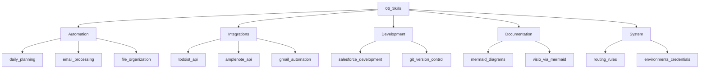

# Organizing Skills and Creating Tools

**Last Updated:** March 1, 2026  
**Purpose:** Guidelines for organizing skills, creating new skills, and developing supporting tools.

---

## Overview

This skill provides a framework for maintaining and expanding the skills library. It covers skill organization, naming conventions, tool creation, and best practices for skill development.

---

## 1. Skill Organization Structure

### Directory Structure

```
06_Skills/
├── README.md                    # Skills catalog
├── _scripts/                    # Automation scripts
├── _tools/                      # MCP servers and tools
├── automation/                  # Daily workflows
├── integrations/                # API integrations
├── development/                 # Development workflows
├── documentation/               # Documentation templates
└── system/                      # Core configuration
```

### Naming Conventions

**Skill Files:**
- Format: `skill_name_of_skill.md`
- Use underscores, not hyphens
- Lowercase only
- Descriptive names

**Examples:**
- ✅ `skill_daily_planning.md`
- ✅ `skill_mermaid_diagrams.md`
- ❌ `daily-planning.md`
- ❌ `DailyPlanning.md`

**Tool Files:**
- Format: `tool_name.py` or `script_name.py`
- Descriptive function names
- Include docstrings

---

## 2. Creating a New Skill

### Step 1: Determine Category

Choose the appropriate category:

- **automation/** - Daily workflows, process automation
- **integrations/** - API and service integrations
- **development/** - Development tools and workflows
- **documentation/** - Documentation and templates
- **system/** - Core system configuration

### Step 2: Create Skill File

**Template Structure:**

```markdown
# Skill Name

**Last Updated:** YYYY-MM-DD  
**Purpose:** Brief description of what this skill does.

---

## Overview

Detailed description of the skill.

---

## 1. Quick Start

Basic usage instructions.

---

## 2. Detailed Instructions

Step-by-step guide.

---

## 3. Examples

Real-world examples.

---

## 4. Troubleshooting

Common issues and solutions.

---

## Related Skills

- [related_skill](category/skill_related_skill.md)

---

**Last Updated:** YYYY-MM-DD  
**Location:** `G:\My Drive\06_Skills\category\skill_name.md`
```

### Step 3: Update Skills README

Add the new skill to `06_Skills/README.md`:

```markdown
### Category Name

- **[skill_name](category/skill_name.md)** - Brief description
```

### Step 4: Update Root README (if major skill)

For frequently used skills, add to root `README.md`:

```markdown
- **[skill_name](06_Skills/category/skill_name.md)** - Description
```

---

## 3. Creating Supporting Tools

### Tool Types

**1. Scripts (_scripts/)**
- Standalone automation scripts
- Wrapper scripts for MCP tools
- One-off utilities

**2. Tools (_tools/)**
- MCP server implementations
- Reusable modules
- API integrations
- Helper functions

### Tool Creation Template

```python
#!/usr/bin/env python3
"""
Tool Name - Brief Description

Usage:
    python tool_name.py [arguments]

Example:
    python tool_name.py --input data.json
"""

import argparse
import logging
from pathlib import Path
from typing import Optional, Dict, Any

# Setup logging
logging.basicConfig(
    level=logging.INFO,
    format='%(asctime)s - %(name)s - %(levelname)s - %(message)s'
)
logger = logging.getLogger(__name__)


class ToolName:
    """Main tool class"""
    
    def __init__(self, config_path: Optional[Path] = None):
        """Initialize the tool"""
        self.config_path = config_path or Path(__file__).parent / "config.json"
        logger.info(f"Initialized {self.__class__.__name__}")
    
    def process(self, input_data: Dict[str, Any]) -> Dict[str, Any]:
        """
        Main processing function
        
        Args:
            input_data: Input data dictionary
            
        Returns:
            Processed results dictionary
        """
        try:
            # Implementation here
            result = {"status": "success", "data": input_data}
            logger.info("Processing completed successfully")
            return result
        except Exception as e:
            logger.error(f"Processing failed: {e}")
            raise


def main():
    """Main entry point"""
    parser = argparse.ArgumentParser(
        description='Tool description'
    )
    parser.add_argument('--input', required=True, help='Input file path')
    parser.add_argument('--output', help='Output file path')
    parser.add_argument('--verbose', action='store_true', help='Verbose output')
    
    args = parser.parse_args()
    
    if args.verbose:
        logging.getLogger().setLevel(logging.DEBUG)
    
    # Create and run tool
    tool = ToolName()
    result = tool.process({"input": args.input})
    
    print(f"✓ Tool completed successfully")
    print(f"Result: {result}")


if __name__ == '__main__':
    main()
```

### Tool Best Practices

**1. Error Handling**
- Use try/except blocks
- Log errors appropriately
- Provide helpful error messages

**2. Configuration**
- Load from `environments.json` when possible
- Support command-line arguments
- Provide sensible defaults

**3. Documentation**
- Include docstrings
- Add usage examples
- Document parameters and return values

**4. Testing**
- Test with real data
- Handle edge cases
- Verify error conditions

---

## 4. MCP Server Integration

### Adding Tools to MCP Server

**Location:** `06_Skills/_tools/server.py`

**Steps:**

1. **Create tool module** (e.g., `new_service_tools.py`)
2. **Import in server.py**
3. **Register tool** in `_register_tools()` method
4. **Update MCP config** if needed

**Example:**

```python
# In server.py
from new_service_tools import NewServiceTools

class DailyPlannerMCP:
    def __init__(self):
        # ... existing code ...
        self.new_service = NewServiceTools(self.auth_manager)
    
    def _register_tools(self):
        # ... existing tools ...
        
        Tool(
            name="new_service_action",
            description="Perform action with new service",
            inputSchema={
                "type": "object",
                "properties": {
                    "param": {
                        "type": "string",
                        "description": "Parameter description"
                    }
                },
                "required": ["param"]
            }
        )
```

---

## 5. Skill Maintenance

### Regular Reviews

**Monthly:**
- Review all skills for accuracy
- Update outdated information
- Fix broken links
- Test tools and scripts

**Quarterly:**
- Reorganize if needed
- Archive unused skills
- Update dependencies
- Refresh examples

### Version Control

**Track changes in skill files:**
- Update "Last Updated" date
- Document major changes
- Keep version history in root README

**Example:**

```markdown
## Version History

| Version | Date | Changes |
|---------|------|---------|
| 1.0.0 | 2026-02-22 | Initial skill creation |
| 1.1.0 | 2026-03-01 | Added new examples, updated API |
```

---

## 6. Skill Discovery and Navigation

### Skills Catalog

**Primary:** `06_Skills/README.md`
- Organized by category
- Quick start section
- Supporting resources

**Secondary:** Root `README.md`
- Most used skills
- Quick reference
- Workflow examples

### Mermaid Diagram

Visual representation of all skills (see root README):



---

## 7. Common Patterns

### Skill Cross-References

Link related skills:

```markdown
## Related Skills

- [skill_name](category/skill_name.md) - Description
- [another_skill](category/skill_another_skill.md) - Description
```

### Tool Integration

Reference tools in skills:

```markdown
## Using the Tool

**Location:** `G:\My Drive\06_Skills\_tools\tool_name.py`

**Usage:**
\`\`\`powershell
cd "G:\My Drive\06_Skills\_tools"
python tool_name.py --input data.json
\`\`\`
```

### Workflow Documentation

Document complete workflows:

```markdown
## Complete Workflow

1. **Step 1:** Action description
   - Use [skill_a](category/skill_a.md)
   - Run tool: `python tool_name.py`

2. **Step 2:** Next action
   - Use [skill_b](category/skill_b.md)
   - Verify output

3. **Step 3:** Final step
   - Review results
   - Update documentation
```

---

## 8. Quality Standards

### Skill Quality Checklist

- [ ] Clear, descriptive title
- [ ] Purpose statement
- [ ] Last updated date
- [ ] Overview section
- [ ] Step-by-step instructions
- [ ] Real examples
- [ ] Troubleshooting section
- [ ] Related skills links
- [ ] Location path at bottom

### Tool Quality Checklist

- [ ] Descriptive filename
- [ ] Module docstring
- [ ] Function docstrings
- [ ] Error handling
- [ ] Logging
- [ ] Command-line interface
- [ ] Usage examples
- [ ] Configuration support

---

## 9. Skill Templates

### Automation Skill Template

```markdown
# Skill Name

**Last Updated:** YYYY-MM-DD  
**Purpose:** Automate [specific task].

## Overview

This skill automates [process description].

## Quick Start

\`\`\`powershell
cd "G:\My Drive\06_Skills\_scripts"
python script_name.py
\`\`\`

## Configuration

Required settings in `environments.json`:
- `service.apiKey`
- `service.endpoint`

## Usage

### Basic Usage

Step-by-step instructions.

### Advanced Options

Additional features.

## Examples

Real-world examples.

## Troubleshooting

Common issues.

## Related Skills

- [related_skill](category/skill_related_skill.md)

---

**Location:** `G:\My Drive\06_Skills\automation\skill_name.md`
```

### Integration Skill Template

```markdown
# Service Name Integration

**Last Updated:** YYYY-MM-DD  
**Purpose:** Integrate with [Service Name] API.

## Overview

This skill provides integration with [Service Name].

## Authentication

### API Key Setup

1. Get API key from [service]
2. Add to `environments.json`
3. Test connection

## API Endpoints

### Endpoint 1

Description and usage.

### Endpoint 2

Description and usage.

## Python Integration

\`\`\`python
from service_tools import ServiceTools

service = ServiceTools(auth_manager)
result = await service.method()
\`\`\`

## Common Use Cases

Real-world scenarios.

## Related Skills

- [related_skill](category/skill_related_skill.md)

---

**Location:** `G:\My Drive\06_Skills\integrations\skill_service_name.md`
```

---

## 10. Workflow for Adding New Skills

### Complete Checklist

1. **Plan**
   - [ ] Identify need for new skill
   - [ ] Determine category
   - [ ] Check for existing similar skills

2. **Create**
   - [ ] Create skill file with proper naming
   - [ ] Write comprehensive documentation
   - [ ] Add examples and troubleshooting

3. **Integrate**
   - [ ] Create supporting tools if needed
   - [ ] Add to Skills README
   - [ ] Add to root README if major skill
   - [ ] Update Mermaid diagram

4. **Test**
   - [ ] Verify all examples work
   - [ ] Test tools and scripts
   - [ ] Check all links

5. **Document**
   - [ ] Update version history
   - [ ] Add to related skills
   - [ ] Update cross-references

---

## Related Skills

- [skill_cascade_workflow](skill_cascade_workflow.md) - Cascade AI workflow patterns
- [skill_mcp_server_setup](skill_mcp_server_setup.md) - MCP server configuration
- [skill_routing_rules](skill_routing_rules.md) - System routing rules
- [skill_mermaid_diagrams](../documentation/skill_mermaid_diagrams.md) - Diagram creation

---

**Last Updated:** March 1, 2026  
**Location:** `G:\My Drive\06_Skills\system\skill_organizing_skills.md`
