# User Commands Quick Reference

**Last Updated:** March 1, 2026  
**Purpose:** Quick reference for common user commands and workflows.

## Quick Reference
**Use when:** Need to quickly find a command, shortcut, or workflow trigger; START HERE before loading any other skill
**Don't use when:** You already know the specific skill to use
**Trigger phrases:** "show me commands", "what can I do", "how do I", "list commands", "quick reference"
**Time:** Instant
**Command:** Reference this file — no script needed

---

## User Commands Workflow Diagram

```mermaid
flowchart TB
    USER[User]
    
    USER --> DAILY[Daily Commands]
    USER --> INTEG[Integration Commands]
    USER --> DEV[Development Commands]
    USER --> FILE[File Commands]
    USER --> DOC[Documentation Commands]
    USER --> SYS[System Commands]
    
    %% Daily Workflow
    DAILY --> PN[process_new - Complete daily planning]
    DAILY --> PD[Process Downloads - File new items]
    DAILY --> PE[Process Emails - Extract tasks]
    
    PN --> PNOUT[Todoist tasks, Amplenote plan, JSON output]
    PD --> PARA[PARA filing]
    PE --> TASKS[Tasks created]
    
    %% Integration
    INTEG --> RAMP["Refresh Amplenote<br/>Token renewal"]
    INTEG --> AUTH["Authenticate All<br/>Re-auth services"]
    INTEG --> QTODO["Query Todoist<br/>Search tasks"]
    INTEG --> QAMP["Query Amplenote<br/>Search notes"]
    
    %% Development
    DEV --> SFDC[Salesforce - Open org, pull/push]
    DEV --> GIT[Git - Status, commit, push]
    
    SFDC --> SFOUT[Apex/LWC code]
    GIT --> GITOUT[Version control]
    
    %% File Organization
    FILE --> PROJ[Move to Projects - Active work]
    FILE --> AREA[Move to Areas - Responsibilities]
    FILE --> RES[Move to Resources - Reference]
    FILE --> ARCH[Move to Archive - Completed]
    FILE --> CINBOX[Check Inbox - List files]
    FILE --> CDL[Check Downloads - Recent files]
    
    %% Documentation
    DOC --> MERM[Create Mermaid - Convert to Visio]
    
    %% System
    SYS --> RR[View Routing Rules - Where things go]
    SYS --> CRED[Check Credentials - Verify config]
    SYS --> MCP[Run MCP Server - Windsurf integration]
    
    %% Styling
    style USER fill:#e1f5fe,stroke:#0d47a1,stroke-width:3px,color:#000
    
    style DAILY fill:#fff9c4,stroke:#f57f17,stroke-width:2px
    style INTEG fill:#f3e5f5,stroke:#6a1b9a,stroke-width:2px
    style DEV fill:#c8e6c9,stroke:#1b5e20,stroke-width:2px
    style FILE fill:#ffe0b2,stroke:#e65100,stroke-width:2px
    style DOC fill:#f8bbd0,stroke:#880e4f,stroke-width:2px
    style SYS fill:#fff59d,stroke:#f57f17,stroke-width:2px
    
    style PN fill:#fff9c4,stroke:#f57f17,stroke-width:3px
    style PD fill:#ffe0b2,stroke:#e65100,stroke-width:2px
    style PE fill:#ffe0b2,stroke:#e65100,stroke-width:2px
    
    style SFDC fill:#c8e6c9,stroke:#1b5e20,stroke-width:2px
    style GIT fill:#c8e6c9,stroke:#1b5e20,stroke-width:2px
```



**Command Categories:**
- 🟡 **Daily** - Most frequently used (daily/weekly)
- 🟣 **Integration** - API and service management
- 🟢 **Development** - Code and version control
- 🟠 **File** - PARA method organization
- 🔴 **Documentation** - Diagram creation
- 🟡 **System** - Configuration and setup

---

## Overview

This skill provides a quick command reference for frequently used workflows. Instead of searching through detailed skill documentation, use this for instant access to the most common commands.

---

## Daily Workflow Commands

### Process New - Complete Daily Planning

**What it does:** Scans Gmail, Calendar, Todoist, and creates your daily plan with AI-generated task summaries.

```powershell
cd "G:\My Drive\06_Skills\_tools"
python run_process_new.py
```

**Output:**
- ✅ JSON file with complete plan data
- ✅ 5 Todoist tasks for DakBoard (AI-generated summaries)
- ✅ Amplenote daily plan note (comprehensive view)

**Related Skill:** [skill_process_new.md](skill_process_new.md)

---

### Process New Downloads

**What it does:** Scans Downloads folder and helps you file items using PARA method.

```powershell
# Manual filing with AI assistance
cd "G:\My Drive\06_Skills\_scripts"
# Ask AI: "Help me file my downloads"
```

**Related Skill:** [skill_file_organization.md](../automation/skill_file_organization.md)

---

### Process New Emails

**What it does:** Processes emails and extracts tasks/notes.

```powershell
cd "G:\My Drive\06_Skills\_scripts"
python email_processor.py
```

**Related Skill:** [skill_email_processing.md](../automation/skill_email_processing.md)

---

## Integration Commands

### Refresh Amplenote Token

**What it does:** Refreshes expired Amplenote OAuth token.

```powershell
cd "G:\My Drive\06_Skills\_scripts"
node refresh_amplenote_token.js
```

**Related Skill:** [skill_amplenote_api.md](../integrations/skill_amplenote_api.md)

---

### Authenticate All Services

**What it does:** Re-authenticates Gmail, Calendar, and other services.

```powershell
cd "G:\My Drive\06_Skills\_scripts"
python authenticate_all.py
```

**Related Skill:** [skill_environments_credentials.md](skill_environments_credentials.md)

---

### Query Todoist Tasks

**What it does:** Search and view Todoist tasks.

```powershell
cd "G:\My Drive\06_Skills\_tools"
python query_todoist.py
```

**Related Skill:** [skill_todoist_api.md](../integrations/skill_todoist_api.md)

---

### Query Amplenote Notes

**What it does:** Search Amplenote notes.

```powershell
cd "G:\My Drive\06_Skills\_tools"
python query_amplenote.py
```

**Related Skill:** [skill_amplenote_api.md](../integrations/skill_amplenote_api.md)

---

## Development Commands

### Salesforce Development

**What it does:** Opens Salesforce org and sets up development environment.

```powershell
# Open org
sfdx force:org:open -u dmedev5

# Pull changes
sfdx force:source:pull

# Push changes
sfdx force:source:push
```

**Related Skill:** [skill_salesforce_development.md](../development/skill_salesforce_development.md)

---

### Git Version Control

**What it does:** Common git operations.

```powershell
# Check status
git status

# Create feature branch
git checkout -b feature/description

# Commit changes
git add .
git commit -m "feat: description"

# Push to remote
git push -u origin feature/description
```

**Related Skill:** [skill_git_version_control.md](../development/skill_git_version_control.md)

---

## File Organization Commands

### File to PARA Location

**What it does:** Move file to correct PARA location.

```powershell
# Projects (active work)
Move-Item "file.pdf" "G:\My Drive\01_Operate\Projects\ProjectName\"

# Areas (ongoing responsibilities)
Move-Item "file.pdf" "G:\My Drive\03_Areas\AreaName\"

# Resources (reference material)
Move-Item "file.pdf" "G:\My Drive\04_Resources\TopicName\"

# Archive (completed/inactive)
Move-Item "file.pdf" "G:\My Drive\05_Archive\Year\"
```

**Related Skill:** [skill_file_organization.md](../automation/skill_file_organization.md)

---

### Check Inbox for New Files

**What it does:** List files in Inbox that need filing.

```powershell
Get-ChildItem "G:\My Drive\01_Operate\Inbox" | Select-Object Name, LastWriteTime
```

---

### Check Downloads for New Files

**What it does:** List recent downloads.

```powershell
Get-ChildItem "$env:USERPROFILE\Downloads" -File | 
    Where-Object {$_.LastWriteTime -gt (Get-Date).AddDays(-7)} | 
    Select-Object Name, LastWriteTime
```

---

## Documentation Commands

### Create Mermaid Diagram

**What it does:** Convert Mermaid syntax to Visio.

```powershell
cd "G:\My Drive\06_Skills\_tools"
python mermaid-to-visio.py input.mmd output.vsdx
```

**Related Skills:** 
- [skill_mermaid_diagrams.md](../documentation/skill_mermaid_diagrams.md)
- [skill_visio_via_mermaid.md](../documentation/skill_visio_via_mermaid.md)

---

## System Commands

### View Routing Rules

**What it does:** Quick reference for where things go.

**Related Skill:** [skill_routing_rules.md](skill_routing_rules.md)

**Quick Reference:**
- **Tasks** → Todoist (permanent storage)
- **Notes** → Amplenote (reference + daily view)
- **Events** → Google Calendar
- **Files** → PARA method (Projects/Areas/Resources/Archive)

---

### Check Credentials

**What it does:** Verify which credentials are configured.

```powershell
Test-Path "G:\My Drive\03_Areas\Keys\Environments\environments.json"
```

**Related Skill:** [skill_environments_credentials.md](skill_environments_credentials.md)

---

### Run MCP Server

**What it does:** Start MCP server for Windsurf integration.

```powershell
cd "G:\My Drive\06_Skills\_tools"
python server.py
```

**Related Skill:** [skill_mcp_server_setup.md](skill_mcp_server_setup.md)

---

## Quick Command Cheat Sheet

| Task | Command | Frequency |
|------|---------|-----------|
| Daily Planning | `cd "G:\My Drive\06_Skills\_tools" && python run_process_new.py` | Daily |
| File Downloads | Ask AI to help file downloads | As needed |
| Process Emails | `cd "G:\My Drive\06_Skills\_scripts" && python email_processor.py` | Weekly |
| Refresh Amplenote | `cd "G:\My Drive\06_Skills\_scripts" && node refresh_amplenote_token.js` | When expired |
| Git Status | `git status` | Frequently |
| Open Salesforce | `sfdx force:org:open -u dmedev5` | As needed |
| Query Todoist | `cd "G:\My Drive\06_Skills\_tools" && python query_todoist.py` | As needed |

---

## Command Templates

### Create New Todoist Task

```powershell
cd "G:\My Drive\06_Skills\_scripts"
python create_todoist_task.py --content "Task description" --priority 4 --due "today"
```

### Update Todoist Task

```powershell
cd "G:\My Drive\06_Skills\_scripts"
python update_todoist_task.py --task-id "12345" --content "Updated description"
```

### Search Gmail

```powershell
# Use Gmail web interface or ask AI to search
# Example: "Search my Gmail for emails from john@example.com about project"
```

---

## PowerShell Aliases (Optional)

Add these to your PowerShell profile for quick access:

```powershell
# Edit profile
notepad $PROFILE

# Add these functions:
function Process-New { 
    cd "G:\My Drive\06_Skills\_tools"
    python run_process_new.py 
}

function File-Downloads {
    Get-ChildItem "$env:USERPROFILE\Downloads" -File | 
        Where-Object {$_.LastWriteTime -gt (Get-Date).AddDays(-7)}
}

function Check-Inbox {
    Get-ChildItem "G:\My Drive\01_Operate\Inbox"
}

# Usage:
# Process-New
# File-Downloads
# Check-Inbox
```

---

## Related Skills

- [skill_process_new.md](skill_process_new.md) - Complete daily planning workflow
- [skill_file_organization.md](../automation/skill_file_organization.md) - PARA method filing
- [skill_routing_rules.md](skill_routing_rules.md) - Where things go
- [skill_daily_planning.md](../automation/skill_daily_planning.md) - Daily planning details
- [skill_email_processing.md](../automation/skill_email_processing.md) - Email workflows

---

**Last Updated:** March 1, 2026  
**Location:** `G:\My Drive\06_Skills\system\skill_user_commands.md`
