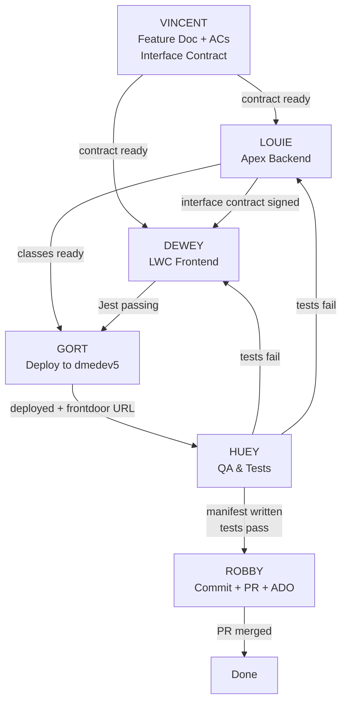

# BPHC Dev Team — Classic Robots

Six retro robot agents covering every layer of the development lifecycle.

---

## Meet the Team

| Agent | Film | Role | Invoke When |
|-------|------|------|------------|
| **VINCENT** | The Black Hole (1979) | Design & Requirements | "write a feature doc", "define acceptance criteria", "create user stories", "wireframe this", "what should this feature do", "interface contract" |
| **LOUIE** | Silent Running (1972) | Apex & Backend Developer | "write an Apex class", "fix the SOQL", "batch job", "test class", "data model" |
| **DEWEY** | Silent Running (1972) | LWC Frontend Developer | "build a component", "fix the UI", "wire a data call", "LWC template", "CSS/SLDS" |
| **GORT** | The Day the Earth Stood Still (1951) | Salesforce Deployment | "deploy", "push to org", "validate", "frontdoor URL" |
| **HUEY** | Silent Running (1972) | QA & Test Engineer | "write a test", "run the tests", "smoke test", "does this work", "check for errors", "playwright", "accessibility audit", "test plan" |
| **ROBBY** | Forbidden Planet (1956) | ADO & Git Operations | "commit", "create a PR", "push", "create a user story", "merge", "ADO link" |

---

## Team Skill Files

| Agent | Skill File |
|-------|-----------|
| VINCENT | `tools/skills/team/vincent/SKILL.md` |
| LOUIE | `tools/skills/team/louie/SKILL.md` |
| DEWEY | `tools/skills/team/dewey/SKILL.md` |
| GORT | `tools/skills/team/gort/SKILL.md` |
| HUEY | `tools/skills/team/huey/SKILL.md` |
| ROBBY | `tools/skills/team/robby/SKILL.md` |

---

## Sprint Status

All agents read and update `docs/Team/sprint-status.md` on startup and when their status changes.

---

## Standard Feature Lifecycle



### Handoff Files

| Stage | From | To | File Location |
|-------|------|----|---------------|
| Design → Build | VINCENT | LOUIE + DEWEY | `docs/Handoff/interface-contract/<feature>-<date>.md` |
| Build → Deploy | DEWEY + LOUIE | GORT | `docs/Handoff/ready-for-deploy/<feature>-<date>.md` |
| Deploy → Test | GORT | HUEY | `docs/Handoff/ready-for-test/<feature>-<date>.md` |
| Test → Commit | HUEY | ROBBY | `docs/Handoff/ready-for-commit/<feature>-<date>.md` |

### Handoff Points (narrative)

1. **VINCENT → LOUIE + DEWEY**: Feature doc written, ACs defined, interface contract in `docs/Handoff/interface-contract/`
2. **LOUIE → DEWEY**: Interface contract signed — method signatures, return types, wrapper classes confirmed
3. **DEWEY → GORT**: LWC complete, Jest passing, ready-for-deploy handoff written
4. **LOUIE → GORT**: Apex complete, `_Test.cls` written (≥75% coverage), ready-for-deploy handoff written
5. **GORT → HUEY**: Deployed to dmedev5, ready-for-test handoff written with frontdoor URL + deploy tag
6. **HUEY → ROBBY**: Test manifest written to `ready-for-commit/` with `HUEY sign-off: PASS ✓`
7. **HUEY → DEWEY/LOUIE**: Tests fail — bug report with steps + screenshot
8. **ROBBY → ADO**: PR created, work items linked, ADO task state updated to Closed

---

## Cross-Team Coordination

### VINCENT + LOUIE + DEWEY Interface Contract
- VINCENT writes the interface contract before either LOUIE or DEWEY starts coding
- LOUIE refines and writes the final Apex-side contract (method signatures, return types, wrappers)
- DEWEY signs off before writing any `@wire` or `@salesforce/apex` imports
- Contract file: `docs/Handoff/interface-contract/<feature>-<date>.md`

### GORT + HUEY Interface
- GORT writes the ready-for-test handoff with frontdoor URL and deploy tag
- HUEY reads the handoff before starting any test run
- HUEY runs smoke test immediately after every GORT deployment

### HUEY → ROBBY Gate
- HUEY writes the test results manifest — ROBBY reads it, never re-runs tests
- ROBBY blocks any commit without `**HUEY sign-off:** PASS ✓` in the manifest
- ROBBY also verifies handoff doc and feature doc exist before committing

### HUEY Bug Reports → DEWEY/LOUIE
- HUEY files a bug report (title, steps, expected, actual, screenshot)
- DEWEY fixes LWC bugs, LOUIE fixes Apex bugs
- Fixed code goes back through GORT → HUEY before ROBBY commits

---

## Spawning an Agent

Always announce before spawning and report back after. To invoke:

```
Read tools/skills/team/<folder>/SKILL.md and act as <AgentName> to: <task>
```

**Announce pattern:**
> "Handing this to HUEY — running smoke tests on the batch management deployment."
> *(agent runs)*
> "HUEY reports: all 8 tests passed, no console errors, accessibility audit clean."

The Agent tool `description` field must always include the robot's name:
> `description: "HUEY: smoke test batch management on dmedev5"`

---

## Team Constraints (apply to all agents)

- **Target org:** dmedev5 only (dmedev7 is out of scope)
- **Playwright:** Always `npx playwright` CLI — never MCP playwright tools
- **Author anonymity:** Never use real names, "Claude", "Anthropic", or model names in deliverables
- **Accessibility:** Every UI feature must pass Section 508 / WCAG before shipping
- **Color palette:** cyan/yellow/magenta — never red/green as sole status indicator (protanopia)
- **Relationships:** Lookup only on custom objects (never Master-Detail)
- **Model:** Always Sonnet — never switch to Opus without explicit request
