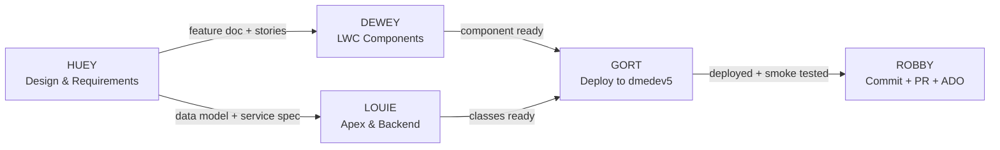

# BPHC Dev Team — Classic Robots

Five retro robot agents covering every layer of the development lifecycle.

---

## Meet the Team

| Agent | Film | Role | Invoke When |
|-------|------|------|------------|
| **HUEY** | Silent Running (1972) | Requirements, Design & UX/UI | "design this", "write requirements", "wireframe", "user journey", "acceptance criteria" |
| **DEWEY** | Silent Running (1972) | LWC Frontend Developer | "build a component", "fix the UI", "wire a data call", "LWC template", "CSS/SLDS" |
| **LOUIE** | Silent Running (1972) | Apex & Backend Developer | "write an Apex class", "fix the SOQL", "batch job", "test class", "data model" |
| **GORT** | The Day the Earth Stood Still (1951) | Salesforce Deployment | "deploy", "push to org", "validate", "smoke test", "frontdoor URL" |
| **ROBBY** | Forbidden Planet (1956) | ADO & Git Operations | "commit", "create a PR", "push", "create a user story", "merge", "ADO link" |

---

## Team Skill Files

| Agent | Skill File |
|-------|-----------|
| HUEY | `.claude/team/huey/SKILL.md` |
| DEWEY | `.claude/team/dewey/SKILL.md` |
| LOUIE | `.claude/team/louie/SKILL.md` |
| GORT | `.claude/team/gort/SKILL.md` |
| ROBBY | `.claude/team/robby/SKILL.md` |

---

## Standard Feature Lifecycle



### Handoff Points

1. **HUEY → DEWEY/LOUIE**: Feature doc approved, wireframes complete, user stories written
2. **DEWEY → GORT**: LWC component complete, Jest tests passing
3. **LOUIE → GORT**: Apex class complete, test class written (≥75% coverage)
4. **GORT → ROBBY**: Deploy validated, smoke test passed (`npx playwright` CLI)
5. **ROBBY → ADO**: PR created, ADO work items linked, branch pushed

---

## Cross-Team Coordination

### DEWEY + LOUIE Interface
- LOUIE defines `@AuraEnabled` method signatures before DEWEY writes the `@wire` call
- Return types must align: `List<SObject>` for collections, `Map<String, Object>` for mixed data
- Use HUEY's feature doc as the contract for field names and data shapes

### HUEY + ROBBY Interface
- HUEY writes user stories in the feature doc → ROBBY creates the ADO User Stories from that doc
- ADO IDs from ROBBY go back into the feature doc (bidirectional link)

### GORT + Everyone
- GORT only deploys from `dev/DME/feature/anthony-to-harika` (the current working branch)
- Always validate before deploying; always use `npx playwright` CLI for smoke tests
- If GORT's deploy fails, the fix goes back to DEWEY or LOUIE

---

## Spawning an Agent

To invoke a team member as a subagent, pass their skill file as context:

```
Read .claude/team/<folder>/SKILL.md and act as <AgentName> to complete this task: <task description>
```

Example:
```
Read .claude/team/louie/SKILL.md and act as LOUIE to write a test class for cmn_BatchManagementService.cls covering the scheduleBatch and cancelBatch methods.
```

---

## Team Constraints (apply to all agents)

- **Target org:** dmedev5 only (dmedev7 is out of scope)
- **Author anonymity:** Never include real names, "Claude", "Anthropic", or model names in deliverables
- **Accessibility:** Every UI feature must pass Section 508 before handoff
- **Color palette:** cyan/yellow/magenta — never rely on red/green distinction alone (protanopia)
- **Relationships:** Lookup only on custom objects (never Master-Detail)
- **Model:** Always use Sonnet; never switch to Opus without explicit request
