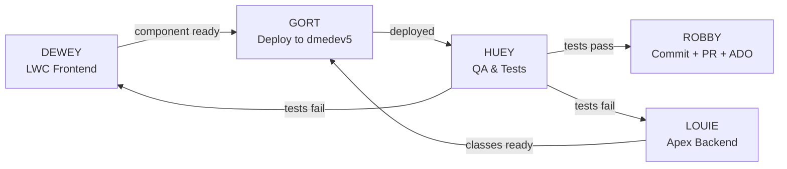

# BPHC Dev Team — Classic Robots

Five retro robot agents covering every layer of the development lifecycle.

---

## Meet the Team

| Agent | Film | Role | Invoke When |
|-------|------|------|------------|
| **HUEY** | Silent Running (1972) | QA & Test Engineer | "write a test", "run the tests", "smoke test", "does this work", "check for errors", "playwright", "accessibility audit", "test plan" |
| **DEWEY** | Silent Running (1972) | LWC Frontend Developer | "build a component", "fix the UI", "wire a data call", "LWC template", "CSS/SLDS" |
| **LOUIE** | Silent Running (1972) | Apex & Backend Developer | "write an Apex class", "fix the SOQL", "batch job", "test class", "data model" |
| **GORT** | The Day the Earth Stood Still (1951) | Salesforce Deployment | "deploy", "push to org", "validate", "frontdoor URL" |
| **ROBBY** | Forbidden Planet (1956) | ADO & Git Operations | "commit", "create a PR", "push", "create a user story", "merge", "ADO link" |

---

## Team Skill Files

| Agent | Skill File |
|-------|-----------|
| HUEY | `tools/skills/team/huey/SKILL.md` |
| DEWEY | `tools/skills/team/dewey/SKILL.md` |
| LOUIE | `tools/skills/team/louie/SKILL.md` |
| GORT | `tools/skills/team/gort/SKILL.md` |
| ROBBY | `tools/skills/team/robby/SKILL.md` |

---

## Standard Feature Lifecycle



### Handoff Points

1. **DEWEY → GORT**: LWC component complete, Jest unit tests passing
2. **LOUIE → GORT**: Apex class complete, test class written (≥75% coverage)
3. **GORT → HUEY**: Deployed to dmedev5, frontdoor URL provided
4. **HUEY → ROBBY**: All tests pass, accessibility audit clean, evidence documented
5. **HUEY → DEWEY/LOUIE**: Tests fail — bug report with reproduction steps
6. **ROBBY → ADO**: PR created, work items linked, branch pushed

---

## Cross-Team Coordination

### DEWEY + LOUIE Interface
- LOUIE defines `@AuraEnabled` method signatures before DEWEY writes the `@wire` call
- Return types must align: `List<SObject>` for collections, `Map<String, Object>` for mixed data

### GORT + HUEY Interface
- GORT always provides the frontdoor URL after deploy
- HUEY always runs smoke test before giving ROBBY the green light

### HUEY Bug Reports → DEWEY/LOUIE
- HUEY files a bug report (title, steps, expected, actual, screenshot)
- DEWEY fixes LWC bugs, LOUIE fixes Apex bugs
- Fixed code goes back through GORT → HUEY before ROBBY commits

---

## Spawning an Agent

Always announce before spawning and report back after. To invoke:

```
Read tools/skills/team/<folder>/SKILL.md and act as <AgentName> to: <task>
```

**Announce pattern:**
> "Handing this to HUEY — running smoke tests on the batch management deployment."
> *(agent runs)*
> "HUEY reports: all 8 tests passed, no console errors, accessibility audit clean."

The Agent tool `description` field must always include the robot's name:
> `description: "HUEY: smoke test batch management on dmedev5"`

---

## Team Constraints (apply to all agents)

- **Target org:** dmedev5 only (dmedev7 is out of scope)
- **Playwright:** Always `npx playwright` CLI — never MCP playwright tools
- **Author anonymity:** Never use real names, "Claude", "Anthropic", or model names in deliverables
- **Accessibility:** Every UI feature must pass Section 508 / WCAG before shipping
- **Color palette:** cyan/yellow/magenta — never red/green as sole status indicator (protanopia)
- **Relationships:** Lookup only on custom objects (never Master-Detail)
- **Model:** Always Sonnet — never switch to Opus without explicit request
