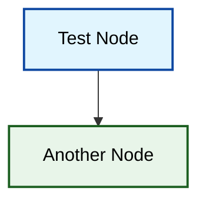

# Mermaid Test

## Simple Test (graph syntax)

```mermaid
graph LR
    A[Start] --> B[End]
```

## Simple Test (flowchart syntax)

```mermaid
flowchart LR
    C[Start] --> D[End]
```

## Test with Styling

```mermaid
graph TB
    Node1[Test Node]
    Node2[Another Node]
    
    Node1 --> Node2
    
    style Node1 fill:#e1f5fe,stroke:#0d47a1,stroke-width:2px,color:#000
    style Node2 fill:#e8f5e9,stroke:#1b5e20,stroke-width:2px,color:#000
```
